# Deployment Architecture

This document provides visual architecture diagrams for the React Visual Feedback Docker deployment.

---

## Overview Architecture

```mermaid
graph TB
    subgraph "External"
        user((End User))
        admin((Admin))
    end

    subgraph "Docker Host"
        direction TB

        subgraph "Reverse Proxy Layer"
            nginx[🔒 Nginx/Traefik<br/>TLS Termination]
        end

        subgraph "feedback-network"
            direction TB

            subgraph "Application Layer"
                example[📱 Feedback Example<br/>Next.js App<br/>:3002]
                webui[🖥️ Feedback WebUI<br/>Admin Dashboard<br/>:5173]
            end

            subgraph "API Layer"
                server[⚙️ Feedback Server<br/>REST API<br/>:3001]
            end

            subgraph "Data Layer"
                pg[(🗄️ PostgreSQL<br/>Database<br/>:5432)]
                uploads[📁 Uploads<br/>Volume]
            end
        end
    end

    user --> nginx
    admin --> nginx
    nginx --> example
    nginx --> webui
    example --> server
    webui --> server
    server --> pg
    server --> uploads

    style nginx fill:#f9f,stroke:#333,stroke-width:2px
    style server fill:#bbf,stroke:#333,stroke-width:2px
    style pg fill:#fbb,stroke:#333,stroke-width:2px
```

---

## Container Dependencies

---

## Network Topology

---

## Data Flow - Feedback Submission

```mermaid
sequenceDiagram
    autonumber

    participant U as 👤 User
    participant W as 📱 Widget
    participant S as ⚙️ Server
    participant D as 🗄️ Database
    participant FS as 📁 File Storage

    U->>W: Click feedback button
    W->>W: Show feedback modal
    U->>W: Enter feedback + screenshot
    W->>W: Capture screenshot (html2canvas)

    rect rgb(200, 230, 255)
        Note over W,FS: Submit Flow
        W->>S: POST /api/v1/feedback
        S->>S: Validate request
        S->>D: INSERT feedback record
        D-->>S: feedback_id

        alt Has screenshot
            S->>FS: Save screenshot
            FS-->>S: file_path
            S->>D: UPDATE feedback SET screenshot_path
        end

        S-->>W: 201 Created
    end

    W-->>U: Success notification
```

---

## Data Flow - Admin Dashboard

```mermaid
sequenceDiagram
    autonumber

    participant A as 👤 Admin
    participant UI as 🖥️ WebUI
    participant S as ⚙️ Server
    participant D as 🗄️ Database

    A->>UI: Open dashboard
    UI->>S: GET /api/v1/feedback
    S->>D: SELECT * FROM feedback
    D-->>S: feedback[]
    S-->>UI: JSON response
    UI-->>A: Display feedback list

    rect rgb(255, 230, 200)
        Note over A,D: Update Status
        A->>UI: Change status to "reviewed"
        UI->>S: PATCH /api/v1/feedback/:id
        S->>D: UPDATE feedback SET status
        D-->>S: OK
        S-->>UI: 200 OK
        UI-->>A: Status updated
    end
```

---

## Volume Architecture

```mermaid
graph TB
    subgraph "Docker Volumes"
        pg_data[(postgres_data<br/>PostgreSQL Data)]
        uploads[(uploads<br/>Screenshots & Files)]
        logs[(logs<br/>Application Logs)]
    end

    subgraph "Containers"
        pg[PostgreSQL]
        server[Feedback Server]
    end

    pg_data --> pg
    uploads --> server
    logs --> server

    subgraph "Backup"
        backup[📦 Backup Script]
        storage[💾 External Storage]
    end

    pg_data -.-> backup
    uploads -.-> backup
    backup --> storage
```

---

## Health Check Flow

---

## Deployment Scenarios

### Development

### Production

```mermaid
graph TB
    subgraph "Cloud Provider"
        lb[🌐 Load Balancer]

        subgraph "Node 1"
            n1_nginx[Nginx]
            n1_server[Server]
            n1_webui[WebUI]
        end

        subgraph "Node 2"
            n2_nginx[Nginx]
            n2_server[Server]
            n2_webui[WebUI]
        end

        subgraph "Database"
            pg_primary[(PostgreSQL Primary)]
            pg_replica[(PostgreSQL Replica)]
        end
    end

    lb --> n1_nginx
    lb --> n2_nginx
    n1_server --> pg_primary
    n2_server --> pg_primary
    pg_primary --> pg_replica
```

---

## Package Dependencies

---

## Security Boundaries

```mermaid
graph TB
    subgraph "Public Internet"
        user((User))
    end

    subgraph "DMZ"
        fw[🔥 Firewall]
        lb[🔒 TLS Termination]
    end

    subgraph "Internal Network"
        subgraph "Application Tier"
            app[Feedback Server]
        end

        subgraph "Data Tier"
            db[(PostgreSQL)]
        end
    end

    user --> fw
    fw -->|443| lb
    lb -->|3001| app
    app -->|5432| db

    style fw fill:#f66
    style lb fill:#f96
    style db fill:#6f6
```

---

_Last updated: 2025-01-XX_
