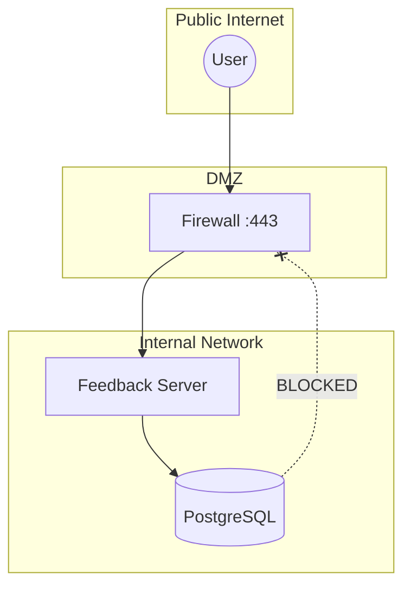

# Security Guide

**Version**: 1.0.0
**Last Updated**: 2025-01-XX

This guide covers security considerations and best practices for deploying the React Visual Feedback stack.

---

## Table of Contents

- [Security Overview](#security-overview)
- [Secret Management](#secret-management)
- [Network Security](#network-security)
- [Container Security](#container-security)
- [Database Security](#database-security)
- [TLS/HTTPS Configuration](#tlshttps-configuration)
- [Access Control](#access-control)
- [Monitoring & Auditing](#monitoring--auditing)
- [Vulnerability Management](#vulnerability-management)
- [Compliance Checklist](#compliance-checklist)

---

## Security Overview

### Security Principles

1. **Defense in Depth**: Multiple layers of security controls
2. **Least Privilege**: Minimal permissions for each component
3. **Secure by Default**: Security enabled out-of-the-box
4. **Fail Secure**: Fail closed rather than open

### Threat Model

| Threat           | Mitigation                                  |
| ---------------- | ------------------------------------------- |
| Exposed secrets  | Environment variables, Docker secrets       |
| Network attacks  | Firewall rules, internal networks           |
| Container escape | Non-root users, read-only filesystems       |
| SQL injection    | Parameterized queries, input validation     |
| XSS attacks      | Content Security Policy, input sanitization |
| CSRF attacks     | Token validation, SameSite cookies          |

---

## Secret Management

### ⚠️ Critical Rules

1. **NEVER commit `.env` to version control**
2. **NEVER use default passwords in production**
3. **ALWAYS use strong, unique passwords**
4. **ROTATE secrets regularly**

### .gitignore Configuration

```gitignore
# REQUIRED - Never commit secrets
.env
.env.local
.env.production
.env.*.local
*.pem
*.key
*secret*
```

### Environment Files

```bash
# Development (committed as template)
.env.example    # Template with placeholder values

# Production (NEVER committed)
.env            # Local development
.env.production # Production secrets
```

### Password Requirements

| Secret              | Minimum Length | Complexity                   |
| ------------------- | -------------- | ---------------------------- |
| `POSTGRES_PASSWORD` | 32 characters  | Mixed case, numbers, symbols |
| `JWT_SECRET`        | 64 characters  | Random bytes, base64 encoded |
| `API_KEY`           | 32 characters  | Alphanumeric                 |

### Generating Secure Secrets

```bash
# Generate strong password (64 chars)
openssl rand -base64 48

# Generate JWT secret
openssl rand -hex 64

# Generate API key
openssl rand -base64 32 | tr -d '=' | tr '+/' '-_'
```

### Docker Secrets (Swarm Mode)

```bash
# Create secrets
echo "my-secure-password" | docker secret create postgres_password -
echo "my-jwt-secret" | docker secret create jwt_secret -

# Reference in docker-compose.yml
services:
  feedback-server:
    secrets:
      - postgres_password
      - jwt_secret
    environment:
      - POSTGRES_PASSWORD_FILE=/run/secrets/postgres_password
      - JWT_SECRET_FILE=/run/secrets/jwt_secret

secrets:
  postgres_password:
    external: true
  jwt_secret:
    external: true
```

### External Secret Managers

#### HashiCorp Vault

```bash
# Store secret
vault kv put secret/feedback postgres_password="secure-password"

# Retrieve in entrypoint
export POSTGRES_PASSWORD=$(vault kv get -field=postgres_password secret/feedback)
```

#### AWS Secrets Manager

```bash
# Store secret
aws secretsmanager create-secret \
  --name feedback/postgres \
  --secret-string '{"password":"secure-password"}'

# Retrieve in entrypoint
export POSTGRES_PASSWORD=$(aws secretsmanager get-secret-value \
  --secret-id feedback/postgres \
  --query SecretString \
  --output text | jq -r .password)
```

---

## Network Security

### Network Architecture



### Docker Network Isolation

```yaml
# docker-compose.yml
networks:
  # Frontend network (exposed)
  frontend:
    driver: bridge

  # Backend network (internal only)
  backend:
    driver: bridge
    internal: true # No external access

services:
  nginx:
    networks:
      - frontend

  feedback-server:
    networks:
      - frontend
      - backend

  postgres:
    networks:
      - backend # Only internal access
```

### Firewall Rules

```bash
# Ubuntu/Debian with UFW
# Allow only HTTPS
sudo ufw default deny incoming
sudo ufw default allow outgoing
sudo ufw allow 22/tcp    # SSH
sudo ufw allow 443/tcp   # HTTPS
sudo ufw enable

# Block direct container access
sudo ufw deny 3001/tcp   # Feedback Server
sudo ufw deny 5173/tcp   # WebUI
sudo ufw deny 5432/tcp   # PostgreSQL
```

### Port Exposure Best Practices

| Service               | Development         | Production    |
| --------------------- | ------------------- | ------------- |
| PostgreSQL :5432      | Exposed (debugging) | Internal only |
| Feedback Server :3001 | Exposed             | Behind proxy  |
| WebUI :5173           | Exposed             | Behind proxy  |
| Example :3002         | Exposed             | Behind proxy  |

```yaml
# Production - don't expose internal ports
services:
  postgres:
    # No ports exposed externally
    expose:
      - "5432" # Internal only
```

---

## Container Security

### Non-Root User

All containers run as non-root by default:

```dockerfile
# Already configured in Dockerfiles
RUN addgroup --system --gid 1001 nodejs && \
    adduser --system --uid 1001 --ingroup nodejs bun

USER bun
```

### Read-Only Filesystem

```yaml
# docker-compose.prod.yml
services:
  feedback-server:
    read_only: true
    tmpfs:
      - /tmp
    volumes:
      - uploads:/app/uploads:rw # Only uploads writable
```

### Security Options

```yaml
services:
  feedback-server:
    security_opt:
      - no-new-privileges:true
    cap_drop:
      - ALL
    cap_add:
      - NET_BIND_SERVICE # Only if needed
```

### Resource Limits

```yaml
services:
  feedback-server:
    deploy:
      resources:
        limits:
          cpus: "1.0"
          memory: 512M
        reservations:
          cpus: "0.25"
          memory: 256M
```

### Image Security

```bash
# Scan images for vulnerabilities
docker scout cves feedback-server:latest

# Or use Trivy
trivy image feedback-server:latest

# Only use trusted base images
FROM oven/bun:1.3.6-debian  # Official image
```

---

## Database Security

### Connection Security

```yaml
# Production - use SSL
services:
  postgres:
    command: >
      postgres
      -c ssl=on
      -c ssl_cert_file=/var/lib/postgresql/server.crt
      -c ssl_key_file=/var/lib/postgresql/server.key
```

### Access Control

```sql
-- Create application user with minimal privileges
CREATE USER feedback_app WITH PASSWORD 'secure-password';
GRANT SELECT, INSERT, UPDATE, DELETE ON ALL TABLES IN SCHEMA public TO feedback_app;
REVOKE CREATE ON SCHEMA public FROM feedback_app;

-- Create read-only user for reporting
CREATE USER feedback_readonly WITH PASSWORD 'another-password';
GRANT SELECT ON ALL TABLES IN SCHEMA public TO feedback_readonly;
```

### Data Encryption

```yaml
# Encrypt data volume
services:
  postgres:
    volumes:
      - type: volume
        source: postgres_data
        target: /var/lib/postgresql/data
        volume:
          driver: local
          driver_opts:
            type: ext4
            o: "encryption"
```

### Backup Security

```bash
# Encrypt backups
pg_dump -U feedback | gpg --symmetric --cipher-algo AES256 > backup.sql.gpg

# Restore encrypted backup
gpg --decrypt backup.sql.gpg | psql -U feedback
```

---

## TLS/HTTPS Configuration

### Using Nginx as Reverse Proxy

```nginx
# /etc/nginx/sites-available/feedback
server {
    listen 80;
    server_name feedback.example.com;
    return 301 https://$server_name$request_uri;
}

server {
    listen 443 ssl http2;
    server_name feedback.example.com;

    # TLS Configuration
    ssl_certificate /etc/letsencrypt/live/feedback.example.com/fullchain.pem;
    ssl_certificate_key /etc/letsencrypt/live/feedback.example.com/privkey.pem;

    # Modern TLS settings
    ssl_protocols TLSv1.2 TLSv1.3;
    ssl_ciphers ECDHE-ECDSA-AES128-GCM-SHA256:ECDHE-RSA-AES128-GCM-SHA256;
    ssl_prefer_server_ciphers off;

    # Security headers
    add_header Strict-Transport-Security "max-age=63072000" always;
    add_header X-Frame-Options "SAMEORIGIN" always;
    add_header X-Content-Type-Options "nosniff" always;
    add_header X-XSS-Protection "1; mode=block" always;
    add_header Content-Security-Policy "default-src 'self';" always;

    # Proxy to services
    location /api {
        proxy_pass http://localhost:3001;
        proxy_set_header Host $host;
        proxy_set_header X-Real-IP $remote_addr;
        proxy_set_header X-Forwarded-For $proxy_add_x_forwarded_for;
        proxy_set_header X-Forwarded-Proto $scheme;
    }

    location / {
        proxy_pass http://localhost:5173;
        proxy_set_header Host $host;
    }
}
```

### Using Traefik

```yaml
# docker-compose.override.yml
services:
  traefik:
    image: traefik:v3.0
    command:
      - "--providers.docker=true"
      - "--entrypoints.websecure.address=:443"
      - "--certificatesresolvers.letsencrypt.acme.email=admin@example.com"
      - "--certificatesresolvers.letsencrypt.acme.storage=/letsencrypt/acme.json"
      - "--certificatesresolvers.letsencrypt.acme.httpchallenge.entrypoint=web"
    ports:
      - "443:443"
    volumes:
      - /var/run/docker.sock:/var/run/docker.sock:ro
      - letsencrypt:/letsencrypt

  feedback-server:
    labels:
      - "traefik.enable=true"
      - "traefik.http.routers.api.rule=Host(`feedback.example.com`) && PathPrefix(`/api`)"
      - "traefik.http.routers.api.tls.certresolver=letsencrypt"
```

### Let's Encrypt Auto-Renewal

```bash
# Install certbot
apt install certbot python3-certbot-nginx

# Get certificate
certbot --nginx -d feedback.example.com

# Auto-renewal (already configured by certbot)
systemctl status certbot.timer
```

---

## Access Control

### API Authentication

```yaml
# Environment configuration
environment:
  - API_AUTH_ENABLED=true
  - API_KEY_HEADER=X-API-Key
```

### CORS Configuration

```yaml
# Restrict CORS origins in production
environment:
  - CORS_ORIGINS=https://feedback.example.com,https://app.example.com
```

### Rate Limiting

```nginx
# Nginx rate limiting
http {
    limit_req_zone $binary_remote_addr zone=api:10m rate=10r/s;

    server {
        location /api {
            limit_req zone=api burst=20 nodelay;
            proxy_pass http://localhost:3001;
        }
    }
}
```

---

## Monitoring & Auditing

### Security Logging

```yaml
# Enable detailed logging
environment:
  - LOG_LEVEL=info
  - LOG_FORMAT=json
  - LOG_SECURITY_EVENTS=true
```

### Log Analysis

```bash
# Search for failed authentication
docker compose logs 2>&1 | grep -i "authentication failed"

# Search for unusual activity
docker compose logs 2>&1 | grep -E "(401|403|500)"
```

### Audit Trail

```sql
-- Create audit table
CREATE TABLE audit_log (
    id SERIAL PRIMARY KEY,
    timestamp TIMESTAMPTZ DEFAULT NOW(),
    user_id TEXT,
    action TEXT,
    resource TEXT,
    details JSONB
);

-- Trigger for tracking changes
CREATE TRIGGER feedback_audit
    AFTER INSERT OR UPDATE OR DELETE ON feedback
    FOR EACH ROW EXECUTE FUNCTION log_audit();
```

---

## Vulnerability Management

### Image Scanning

```bash
# Regular vulnerability scans
# Add to CI/CD pipeline

# Docker Scout
docker scout cves feedback-server:latest

# Trivy
trivy image feedback-server:latest

# Snyk
snyk container test feedback-server:latest
```

### Dependency Scanning

```bash
# Scan npm dependencies
npm audit

# Scan with Snyk
snyk test

# Update vulnerable packages
npm audit fix
```

### Update Process

```bash
# Check for base image updates
docker pull oven/bun:1.3.6-debian

# Rebuild with latest patches
docker compose build --pull --no-cache

# Test before deploying
docker compose -f docker-compose.yml -f docker-compose.test.yml up --exit-code-from tests

# Deploy
docker compose up -d
```

---

## Compliance Checklist

### Pre-Production Security Review

- [ ] **Secrets Management**

  - [ ] No secrets in code or version control
  - [ ] Strong, unique passwords for all services
  - [ ] Secret rotation process documented

- [ ] **Network Security**

  - [ ] Firewall configured
  - [ ] Internal services not exposed externally
  - [ ] TLS/HTTPS configured

- [ ] **Container Security**

  - [ ] Running as non-root user
  - [ ] Resource limits configured
  - [ ] Images scanned for vulnerabilities

- [ ] **Database Security**

  - [ ] Strong password set
  - [ ] Backups encrypted
  - [ ] Connection encryption enabled

- [ ] **Access Control**

  - [ ] API authentication enabled
  - [ ] CORS properly configured
  - [ ] Rate limiting enabled

- [ ] **Monitoring**
  - [ ] Security logging enabled
  - [ ] Alerts configured for suspicious activity
  - [ ] Regular log review scheduled

### Periodic Security Tasks

| Task                     | Frequency |
| ------------------------ | --------- |
| Review access logs       | Weekly    |
| Scan for vulnerabilities | Weekly    |
| Update dependencies      | Monthly   |
| Rotate secrets           | Quarterly |
| Security audit           | Annually  |

---

## Quick Reference

### Security Commands

```bash
# Scan image for vulnerabilities
docker scout cves feedback-server:latest

# Check for exposed secrets in git history
git log -p | grep -i "password\|secret\|key"

# Test SSL configuration
openssl s_client -connect feedback.example.com:443

# Check security headers
curl -I https://feedback.example.com

# Verify non-root user
docker compose exec feedback-server whoami
# Should output: bun (not root)

# Check network isolation
docker network inspect feedback-network
```

---

## Resources

- [Docker Security Best Practices](https://docs.docker.com/develop/security-best-practices/)
- [OWASP Docker Security Cheat Sheet](https://cheatsheetseries.owasp.org/cheatsheets/Docker_Security_Cheat_Sheet.html)
- [CIS Docker Benchmark](https://www.cisecurity.org/benchmark/docker)
- [PostgreSQL Security](https://www.postgresql.org/docs/current/security.html)

---

_Last updated: 2025-01-XX_
