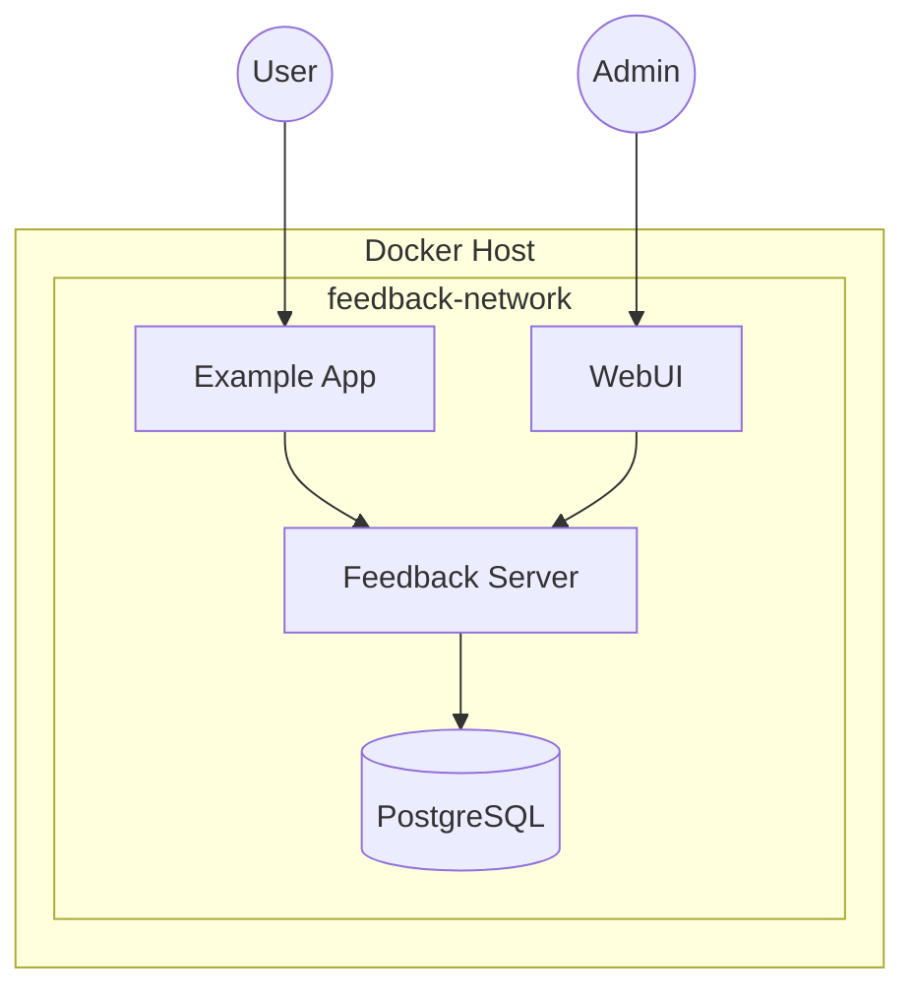
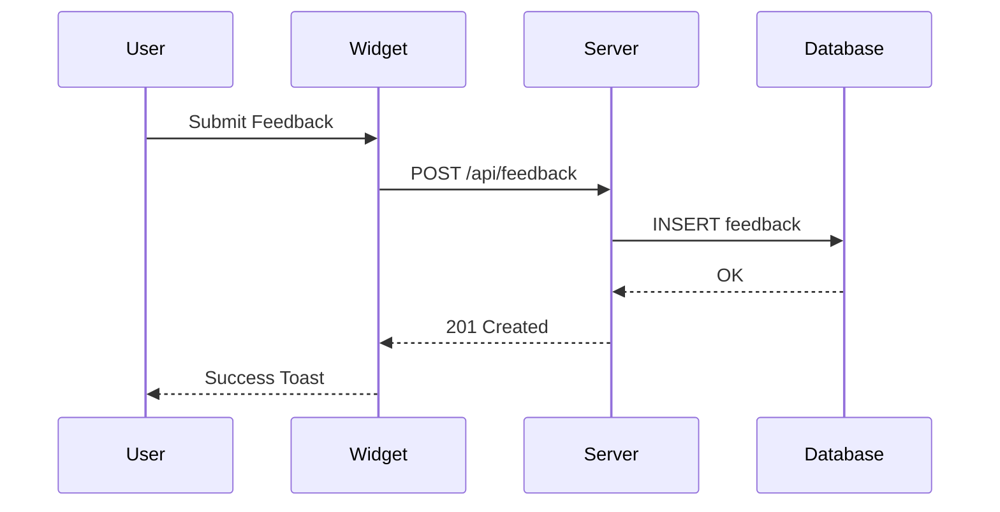

# Reference Deployment - Documentation Tasks

**Version**: 1.0.0  
**Created**: 2026-01-19  
**Updated**: 2026-01-19

---

## Set 8: Documentation

### D001 - Create Deployment Guide

**Status**: 🔲 TODO  
**Priority**: 🟡 Medium

**Description**: Create comprehensive deployment guide for operators.

**Implementation**:
Create `docs/deployment/README.md` with:
- Prerequisites (Docker, Docker Compose versions)
- Quick start guide
- Configuration options
- Security considerations
- Backup procedures
- Upgrade procedures
- Monitoring setup

**Sections**:

```markdown
# Deployment Guide

## Prerequisites
- Docker 24.0+
- Docker Compose 2.20+
- 2GB RAM minimum
- 10GB disk space

## Quick Start
1. Clone repository
2. Copy .env.example to .env
3. Configure environment
4. Run: task up

## Configuration
[Environment variables documentation]

## Security
[TLS, secrets management]

## Operations
[Backup, restore, upgrade]

## Monitoring
[Health endpoints, logging]
```

**Acceptance Criteria**:
- [ ] Guide exists at docs/deployment/README.md
- [ ] Covers all operational aspects
- [ ] Includes copy-paste commands
- [ ] Tested by following guide from scratch

**Testing**: Have someone follow the guide on a fresh system

**Dependencies**: T015, T032

---

### D002 - Create Troubleshooting Guide

**Status**: 🔲 TODO  
**Priority**: 🟡 Medium

**Description**: Create troubleshooting guide for common issues.

**Implementation**:
Create `docs/deployment/troubleshooting.md` with:
- Common error messages and solutions
- Health check debugging
- Database connectivity issues
- Permission problems
- Container startup failures
- Network issues
- Performance problems

**Template**:

```markdown
# Troubleshooting Guide

## Container Won't Start

### Symptom
Container exits immediately after starting.

### Diagnosis
```bash
docker logs feedback-server
docker inspect feedback-server --format='{{.State.ExitCode}}'
```

### Common Causes
1. Missing environment variables
2. Database not ready
3. Permission issues

### Solutions
[Step-by-step solutions]
```

**Acceptance Criteria**:
- [ ] Guide exists at docs/deployment/troubleshooting.md
- [ ] Covers top 10 common issues
- [ ] Includes diagnostic commands
- [ ] Provides clear solutions

**Testing**: Simulate issues and follow troubleshooting steps

**Dependencies**: T032

---

### D003 - Create Architecture Diagrams

**Status**: 🔲 TODO  
**Priority**: 🔴 Low

**Description**: Create detailed architecture diagrams for the deployment.

**Implementation**:
Create diagrams in `docs/deployment/diagrams/`:
- deployment-architecture.md (Mermaid)
- network-topology.md (Mermaid)
- data-flow.md (Mermaid)
- Optional: draw.io or SVG versions

**Diagrams**:

1. **Deployment Architecture**


2. **Data Flow**


**Acceptance Criteria**:
- [ ] Diagrams directory exists
- [ ] At least 2 diagrams created
- [ ] Diagrams render correctly in GitHub
- [ ] Diagrams match actual architecture

**Testing**: View diagrams in GitHub preview

**Dependencies**: T015

---

## Additional Documentation Tasks

### D004 - Update Package READMEs

**Status**: 🔲 TODO  
**Priority**: 🔴 Low

**Description**: Add Docker build/run instructions to each package README.

**Implementation**:
Add Docker section to each package README:
- Build command
- Run command (standalone)
- Environment variables
- Link to root deployment guide

**Acceptance Criteria**:
- [ ] All package READMEs updated
- [ ] Commands are accurate
- [ ] Links work

**Testing**: Follow README instructions in each package

**Dependencies**: T005-T010

---

### D005 - Create CHANGELOG for Docker Features

**Status**: 🔲 TODO  
**Priority**: 🔴 Low

**Description**: Document the Docker deployment features in CHANGELOG.

**Implementation**:
Add entry to CHANGELOG.md:
```markdown
## [Unreleased]

### Added
- Docker deployment support for all packages
- Root docker-compose.yml for full-stack deployment
- Taskfile automation for Docker operations
- Health check endpoints
- Deployment documentation
```

**Acceptance Criteria**:
- [ ] CHANGELOG updated
- [ ] All features documented

**Testing**: Review CHANGELOG

**Dependencies**: All other tasks

---

### D006 - Create Security Documentation

**Status**: 🔲 TODO  
**Priority**: 🔴 Low

**Description**: Document security considerations for Docker deployment.

**Implementation**:
Create `docs/deployment/security.md`:
- Secret management (never commit .env)
- Network isolation
- Non-root containers
- Image scanning
- TLS configuration
- Firewall rules

**Acceptance Criteria**:
- [ ] Security guide exists
- [ ] Covers all security aspects
- [ ] References best practices

**Testing**: Security review of guide

**Dependencies**: D001

---

## Documentation Summary

| Task ID | Title | Priority | Dependencies |
|---------|-------|----------|--------------|
| D001 | Create Deployment Guide | 🟡 Medium | T015, T032 |
| D002 | Create Troubleshooting Guide | 🟡 Medium | T032 |
| D003 | Create Architecture Diagrams | 🔴 Low | T015 |
| D004 | Update Package READMEs | 🔴 Low | T005-T010 |
| D005 | Create CHANGELOG Entry | 🔴 Low | All tasks |
| D006 | Create Security Documentation | 🔴 Low | D001 |

---

**Total Documentation Tasks**: 6  
**High Priority**: 0  
**Medium Priority**: 2  
**Low Priority**: 4

---

**Tasks Version**: 1.0.0  
**Created by**: GitHub Copilot  
**Last Updated**: 2026-01-19
