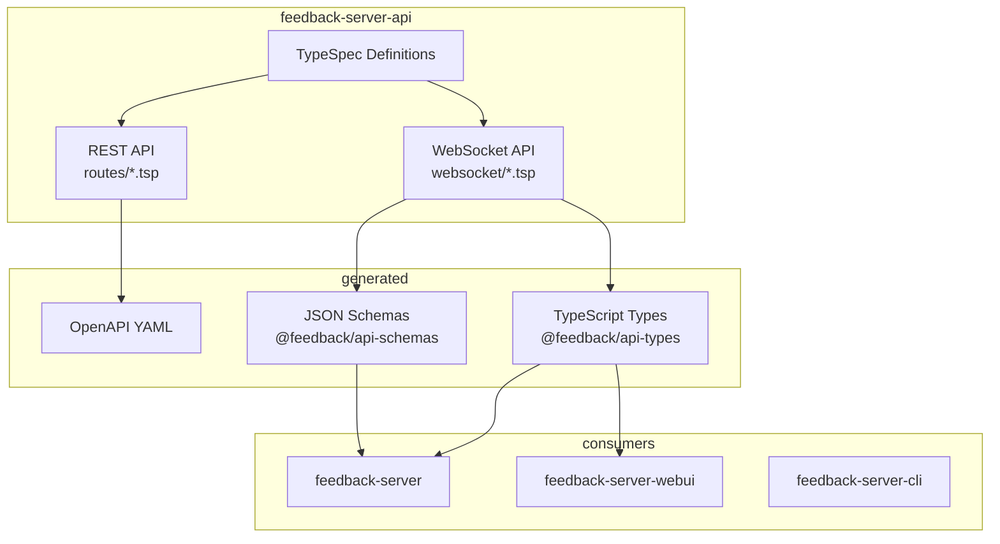
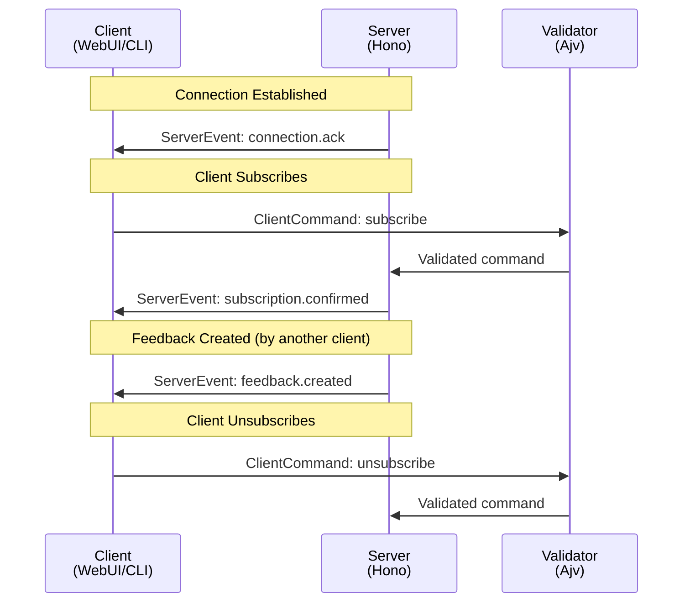
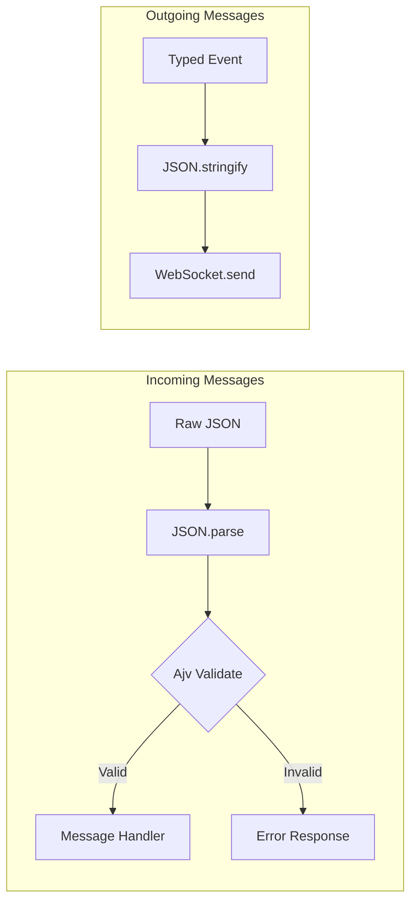

# Feedback Server API - WebSocket Addon Specification

> **Version:** 0.1.0
> **Status:** Draft
> **Last Updated:** 2025-01-22

## 📋 Table of Contents

1. [Overview](#overview)
2. [Goals & Non-Goals](#goals--non-goals)
3. [Research Summary](#research-summary)
4. [Architecture](#architecture)
5. [TypeSpec Implementation](#typespec-implementation)
6. [Message Types](#message-types)
7. [Generated Artifacts](#generated-artifacts)
8. [Implementation Guide](#implementation-guide)
9. [Testing Strategy](#testing-strategy)
10. [References](#references)

---

## Overview

### Purpose

This addon extends the `feedback-server-api` TypeSpec package to define **WebSocket message contracts** for real-time communication between the feedback server and its clients (WebUI, CLI).

### Problem Statement

The current API-First approach only covers REST endpoints via OpenAPI. Real-time features (WebSocket) are implemented without a formal contract, leading to:

1. **No type safety** for WebSocket messages
2. **Manual synchronization** between client and server message handling
3. **No runtime validation** of WebSocket payloads
4. **Undocumented protocol** for real-time events

### Solution

Extend the TypeSpec API definition to include:

1. **Server → Client Events** using `@typespec/events`
2. **Client → Server Commands** as typed models
3. **JSON Schema generation** for runtime validation
4. **Generated TypeScript types** for both ends

### Relationship to Other Packages



---

## Goals & Non-Goals

### Goals

1. ✅ **Type-safe WebSocket messages** - Compile-time error detection
2. ✅ **Runtime validation** - JSON Schema for message validation
3. ✅ **Single source of truth** - TypeSpec defines all contracts
4. ✅ **Generated artifacts** - No manual type duplication
5. ✅ **Documentation** - Self-documenting message formats
6. ✅ **Backward compatible** - Extends existing TypeSpec, doesn't change REST

### Non-Goals

1. ❌ **Protocol implementation** - Only defines contracts, not WebSocket handling
2. ❌ **AsyncAPI generation** - Community emitter is alpha quality, not production-ready
3. ❌ **gRPC/Protobuf** - Overkill for browser WebSocket use case
4. ❌ **Breaking changes** - Existing REST API remains unchanged

---

## Research Summary

Based on research documented in [`packages/feedback-server/docs/research/typespec-api-first/05-websocket-api-first.md`](../../../feedback-server/docs/research/typespec-api-first/05-websocket-api-first.md):

### Evaluated Options

| Option | Technology | Verdict |
|--------|-----------|---------|
| A | `@typespec/protobuf` + gRPC streaming | ⚠️ Overkill |
| B | `@typespec/json-schema` alone | ⚠️ Partial solution |
| C | `@lars-artmann/typespec-asyncapi` | ❌ Alpha quality (38.4% tests) |
| **D** | **`@typespec/events` + JSON Schema** | ✅ **Recommended** |

### Recommended Approach

Use official TypeSpec packages:
- `@typespec/events` - Define event sets with semantic decorators
- `@typespec/json-schema` - Generate validation schemas

This provides:
- ✅ Stable, official packages
- ✅ Clean event modeling semantics
- ✅ Runtime validation via JSON Schema
- ✅ Type safety for TypeScript consumers
- ✅ Future-proof (foundation for AsyncAPI when stable)

---

## Architecture

### Message Flow



### Validation Layer



---

## TypeSpec Implementation

### Directory Structure

```
packages/feedback-server-api/
├── typespec/
│   ├── main.tsp              # Main entry point
│   ├── models/               # Shared data models
│   │   ├── feedback.tsp
│   │   └── video.tsp
│   ├── routes/               # REST API routes
│   │   ├── feedback.tsp
│   │   ├── video.tsp
│   │   └── health.tsp
│   └── websocket/            # WebSocket definitions (NEW)
│       ├── events.tsp        # Server → Client events
│       └── commands.tsp      # Client → Server commands
└── tspconfig.yaml            # Updated with JSON Schema emitter
```

### Main Entry Point Update

```typespec
// typespec/main.tsp
import "@typespec/http";
import "@typespec/rest";
import "@typespec/openapi3";
import "@typespec/openapi";
import "@typespec/events";
import "@typespec/json-schema";

import "./models/feedback.tsp";
import "./models/video.tsp";
import "./routes/feedback.tsp";
import "./routes/video.tsp";
import "./routes/health.tsp";
import "./websocket/events.tsp";
import "./websocket/commands.tsp";

using Http;
using Rest;
using OpenAPI;

/** Feedback Server API for collecting and managing user feedback with video recordings */
@service(#{ title: "Feedback Server API" })
@info(#{ version: "1.0.0" })
@server("http://localhost:3000", "Local development server")
namespace FeedbackServer;
```

### Server Events Definition

```typespec
// typespec/websocket/events.tsp
import "@typespec/events";
import "@typespec/json-schema";
import "../models/feedback.tsp";

using TypeSpec.Events;
using TypeSpec.JsonSchema;

namespace FeedbackServer.WebSocket;

/**
 * Server-to-Client Events sent over WebSocket
 */
@jsonSchema
@events
union ServerEvents {
  /** Feedback item was created */
  feedbackCreated: FeedbackCreatedEvent,
  
  /** Feedback item was updated */
  feedbackUpdated: FeedbackUpdatedEvent,
  
  /** Feedback item was deleted */
  feedbackDeleted: FeedbackDeletedEvent,
  
  /** Multiple feedback items updated (bulk operation) */
  feedbackBulkUpdate: FeedbackBulkUpdateEvent,
  
  /** Connection acknowledged by server */
  connectionAck: ConnectionAckEvent,
  
  /** Subscription confirmed */
  subscriptionConfirmed: SubscriptionConfirmedEvent,
  
  /** Error occurred */
  error: ErrorEvent,
  
  /** Pong response to ping */
  pong: PongEvent,
}

/** Emitted when a new feedback item is created */
model FeedbackCreatedEvent {
  type: "feedback.created";
  timestamp: utcDateTime;
  @data feedback: FeedbackServer.Models.Feedback;
}

/** Emitted when a feedback item is updated */
model FeedbackUpdatedEvent {
  type: "feedback.updated";
  timestamp: utcDateTime;
  @data feedback: FeedbackServer.Models.Feedback;
  /** List of fields that were changed */
  changedFields: string[];
}

/** Emitted when a feedback item is deleted */
model FeedbackDeletedEvent {
  type: "feedback.deleted";
  timestamp: utcDateTime;
  /** ID of the deleted feedback */
  feedbackId: string;
}

/** Emitted when multiple feedback items are updated */
model FeedbackBulkUpdateEvent {
  type: "feedback.bulk_update";
  timestamp: utcDateTime;
  /** IDs of updated feedback items */
  feedbackIds: string[];
  /** Action that was performed */
  action: "status_change" | "priority_change" | "archive" | "delete";
}

/** Emitted when connection is established */
model ConnectionAckEvent {
  type: "connection.ack";
  timestamp: utcDateTime;
  /** Unique connection identifier */
  connectionId: string;
  /** Server version */
  serverVersion: string;
}

/** Emitted when subscription is confirmed */
model SubscriptionConfirmedEvent {
  type: "subscription.confirmed";
  timestamp: utcDateTime;
  /** Channel that was subscribed to */
  channel: string;
}

/** Emitted when an error occurs */
model ErrorEvent {
  type: "error";
  timestamp: utcDateTime;
  /** Error code */
  code: "INVALID_COMMAND" | "UNAUTHORIZED" | "SUBSCRIPTION_FAILED" | "INTERNAL_ERROR";
  /** Human-readable error message */
  message: string;
  /** Optional details */
  details?: Record<string>;
}

/** Response to ping command */
model PongEvent {
  type: "pong";
  timestamp: utcDateTime;
}
```

### Client Commands Definition

```typespec
// typespec/websocket/commands.tsp
import "@typespec/json-schema";
import "../models/feedback.tsp";

using TypeSpec.JsonSchema;

namespace FeedbackServer.WebSocket;

/**
 * Client-to-Server Commands sent over WebSocket
 */
@jsonSchema
union ClientCommands {
  /** Subscribe to events for a channel */
  subscribe: SubscribeCommand,
  
  /** Unsubscribe from a channel */
  unsubscribe: UnsubscribeCommand,
  
  /** Ping to keep connection alive */
  ping: PingCommand,
  
  /** Authenticate the WebSocket connection */
  authenticate: AuthenticateCommand,
}

/** Subscribe to a specific channel or set of events */
model SubscribeCommand {
  type: "subscribe";
  /** Channel to subscribe to (e.g., "feedback", "feedback:project-123") */
  channel: string;
  /** Optional filters to narrow down events */
  filters?: SubscriptionFilters;
}

/** Filters for subscription */
model SubscriptionFilters {
  /** Filter by feedback types */
  types?: FeedbackServer.Models.FeedbackType[];
  /** Filter by feedback statuses */
  statuses?: FeedbackServer.Models.FeedbackStatus[];
  /** Filter by project ID */
  projectId?: string;
  /** Filter by priority */
  priorities?: FeedbackServer.Models.FeedbackPriority[];
}

/** Unsubscribe from a channel */
model UnsubscribeCommand {
  type: "unsubscribe";
  /** Channel to unsubscribe from */
  channel: string;
}

/** Ping command to keep connection alive */
model PingCommand {
  type: "ping";
  timestamp?: utcDateTime;
}

/** Authenticate the WebSocket connection */
model AuthenticateCommand {
  type: "authenticate";
  /** API key for authentication */
  apiKey?: string;
  /** JWT token for authentication */
  token?: string;
}
```

---

## Message Types

### Server Events (Server → Client)

| Event Type | Description | Payload |
|------------|-------------|---------|
| `feedback.created` | New feedback created | Full `Feedback` object |
| `feedback.updated` | Feedback updated | Full `Feedback` object + changed fields |
| `feedback.deleted` | Feedback deleted | `feedbackId` only |
| `feedback.bulk_update` | Multiple items updated | Array of IDs + action type |
| `connection.ack` | Connection established | `connectionId`, `serverVersion` |
| `subscription.confirmed` | Subscription success | `channel` |
| `error` | Error occurred | `code`, `message`, `details?` |
| `pong` | Ping response | `timestamp` |

### Client Commands (Client → Server)

| Command Type | Description | Parameters |
|--------------|-------------|------------|
| `subscribe` | Subscribe to events | `channel`, `filters?` |
| `unsubscribe` | Unsubscribe from events | `channel` |
| `ping` | Keep connection alive | `timestamp?` |
| `authenticate` | Authenticate connection | `apiKey?` or `token?` |

### Channel Naming Convention

| Channel | Description |
|---------|-------------|
| `feedback` | All feedback events |
| `feedback:project-{id}` | Events for specific project |
| `feedback:{id}` | Events for specific feedback item |

---

## Generated Artifacts

### TypeScript Types (in @feedback/api-types)

```typescript
// Generated from TypeSpec
export type ServerEvents = 
  | FeedbackCreatedEvent
  | FeedbackUpdatedEvent
  | FeedbackDeletedEvent
  | FeedbackBulkUpdateEvent
  | ConnectionAckEvent
  | SubscriptionConfirmedEvent
  | ErrorEvent
  | PongEvent;

export type ClientCommands =
  | SubscribeCommand
  | UnsubscribeCommand
  | PingCommand
  | AuthenticateCommand;

export interface FeedbackCreatedEvent {
  type: "feedback.created";
  timestamp: string;
  feedback: Feedback;
}
// ... etc
```

### JSON Schemas (in @feedback/api-schemas)

```
packages/generated/feedback-api-schemas/
├── server-events.json
├── client-commands.json
├── feedback-created-event.json
├── feedback-updated-event.json
└── ... (individual schemas)
```

---

## Implementation Guide

### Server-Side (Hono)

```typescript
// packages/feedback-server/src/websocket/handler.ts
import Ajv from 'ajv';
import clientCommandsSchema from '@feedback/api-schemas/client-commands.json';
import type { ServerEvents, ClientCommands } from '@feedback/api-types';

const ajv = new Ajv();
const validateCommand = ajv.compile(clientCommandsSchema);

export function handleWebSocketMessage(
  ws: WebSocket,
  data: string,
  context: ConnectionContext
): void {
  let command: ClientCommands;
  
  try {
    command = JSON.parse(data);
  } catch {
    sendError(ws, 'INVALID_COMMAND', 'Invalid JSON');
    return;
  }
  
  if (!validateCommand(command)) {
    sendError(ws, 'INVALID_COMMAND', ajv.errorsText(validateCommand.errors));
    return;
  }
  
  switch (command.type) {
    case 'subscribe':
      handleSubscribe(ws, command, context);
      break;
    case 'unsubscribe':
      handleUnsubscribe(ws, command, context);
      break;
    case 'ping':
      sendPong(ws);
      break;
    case 'authenticate':
      handleAuthenticate(ws, command, context);
      break;
  }
}

function sendEvent(ws: WebSocket, event: ServerEvents): void {
  ws.send(JSON.stringify(event));
}
```

### Client-Side (React/WebUI)

```typescript
// packages/feedback-server-webui/src/hooks/useWebSocket.ts
import { useCallback, useEffect, useRef } from 'react';
import { useQueryClient } from '@tanstack/react-query';
import type { ServerEvents, ClientCommands } from '@feedback/api-types';

export function useFeedbackWebSocket(url: string) {
  const ws = useRef<WebSocket | null>(null);
  const queryClient = useQueryClient();
  
  const sendCommand = useCallback((command: ClientCommands) => {
    ws.current?.send(JSON.stringify(command));
  }, []);
  
  const subscribe = useCallback((channel: string, filters?: SubscriptionFilters) => {
    sendCommand({ type: 'subscribe', channel, filters });
  }, [sendCommand]);
  
  useEffect(() => {
    ws.current = new WebSocket(url);
    
    ws.current.onmessage = (event) => {
      const serverEvent: ServerEvents = JSON.parse(event.data);
      
      switch (serverEvent.type) {
        case 'feedback.created':
          queryClient.invalidateQueries({ queryKey: ['feedbacks'] });
          break;
        case 'feedback.updated':
          queryClient.setQueryData(
            ['feedback', serverEvent.feedback.id],
            serverEvent.feedback
          );
          break;
        case 'feedback.deleted':
          queryClient.invalidateQueries({ queryKey: ['feedbacks'] });
          break;
      }
    };
    
    return () => ws.current?.close();
  }, [url, queryClient]);
  
  return { subscribe, sendCommand };
}
```

---

## Testing Strategy

### Unit Tests

1. **Schema validation tests** - Verify JSON Schema validates correctly
2. **Type guard tests** - Test discriminated union type guards
3. **Serialization tests** - Verify JSON serialization/deserialization

### Integration Tests

1. **Message round-trip** - Send command, receive event
2. **Subscription tests** - Subscribe/unsubscribe flow
3. **Authentication tests** - Verify auth command handling

### BDD Tests

1. **Real-time updates** - Test actual WebSocket message delivery
2. **Reconnection** - Test reconnection with re-subscription
3. **Error handling** - Test invalid message handling

---

## References

- [TypeSpec Events Package](https://github.com/microsoft/typespec/tree/main/packages/events)
- [TypeSpec JSON Schema Emitter](https://typespec.io/docs/emitters/json-schema)
- [WebSocket API-First Research](../../../feedback-server/docs/research/typespec-api-first/05-websocket-api-first.md)
- [Ajv JSON Schema Validator](https://ajv.js.org/)

---

**Document compiled by:** GitHub Copilot  
**For project:** react-feedback-widget / feedback-server-api  
**Date:** January 2025
