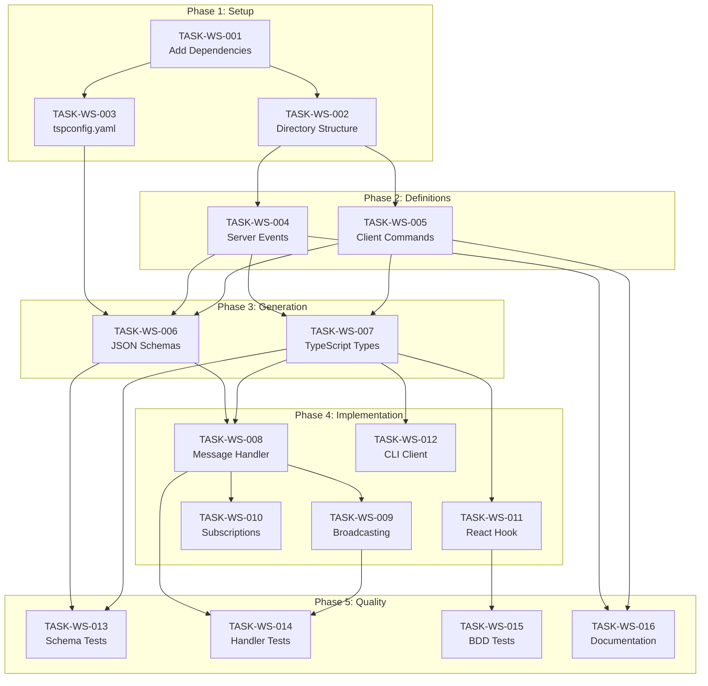

# Feedback Server API - WebSocket Addon Tasks

> **Version:** 0.1.0
> **Last Updated:** 2025-01-22

## 📋 Task Summary

| Category           | Total  | Not Started | In Progress | Done  |
| ------------------ | ------ | ----------- | ----------- | ----- |
| TypeSpec Setup     | 3      | 3           | 0           | 0     |
| Event Definitions  | 2      | 2           | 0           | 0     |
| Schema Generation  | 2      | 2           | 0           | 0     |
| Server Integration | 3      | 3           | 0           | 0     |
| Client Integration | 2      | 2           | 0           | 0     |
| Testing            | 3      | 3           | 0           | 0     |
| Documentation      | 1      | 1           | 0           | 0     |
| **Total**          | **16** | **16**      | **0**       | **0** |

---

## 📦 Category: TypeSpec Setup

### TASK-WS-001: Add TypeSpec Dependencies

**Priority:** P0 - Critical
**Estimated Effort:** 30 minutes
**Status:** 📋 NOT STARTED

**Description:**
Add `@typespec/events` and configure `@typespec/json-schema` emitter to the `feedback-server-api` package.

**Acceptance Criteria:**

- [ ] Add `@typespec/events` to package.json dependencies
- [ ] Add `@typespec/json-schema` to package.json dependencies
- [ ] Run `bun install` to update lockfile
- [ ] Verify packages are accessible in TypeSpec files

---

### TASK-WS-002: Create WebSocket Directory Structure

**Priority:** P0 - Critical
**Estimated Effort:** 15 minutes
**Status:** 📋 NOT STARTED
**Dependencies:** TASK-WS-001

**Description:**
Create the `typespec/websocket/` directory structure for WebSocket message definitions.

**Acceptance Criteria:**

- [ ] Create `typespec/websocket/` directory
- [ ] Create `typespec/websocket/events.tsp` for server events
- [ ] Create `typespec/websocket/commands.tsp` for client commands
- [ ] Update `typespec/main.tsp` to import websocket files

---

### TASK-WS-003: Update tspconfig.yaml

**Priority:** P0 - Critical
**Estimated Effort:** 30 minutes
**Status:** 📋 NOT STARTED
**Dependencies:** TASK-WS-001

**Description:**
Configure `tspconfig.yaml` to emit JSON Schemas alongside OpenAPI for WebSocket message validation.

**Acceptance Criteria:**

- [ ] Add `@typespec/json-schema` to emitters list
- [ ] Configure JSON Schema output directory
- [ ] Configure bundling options for schemas
- [ ] Test schema generation with `task typespec:compile`

**Implementation:**

```yaml
# tspconfig.yaml
emit:
  - "@typespec/openapi3"
  - "@typespec/json-schema"
options:
  "@typespec/openapi3":
    output-file: openapi.yaml
  "@typespec/json-schema":
    emitAllModels: true
    bundleId: "feedback-websocket"
    file-type: "json"
```

---

## 🔔 Category: Event Definitions

### TASK-WS-004: Define Server Events

**Priority:** P1 - High
**Estimated Effort:** 2 hours
**Status:** 📋 NOT STARTED
**Dependencies:** TASK-WS-002

**Description:**
Define all server-to-client WebSocket events using `@typespec/events` decorators.

**Acceptance Criteria:**

- [ ] Define `ServerEvents` union with `@events` decorator
- [ ] Define `FeedbackCreatedEvent` model
- [ ] Define `FeedbackUpdatedEvent` model
- [ ] Define `FeedbackDeletedEvent` model
- [ ] Define `FeedbackBulkUpdateEvent` model
- [ ] Define `ConnectionAckEvent` model
- [ ] Define `SubscriptionConfirmedEvent` model
- [ ] Define `ErrorEvent` model
- [ ] Define `PongEvent` model
- [ ] Add JSDoc comments for all types

**Reference:** See specification [001.websocket-addon-specification](../001.websocket-addon-specification/README.md#server-events-definition)

---

### TASK-WS-005: Define Client Commands

**Priority:** P1 - High
**Estimated Effort:** 1.5 hours
**Status:** 📋 NOT STARTED
**Dependencies:** TASK-WS-002

**Description:**
Define all client-to-server WebSocket commands as typed models.

**Acceptance Criteria:**

- [ ] Define `ClientCommands` union
- [ ] Define `SubscribeCommand` model with filters
- [ ] Define `UnsubscribeCommand` model
- [ ] Define `PingCommand` model
- [ ] Define `AuthenticateCommand` model
- [ ] Define `SubscriptionFilters` model
- [ ] Add JSDoc comments for all types

**Reference:** See specification [001.websocket-addon-specification](../001.websocket-addon-specification/README.md#client-commands-definition)

---

## 📦 Category: Schema Generation

### TASK-WS-006: Generate and Publish JSON Schemas

**Priority:** P1 - High
**Estimated Effort:** 1 hour
**Status:** 📋 NOT STARTED
**Dependencies:** TASK-WS-003, TASK-WS-004, TASK-WS-005

**Description:**
Generate JSON Schemas from TypeSpec and publish to `@feedback/api-schemas` package.

**Acceptance Criteria:**

- [ ] Run `task typespec:compile` to generate schemas
- [ ] Verify `server-events.json` is generated
- [ ] Verify `client-commands.json` is generated
- [ ] Copy schemas to `packages/generated/feedback-api-schemas/`
- [ ] Update `@feedback/api-schemas` package.json exports

---

### TASK-WS-007: Generate and Publish TypeScript Types

**Priority:** P1 - High
**Estimated Effort:** 1 hour
**Status:** 📋 NOT STARTED
**Dependencies:** TASK-WS-004, TASK-WS-005

**Description:**
Generate TypeScript types for WebSocket messages and add to `@feedback/api-types` package.

**Acceptance Criteria:**

- [ ] Verify WebSocket types are included in generated types
- [ ] Add `ServerEvents` type export
- [ ] Add `ClientCommands` type export
- [ ] Add individual event/command type exports
- [ ] Update `@feedback/api-types` package.json exports
- [ ] Add type guards for discriminated unions

---

## 🖥️ Category: Server Integration

### TASK-WS-008: Create WebSocket Message Handler

**Priority:** P2 - Medium
**Estimated Effort:** 3 hours
**Status:** 📋 NOT STARTED
**Dependencies:** TASK-WS-006, TASK-WS-007
**Package:** `feedback-server`

**Description:**
Create a WebSocket message handler in `feedback-server` that validates incoming commands using JSON Schema.

**Acceptance Criteria:**

- [ ] Add Ajv dependency to `feedback-server`
- [ ] Create `src/websocket/validator.ts` with schema validation
- [ ] Create `src/websocket/handler.ts` for message routing
- [ ] Implement typed command handlers (subscribe, unsubscribe, ping, auth)
- [ ] Send typed error events for invalid commands
- [ ] Add logging for WebSocket messages

---

### TASK-WS-009: Implement Event Broadcasting

**Priority:** P2 - Medium
**Estimated Effort:** 2 hours
**Status:** 📋 NOT STARTED
**Dependencies:** TASK-WS-008
**Package:** `feedback-server`

**Description:**
Implement event broadcasting when feedback items are created, updated, or deleted.

**Acceptance Criteria:**

- [ ] Create `src/websocket/broadcaster.ts`
- [ ] Emit `FeedbackCreatedEvent` when POST /api/feedbacks succeeds
- [ ] Emit `FeedbackUpdatedEvent` when PATCH /api/feedbacks/:id succeeds
- [ ] Emit `FeedbackDeletedEvent` when DELETE /api/feedbacks/:id succeeds
- [ ] Include `changedFields` array in update events
- [ ] Filter events by subscription channel/filters

---

### TASK-WS-010: Implement Subscription Management

**Priority:** P2 - Medium
**Estimated Effort:** 2 hours
**Status:** 📋 NOT STARTED
**Dependencies:** TASK-WS-008
**Package:** `feedback-server`

**Description:**
Implement subscription management to track which clients are subscribed to which channels.

**Acceptance Criteria:**

- [ ] Create `src/websocket/subscriptions.ts`
- [ ] Track subscriptions by connection ID and channel
- [ ] Apply subscription filters when broadcasting events
- [ ] Send `SubscriptionConfirmedEvent` on successful subscribe
- [ ] Clean up subscriptions on connection close
- [ ] Support channel patterns (e.g., `feedback:*`)

---

## 📱 Category: Client Integration

### TASK-WS-011: Create React WebSocket Hook

**Priority:** P2 - Medium
**Estimated Effort:** 3 hours
**Status:** 📋 NOT STARTED
**Dependencies:** TASK-WS-007
**Package:** `feedback-server-webui`

**Description:**
Create a React hook for WebSocket communication with type-safe message handling.

**Acceptance Criteria:**

- [ ] Create `src/hooks/useWebSocket.ts`
- [ ] Handle connection lifecycle (connect, reconnect, disconnect)
- [ ] Provide typed `sendCommand` function
- [ ] Provide typed event callbacks
- [ ] Integrate with React Query for cache invalidation
- [ ] Handle authentication via `AuthenticateCommand`
- [ ] Implement automatic reconnection with backoff

---

### TASK-WS-012: Update CLI WebSocket Client

**Priority:** P3 - Low
**Estimated Effort:** 2 hours
**Status:** 📋 NOT STARTED
**Dependencies:** TASK-WS-007
**Package:** `feedback-server-cli`

**Description:**
Update the CLI package to use typed WebSocket messages for real-time features.

**Acceptance Criteria:**

- [ ] Update `src/utils/websocket.ts` to use typed commands
- [ ] Handle typed server events
- [ ] Add schema validation for development mode
- [ ] Update `watch` command to use typed subscriptions

---

## 🧪 Category: Testing

### TASK-WS-013: Unit Tests for Schema Validation

**Priority:** P2 - Medium
**Estimated Effort:** 2 hours
**Status:** 📋 NOT STARTED
**Dependencies:** TASK-WS-006, TASK-WS-007

**Description:**
Write unit tests for JSON Schema validation of WebSocket messages.

**Acceptance Criteria:**

- [ ] Test valid `ServerEvents` pass validation
- [ ] Test valid `ClientCommands` pass validation
- [ ] Test invalid messages fail with descriptive errors
- [ ] Test all event types individually
- [ ] Test all command types individually
- [ ] Test type discriminator works correctly

---

### TASK-WS-014: Integration Tests for WebSocket Handler

**Priority:** P2 - Medium
**Estimated Effort:** 3 hours
**Status:** 📋 NOT STARTED
**Dependencies:** TASK-WS-008, TASK-WS-009

**Description:**
Write integration tests for the WebSocket message handler.

**Acceptance Criteria:**

- [ ] Test subscribe command receives confirmation
- [ ] Test unsubscribe command works
- [ ] Test ping/pong works
- [ ] Test authentication flow
- [ ] Test event broadcasting on feedback CRUD
- [ ] Test subscription filters work correctly

---

### TASK-WS-015: BDD Tests for Real-time Updates

**Priority:** P2 - Medium
**Estimated Effort:** 3 hours
**Status:** 📋 NOT STARTED
**Dependencies:** TASK-WS-011
**Package:** `feedback-server-webui`

**Description:**
Write BDD tests verifying real-time updates work end-to-end.

**Acceptance Criteria:**

- [ ] Test WebSocket connection established on page load
- [ ] Test feedback list updates when item created (via another client)
- [ ] Test feedback detail updates when item modified
- [ ] Test error handling for invalid messages
- [ ] Test reconnection after connection drop

---

## 📚 Category: Documentation

### TASK-WS-016: Update API Documentation

**Priority:** P3 - Low
**Estimated Effort:** 2 hours
**Status:** 📋 NOT STARTED
**Dependencies:** TASK-WS-004, TASK-WS-005

**Description:**
Document the WebSocket API in the project documentation.

**Acceptance Criteria:**

- [ ] Add WebSocket section to `packages/feedback-server-api/README.md`
- [ ] Document all server events with examples
- [ ] Document all client commands with examples
- [ ] Document channel naming convention
- [ ] Add connection/authentication flow diagram
- [ ] Add troubleshooting section

---

## 📊 Task Dependencies Diagram



---

## 🚀 Suggested Implementation Order

### Sprint 1: Foundation (3 days)

1. **TASK-WS-001** - Add dependencies (30 min)
2. **TASK-WS-002** - Directory structure (15 min)
3. **TASK-WS-003** - tspconfig.yaml (30 min)
4. **TASK-WS-004** - Server events (2 hours)
5. **TASK-WS-005** - Client commands (1.5 hours)
6. **TASK-WS-006** - JSON Schemas (1 hour)
7. **TASK-WS-007** - TypeScript types (1 hour)

### Sprint 2: Server Implementation (3 days)

8. **TASK-WS-008** - Message handler (3 hours)
9. **TASK-WS-009** - Event broadcasting (2 hours)
10. **TASK-WS-010** - Subscription management (2 hours)
11. **TASK-WS-013** - Schema tests (2 hours)
12. **TASK-WS-014** - Handler tests (3 hours)

### Sprint 3: Client Integration (2 days)

13. **TASK-WS-011** - React hook (3 hours)
14. **TASK-WS-012** - CLI client (2 hours)
15. **TASK-WS-015** - BDD tests (3 hours)
16. **TASK-WS-016** - Documentation (2 hours)

---

**Document compiled by:** GitHub Copilot
**For project:** react-feedback-widget / feedback-server-api
**Date:** January 2025
