# API-First Technical Debt - Software Specification

> **Version:** 1.0.0
> **Status:** Active
> **Last Updated:** 2026-01-18

## 📋 Table of Contents

1. [Overview](#overview)
2. [Problem Statement](#problem-statement)
3. [Solution Architecture](#solution-architecture)
4. [Dependencies](#dependencies)
5. [Integration Points](#integration-points)
6. [Migration Strategy](#migration-strategy)
7. [Design Decisions](#design-decisions)
8. [References](#references)

---

## Overview

### Purpose

This document describes the technical debt in the `feedback-server-cli` package regarding the API-First architecture approach. The CLI currently uses **manually defined types** that duplicate the API contract instead of using the centralized `@feedback/api-types` package generated from the TypeSpec specification.

### Scope

| Component        | Current State                 | Target State                      |
| ---------------- | ----------------------------- | --------------------------------- |
| Type definitions | Manual (`src/types/index.ts`) | Generated (`@feedback/api-types`) |
| API client       | Custom fetch wrapper          | Potentially use generated client  |
| Type safety      | Partial (manual sync)         | Full (single source of truth)     |

### Background

The monorepo implements an **API-First architecture** where:

1. **TypeSpec** (`packages/feedback-server-api/`) defines the canonical API contract
2. **Taskfile.yml** generates code packages from the specification
3. **Generated packages** (`packages/generated/`) provide typed clients and schemas
4. **Consumer packages** use workspace dependencies for type safety

The CLI was implemented before the API-First architecture was finalized, leading to this technical debt.

---

## Problem Statement

### Current Architecture (Problematic)

```mermaid
graph TD
    subgraph "API Specification"
        TS[TypeSpec Spec]
    end

    subgraph "Generated Packages"
        TS --> G[feedback-api-types]
    end

    subgraph "Consumer Packages"
        G --> S[feedback-server ✅]
        CLI[feedback-server-cli ❌]
    end

    subgraph "CLI Manual Types"
        M[src/types/index.ts]
        CLI --> M
    end

    style CLI fill:#ffcccc
    style M fill:#ffcccc
```



### Issues

| Issue           | Impact                                         | Severity  |
| --------------- | ---------------------------------------------- | --------- |
| **Type Drift**  | Manual types can diverge from API spec         | 🔴 High   |
| **Duplication** | Same types defined in multiple places          | 🟡 Medium |
| **Maintenance** | Changes require updates in multiple files      | 🟡 Medium |
| **Type Safety** | No compile-time guarantee of API compatibility | 🔴 High   |

### Current Manual Types (`src/types/index.ts`)

```typescript
// PROBLEM: These types are manually maintained
export type FeedbackStatus =
  | "new"
  | "acknowledged"
  | "in_progress"
  | "resolved"
  | "closed";

export type FeedbackType = "bug" | "feature" | "improvement" | "question";

export interface Feedback {
  id: string;
  title: string;
  description?: string;
  type: FeedbackType;
  status: FeedbackStatus;
  // ... more fields manually defined
}
```

---

## Solution Architecture

### Target Architecture (API-First)

```mermaid
graph TD
    subgraph "API Specification"
        TS[TypeSpec Spec]
    end

    subgraph "Generated Packages"
        TS --> G[feedback-api-types]
    end

    subgraph "Consumer Packages"
        G --> S[feedback-server ✅]
        G --> CLI[feedback-server-cli ✅]
        G --> WUI[feedback-server-webui ✅]
    end

    style CLI fill:#ccffcc
    style S fill:#ccffcc
    style WUI fill:#ccffcc
```



### Target Types Usage

```typescript
// SOLUTION: Import types from generated package
import type {
  Feedback,
  FeedbackStatus,
  FeedbackType,
  FeedbackPriority,
  CreateFeedbackRequest,
  UpdateFeedbackRequest,
  FeedbackListResponse,
  FeedbackStats,
} from "@feedback/api-types";
```

### Component Architecture

```
packages/feedback-server-cli/
├── src/
│   ├── index.ts                 # Entry point
│   ├── commands/                # CLI commands
│   │   ├── auth.ts
│   │   ├── config.ts
│   │   ├── export.ts
│   │   ├── feedback.ts          # Uses @feedback/api-types
│   │   └── stats.ts             # Uses @feedback/api-types
│   ├── lib/
│   │   ├── api.ts               # API client with generated types
│   │   ├── auth.ts
│   │   ├── config.ts
│   │   ├── export.ts            # Uses @feedback/api-types
│   │   └── output.ts
│   ├── types/
│   │   └── index.ts             # CLI-specific types only (deprecated API types)
│   └── utils/
│       └── logger.ts
└── package.json                  # Add @feedback/api-types dependency
```

---

## Dependencies

### Required Workspace Dependencies

| Package               | Purpose                                 | Version       |
| --------------------- | --------------------------------------- | ------------- |
| `@feedback/api-types` | Generated TypeScript types from OpenAPI | `workspace:*` |

### package.json Changes

```json
{
  "dependencies": {
    "@feedback/api-types": "workspace:*"
  }
}
```

### Build Order Dependency


---

## Integration Points

### 1. Type Imports

**Before (Manual):**

```typescript
import type { Feedback, FeedbackStatus } from "../types/index.js";
```

**After (Generated):**

```typescript
import type { Feedback, FeedbackStatus } from "@feedback/api-types";
```

### 2. API Client Response Typing

**Before:**

```typescript
interface FeedbackListResponse {
  items: Feedback[];
  total: number;
  limit: number;
  offset: number;
}
```

**After:**

```typescript
import type { FeedbackListResponse } from "@feedback/api-types";
// Type is automatically correct and in sync with API
```

### 3. Export Functionality

**Before:**

```typescript
// Manual type definition for export
export interface ExportData {
  feedback: Feedback[];
  exportedAt: string;
  version: string;
}
```

**After:**

```typescript
import type { Feedback } from "@feedback/api-types";

// CLI-specific type extending the canonical type
export interface ExportData {
  feedback: Feedback[]; // Uses generated type
  exportedAt: string;
  version: string;
}
```

---

## Migration Strategy

### Phase 1: Add Dependency

1. Add `@feedback/api-types` as workspace dependency
2. Verify types are accessible
3. No functional changes yet

### Phase 2: Migrate Types

1. Update imports in each file
2. Replace manual type definitions
3. Keep CLI-specific types separate

### Phase 3: Deprecate Manual Types

1. Remove duplicated type definitions from `src/types/index.ts`
2. Keep only CLI-specific types (e.g., `CLIConfig`, `OutputFormat`)
3. Update documentation

### Phase 4: Verify & Test

1. Run type checking
2. Verify CLI functionality
3. Update unit tests if needed

---

## Design Decisions

### ADR-001: Use Workspace Dependencies for Generated Types

**Context:**
Generated packages could be consumed via npm publish or workspace references.

**Decision:**
Use Bun workspace dependencies (`workspace:*`) for generated packages.

**Rationale:**

- No npm publish step required during development
- Changes are immediately reflected
- Simpler CI/CD pipeline
- Already established pattern in the monorepo

**Consequences:**

- Positive: Faster development iteration
- Positive: Single version source of truth
- Negative: Generated packages not available outside monorepo
- Mitigation: Can publish to npm for external consumption if needed

### ADR-002: Keep CLI-Specific Types Separate

**Context:**
The CLI has types that are not part of the API contract (e.g., output formats, CLI configuration).

**Decision:**
Maintain a separate `src/types/cli.ts` for CLI-specific types that are not in the API.

**Rationale:**

- Clear separation of concerns
- API types from generated package
- CLI types local to the CLI package

**Consequences:**

- Positive: Clear ownership of types
- Positive: Easy to identify what comes from API vs CLI-specific
- Negative: Minor maintenance of two type locations

### ADR-003: Deprecate Manual API Types Gradually

**Context:**
The CLI has working functionality with manual types.

**Decision:**
Migrate types file-by-file rather than big-bang replacement.

**Rationale:**

- Reduces risk of breaking functionality
- Allows incremental testing
- Easier to review changes

**Consequences:**

- Positive: Lower risk
- Positive: Easier code review
- Negative: Temporary duplication during migration

---

## References

### Internal Documentation

- [API-First Modular Architecture](../../../feedback-server/docs/research/typespec-api-first/04-modular-api-package-architecture.md)
- [TypeSpec API-First Research](../../../feedback-server/docs/research/typespec-api-first/README.md)
- [feedback-server API-First Technical Debt](../../../feedback-server/docs/spec/004.api-first-technical-debt/README.md)

### Generated Package

- [`@feedback/api-types`](../../../generated/feedback-api-types/)
- [Generation Taskfile](../../../feedback-server-api/Taskfile.yml)

### External Resources

- [Bun Workspaces](https://bun.sh/docs/install/workspaces)
- [TypeSpec Documentation](https://typespec.io/docs/)
- [openapi-typescript](https://openapi-ts.dev/)

---

**Document Status:** Active
**Author:** GitHub Copilot
**Created:** January 2026
