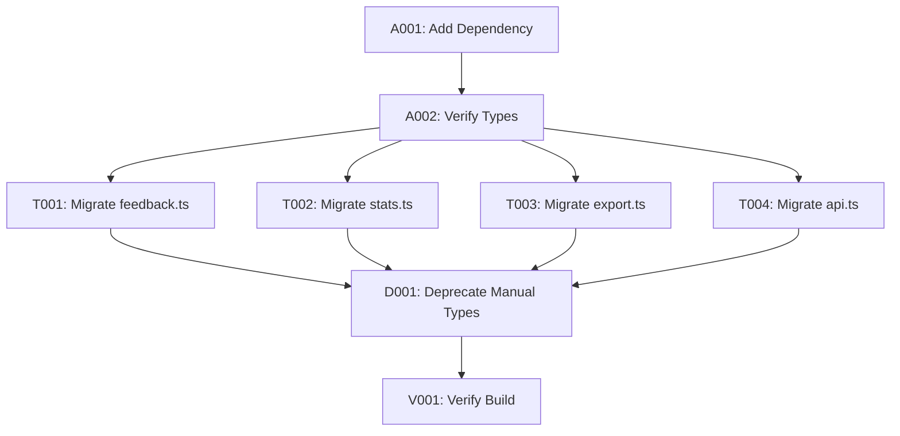

# API-First Technical Debt - Tasks Documentation

> **Version:** 1.0.0
> **Status:** Active
> **Last Updated:** 2026-01-18
> **Related Specification:** [004.api-first-technical-debt/README.md](../004.api-first-technical-debt/README.md)

---

## 📊 Quick Status Overview

| Metric          | Value |
| --------------- | ----- |
| **Total Tasks** | 8     |
| **Completed**   | 0     |
| **In Progress** | 0     |
| **Not Started** | 8     |
| **Blocked**     | 0     |

---

## 📋 Task Summary

| Task ID | Title                              | Priority  | Status  | Dependencies |
| ------- | ---------------------------------- | --------- | ------- | ------------ |
| A001    | Add @feedback/api-types Dependency | 🟢 High   | 🔲 TODO | -            |
| A002    | Verify Type Accessibility          | 🟢 High   | 🔲 TODO | A001         |
| T001    | Migrate feedback.ts Types          | 🟢 High   | 🔲 TODO | A002         |
| T002    | Migrate stats.ts Types             | 🟢 High   | 🔲 TODO | A002         |
| T003    | Migrate export.ts Types            | 🟡 Medium | 🔲 TODO | A002         |
| T004    | Migrate api.ts Types               | 🟢 High   | 🔲 TODO | A002         |
| D001    | Deprecate Manual Type Definitions  | 🟡 Medium | 🔲 TODO | T001-T004    |
| V001    | Verify Build & Type Check          | 🟢 High   | 🔲 TODO | D001         |

---

## 📦 Task Sets

### Set 1: Add Dependency (2 tasks)

Tasks for adding the workspace dependency and verifying access.

| Task | Title                              | Priority | Status  |
| ---- | ---------------------------------- | -------- | ------- |
| A001 | Add @feedback/api-types Dependency | 🟢 High  | 🔲 TODO |
| A002 | Verify Type Accessibility          | 🟢 High  | 🔲 TODO |

### Set 2: Type Migration (4 tasks)

Tasks for migrating from manual types to generated types.

| Task | Title                     | Priority  | Status  |
| ---- | ------------------------- | --------- | ------- |
| T001 | Migrate feedback.ts Types | 🟢 High   | 🔲 TODO |
| T002 | Migrate stats.ts Types    | 🟢 High   | 🔲 TODO |
| T003 | Migrate export.ts Types   | 🟡 Medium | 🔲 TODO |
| T004 | Migrate api.ts Types      | 🟢 High   | 🔲 TODO |

### Set 3: Cleanup & Verification (2 tasks)

Tasks for deprecating manual types and verification.

| Task | Title                             | Priority  | Status  |
| ---- | --------------------------------- | --------- | ------- |
| D001 | Deprecate Manual Type Definitions | 🟡 Medium | 🔲 TODO |
| V001 | Verify Build & Type Check         | 🟢 High   | 🔲 TODO |

---

## 📝 Task Details

---

### A001 - Add @feedback/api-types Dependency

**Status:** 🔲 TODO
**Priority:** 🟢 High
**Dependencies:** None

**Description:**

Add the `@feedback/api-types` workspace dependency to the CLI package.json. This enables importing types generated from the TypeSpec API specification.

**Implementation:**

1. Update `packages/feedback-server-cli/package.json`:

```json
{
  "dependencies": {
    "@feedback/api-types": "workspace:*"
  }
}
```

2. Run `bun install` from monorepo root to update lockfile

**Acceptance Criteria:**

- [x] @feedback/api-types added to dependencies
- [x] bun install succeeds without errors
- [x] Package is resolved in node_modules

---

### A002 - Verify Type Accessibility

**Status:** 🔲 TODO
**Priority:** 🟢 High
**Dependencies:** A001

**Description:**

Verify that the generated types from `@feedback/api-types` are accessible and correctly typed in the CLI package.

**Implementation:**

1. Create a test file to verify imports:

```typescript
// src/lib/__tests__/type-check.ts
import type {
  Feedback,
  FeedbackStatus,
  FeedbackType,
  FeedbackPriority,
  CreateFeedbackRequest,
  UpdateFeedbackRequest,
  FeedbackListResponse,
  FeedbackStats,
} from "@feedback/api-types";

// Type assertion tests
const testStatus: FeedbackStatus = "new";
const testType: FeedbackType = "bug";
```

2. Run `bun run typecheck` to verify types resolve correctly

**Acceptance Criteria:**

- [x] All imported types resolve without errors
- [x] TypeScript IntelliSense shows correct type information
- [x] Type checking passes

---

### T001 - Migrate feedback.ts Types

**Status:** 🔲 TODO
**Priority:** 🟢 High
**Dependencies:** A002

**Description:**

Migrate the `src/commands/feedback.ts` file to use generated types from `@feedback/api-types`.

**Implementation:**

1. Update imports:

```typescript
// Before
import type {
  Feedback,
  FeedbackStatus,
  FeedbackPriority,
} from "../types/index.js";

// After
import type {
  Feedback,
  FeedbackStatus,
  FeedbackPriority,
} from "@feedback/api-types";
```

2. Verify all type usages are compatible
3. Update any type assertions if needed

**Acceptance Criteria:**

- [x] All imports use @feedback/api-types
- [x] No type errors after migration
- [x] CLI commands still function correctly

---

### T002 - Migrate stats.ts Types

**Status:** 🔲 TODO
**Priority:** 🟢 High
**Dependencies:** A002

**Description:**

Migrate the `src/commands/stats.ts` file to use generated types from `@feedback/api-types`.

**Implementation:**

1. Update imports:

```typescript
// Before
import type { FeedbackStats } from "../types/index.js";

// After
import type { FeedbackStats } from "@feedback/api-types";
```

2. Verify FeedbackStats structure matches

**Acceptance Criteria:**

- [x] All imports use @feedback/api-types
- [x] No type errors after migration
- [x] Stats command displays correctly

---

### T003 - Migrate export.ts Types

**Status:** 🔲 TODO
**Priority:** 🟡 Medium
**Dependencies:** A002

**Description:**

Migrate the `src/lib/export.ts` file to use generated types from `@feedback/api-types`.

**Implementation:**

1. Update imports:

```typescript
import type { Feedback } from "@feedback/api-types";
```

2. CLI-specific export types remain local:

```typescript
// Keep in src/types/cli.ts - CLI-specific
export interface ExportData {
  feedback: Feedback[]; // Uses generated type
  exportedAt: string;
  version: string;
}
```

**Acceptance Criteria:**

- [x] Feedback type imported from @feedback/api-types
- [x] CLI-specific types remain in local file
- [x] Export functionality works correctly

---

### T004 - Migrate api.ts Types

**Status:** 🔲 TODO
**Priority:** 🟢 High
**Dependencies:** A002

**Description:**

Migrate the `src/lib/api.ts` API client to use generated types from `@feedback/api-types`.

**Implementation:**

1. Update imports:

```typescript
import type {
  Feedback,
  FeedbackListResponse,
  CreateFeedbackRequest,
  UpdateFeedbackRequest,
  FeedbackStats,
} from "@feedback/api-types";
```

2. Update method signatures:

```typescript
async listFeedback(params: ListFeedbackParams): Promise<FeedbackListResponse> {
  // Implementation
}

async createFeedback(data: CreateFeedbackRequest): Promise<Feedback> {
  // Implementation
}
```

**Acceptance Criteria:**

- [x] All API method types use generated types
- [x] Request and response types match API contract
- [x] Type checking passes

---

### D001 - Deprecate Manual Type Definitions

**Status:** 🔲 TODO
**Priority:** 🟡 Medium
**Dependencies:** T001, T002, T003, T004

**Description:**

Remove duplicated type definitions from `src/types/index.ts` that are now provided by `@feedback/api-types`. Keep only CLI-specific types.

**Implementation:**

1. Review `src/types/index.ts` for types to remove
2. Create `src/types/cli.ts` for CLI-specific types:

```typescript
// src/types/cli.ts - CLI-specific types (not from API)

export type OutputFormat = "json" | "yaml" | "table";

export interface CLIConfig {
  serverUrl: string;
  outputFormat: OutputFormat;
  debug: boolean;
}

export interface ExportOptions {
  format: "json" | "csv" | "markdown";
  output?: string;
  status?: string;
  type?: string;
  from?: string;
  to?: string;
}
```

3. Update `src/types/index.ts`:

```typescript
// Re-export API types for convenience
export type {
  Feedback,
  FeedbackStatus,
  FeedbackType,
  FeedbackPriority,
  CreateFeedbackRequest,
  UpdateFeedbackRequest,
  FeedbackListResponse,
  FeedbackStats,
} from "@feedback/api-types";

// Export CLI-specific types
export * from "./cli.js";
```

**Acceptance Criteria:**

- [x] Duplicated type definitions removed
- [x] CLI-specific types moved to cli.ts
- [x] index.ts re-exports from @feedback/api-types
- [x] All imports still work throughout codebase

---

### V001 - Verify Build & Type Check

**Status:** 🔲 TODO
**Priority:** 🟢 High
**Dependencies:** D001

**Description:**

Final verification that the CLI builds correctly and all type checking passes after the migration.

**Implementation:**

1. Run type checking:

```bash
cd packages/feedback-server-cli
bun run typecheck
```

2. Run build:

```bash
bun run build
```

3. Test CLI commands:

```bash
bun run start -- --help
bun run start -- feedback --help
bun run start -- stats --help
```

**Acceptance Criteria:**

- [x] Type checking passes with no errors
- [x] Build succeeds
- [x] CLI --help works
- [x] All commands are accessible
- [x] No runtime errors

---

## 🔄 Implementation Order



---

## 📝 Testing Notes

### Type Checking

- Run `bun run typecheck` after each migration task
- Ensure no new type errors are introduced
- Check that IntelliSense works correctly in VS Code

### Functional Testing

- Test CLI commands manually after migration
- Verify output format is unchanged
- Check API responses are correctly typed

---

## ⚠️ Risks & Mitigations

| Risk                                | Likelihood | Impact | Mitigation                                 |
| ----------------------------------- | ---------- | ------ | ------------------------------------------ |
| Type mismatch between CLI and API   | Low        | High   | TypeScript will catch at compile time      |
| Breaking changes in generated types | Low        | Medium | Pin workspace dependency version if needed |
| Missing types in generated package  | Low        | High   | Extend generated types locally if needed   |

---

**Document Status:** Active
**Author:** GitHub Copilot
**Created:** January 2026
