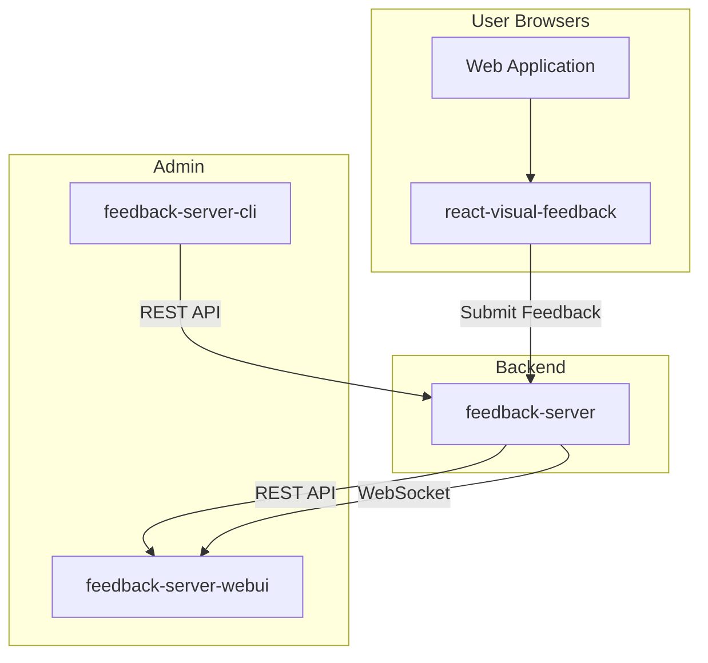
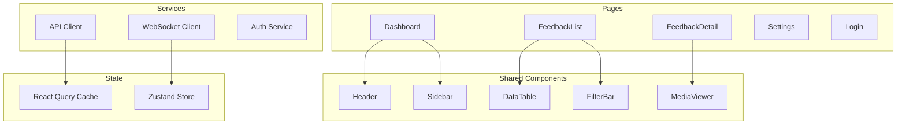
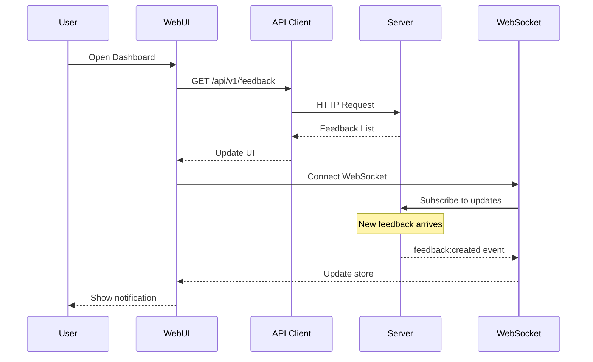
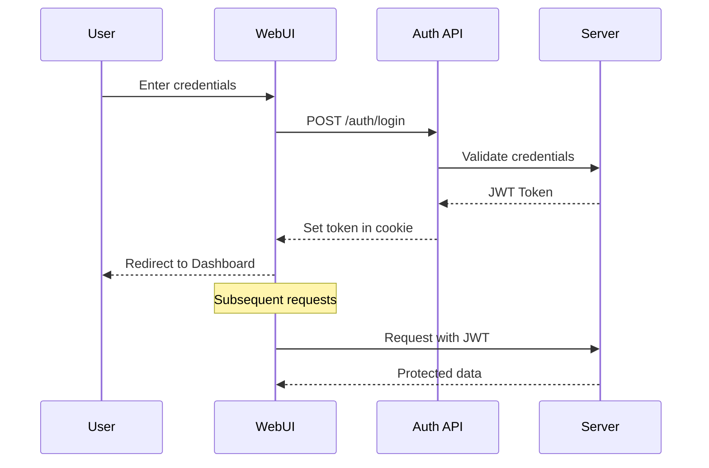

# Feedback Server WebUI - Software Specification

> **Version:** 0.1.0
> **Status:** Draft
> **Last Updated:** 2025-01-15

## 📋 Table of Contents

1. [Overview](#overview)
2. [Goals & Non-Goals](#goals--non-goals)
3. [Feature Matrix](#feature-matrix)
4. [Architecture](#architecture)
5. [Technology Stack](#technology-stack)
6. [UI/UX Design](#uiux-design)
7. [Pages & Components](#pages--components)
8. [State Management](#state-management)
9. [API Integration](#api-integration)
10. [Authentication & Authorization](#authentication--authorization)
11. [Configuration](#configuration)
12. [Deployment](#deployment)
13. [Testing Strategy](#testing-strategy)
14. [References](#references)

---

## Overview

### Purpose

The **Feedback Server WebUI** is an administrative dashboard for managing feedback collected by the `@react-visual-feedback/server`. It provides a visual interface for:

- Viewing and filtering feedback submissions
- Managing feedback status and priority
- Viewing screenshots and video recordings
- Real-time updates via WebSocket
- Exporting data for analysis
- Managing projects and API keys

### Target Users

| User Type            | Description                                                       |
| -------------------- | ----------------------------------------------------------------- |
| **Developers**       | View bug reports with screenshots, console logs, network requests |
| **QA Engineers**     | Manage feedback status, reproduce issues from session replays     |
| **Product Managers** | Review feature requests, analyze feedback trends                  |
| **Administrators**   | Manage projects, users, and API keys                              |

### Relationship to Other Packages



---

## Goals & Non-Goals

### Goals

1. ✅ **Single-page application** for managing feedback
2. ✅ **Real-time updates** when new feedback arrives
3. ✅ **Rich media viewer** for screenshots and videos
4. ✅ **Filtering and search** with saved filters
5. ✅ **Responsive design** for desktop and tablet
6. ✅ **Dark/Light theme** support
7. ✅ **Keyboard navigation** for power users
8. ✅ **Export capabilities** (JSON, CSV)
9. ✅ **Statistics dashboard** with charts

### Non-Goals

1. ❌ **Mobile-first design** (optimized for desktop)
2. ❌ **Offline mode** (requires server connection)
3. ❌ **User registration** (invite-only)
4. ❌ **Public feedback portal** (internal tool)
5. ❌ **Integrations UI** (managed via CLI)

---

## Feature Matrix

| Feature                 | Priority | Status     |
| ----------------------- | -------- | ---------- |
| **Dashboard**           | P0       | 🔲 Planned |
| Overview statistics     | P0       | 🔲         |
| Recent feedback list    | P0       | 🔲         |
| Quick filters           | P1       | 🔲         |
| **Feedback List**       | P0       | 🔲 Planned |
| Table/Grid view         | P0       | 🔲         |
| Sorting & filtering     | P0       | 🔲         |
| Pagination              | P0       | 🔲         |
| Bulk actions            | P1       | 🔲         |
| Saved filters           | P2       | 🔲         |
| **Feedback Detail**     | P0       | 🔲 Planned |
| Metadata display        | P0       | 🔲         |
| Screenshot viewer       | P0       | 🔲         |
| Video player            | P0       | 🔲         |
| Console logs viewer     | P1       | 🔲         |
| Network requests viewer | P1       | 🔲         |
| Status/Priority editor  | P0       | 🔲         |
| **Real-time Updates**   | P1       | 🔲 Planned |
| WebSocket connection    | P1       | 🔲         |
| Toast notifications     | P1       | 🔲         |
| Auto-refresh list       | P1       | 🔲         |
| **Settings**            | P2       | 🔲 Planned |
| Project management      | P2       | 🔲         |
| API key management      | P2       | 🔲         |
| Theme preferences       | P2       | 🔲         |
| **Authentication**      | P0       | 🔲 Planned |
| Login page              | P0       | 🔲         |
| Session management      | P0       | 🔲         |
| Role-based access       | P2       | 🔲         |

---

## Architecture

### Component Architecture



### Data Flow



---

## Technology Stack

### Core Technologies

| Category             | Technology     | Version | Purpose                     |
| -------------------- | -------------- | ------- | --------------------------- |
| **Framework**        | React          | 18.x    | UI framework                |
| **Build Tool**       | Vite           | 6.x     | Fast development and builds |
| **Language**         | TypeScript     | 5.x     | Type safety                 |
| **Styling**          | Tailwind CSS   | 3.x     | Utility-first CSS           |
| **UI Components**    | shadcn/ui      | latest  | Accessible components       |
| **State Management** | Zustand        | 4.x     | Simple state management     |
| **Data Fetching**    | TanStack Query | 5.x     | Server state management     |
| **Routing**          | React Router   | 6.x     | Client-side routing         |
| **Charts**           | Recharts       | 2.x     | Data visualization          |
| **Icons**            | Lucide React   | latest  | Icon library                |

### Development Tools

| Tool       | Purpose                 |
| ---------- | ----------------------- |
| ESLint     | Code linting            |
| Prettier   | Code formatting         |
| Vitest     | Unit testing            |
| Playwright | E2E testing             |
| Storybook  | Component documentation |

---

## UI/UX Design

### Layout Structure

```
┌─────────────────────────────────────────────────────────┐
│  Header (Logo, Search, User Menu, Theme Toggle)         │
├─────────┬───────────────────────────────────────────────┤
│         │                                               │
│ Sidebar │  Main Content Area                            │
│         │                                               │
│ - Dash  │  ┌─────────────────────────────────────────┐  │
│ - List  │  │  Page Title / Breadcrumbs              │  │
│ - Stats │  ├─────────────────────────────────────────┤  │
│ - Sett  │  │                                         │  │
│         │  │  Content (Tables, Forms, Details)       │  │
│         │  │                                         │  │
│         │  │                                         │  │
│         │  └─────────────────────────────────────────┘  │
│         │                                               │
└─────────┴───────────────────────────────────────────────┘
```

### Color Scheme

**Light Theme:**

- Background: `#ffffff`
- Surface: `#f8fafc`
- Primary: `#3b82f6` (Blue)
- Secondary: `#64748b` (Slate)
- Success: `#22c55e` (Green)
- Warning: `#f59e0b` (Amber)
- Error: `#ef4444` (Red)

**Dark Theme:**

- Background: `#0f172a`
- Surface: `#1e293b`
- Primary: `#60a5fa` (Light Blue)
- Same accent colors with adjusted brightness

### Typography

- **Headings:** Inter (sans-serif)
- **Body:** Inter (sans-serif)
- **Code:** JetBrains Mono (monospace)

---

## Pages & Components

### 1. Dashboard Page (`/`)

**Purpose:** Overview of feedback statistics and recent activity

**Components:**

- `StatCard` - Display key metrics (total, by status, by type)
- `FeedbackChart` - Line chart of feedback over time
- `RecentFeedbackList` - Last 10 feedback items
- `QuickFilters` - One-click filters

**Wireframe:**

```
┌─────────────────────────────────────────────────────────┐
│  Dashboard                                              │
├─────────────────────────────────────────────────────────┤
│  ┌─────────┐ ┌─────────┐ ┌─────────┐ ┌─────────┐       │
│  │ Total   │ │ Pending │ │ Bugs    │ │ Features│       │
│  │   247   │ │    32   │ │   156   │ │    91   │       │
│  └─────────┘ └─────────┘ └─────────┘ └─────────┘       │
│                                                         │
│  ┌─────────────────────────────────────────────────┐   │
│  │  Feedback Trend (Last 30 Days)                  │   │
│  │  📈                                              │   │
│  └─────────────────────────────────────────────────┘   │
│                                                         │
│  ┌─────────────────────────────────────────────────┐   │
│  │  Recent Feedback                                 │   │
│  │  • Bug: Login button not working        2m ago  │   │
│  │  • Feature: Dark mode support          15m ago  │   │
│  │  • Bug: Image upload fails              1h ago  │   │
│  └─────────────────────────────────────────────────┘   │
└─────────────────────────────────────────────────────────┘
```

### 2. Feedback List Page (`/feedback`)

**Purpose:** Browse and filter all feedback submissions

**Components:**

- `FilterBar` - Type, status, priority, date range filters
- `SearchInput` - Full-text search
- `FeedbackTable` - Sortable data table
- `Pagination` - Page navigation
- `BulkActions` - Select and act on multiple items

### 3. Feedback Detail Page (`/feedback/:id`)

**Purpose:** View complete feedback details and media

**Components:**

- `FeedbackHeader` - Title, status, priority badges
- `MetadataPanel` - Environment info, user details
- `ScreenshotViewer` - Zoomable screenshot with annotations
- `VideoPlayer` - Embedded video player
- `ConsoleLogViewer` - Formatted console output
- `NetworkRequestViewer` - Request/response viewer
- `StatusEditor` - Change status/priority
- `TagEditor` - Add/remove tags

### 4. Settings Page (`/settings`)

**Purpose:** Configure projects and API access

**Sections:**

- Projects management
- API key generation
- User preferences
- Theme settings

### 5. Login Page (`/login`)

**Purpose:** Authentication entry point

**Components:**

- Login form (email/password)
- "Remember me" option
- Error messages

---

## State Management

### Zustand Store Structure

```typescript
interface AppState {
  // UI State
  theme: "light" | "dark" | "system";
  sidebarOpen: boolean;

  // Real-time State
  wsConnected: boolean;
  notifications: Notification[];

  // Actions
  setTheme: (theme: Theme) => void;
  toggleSidebar: () => void;
  addNotification: (notification: Notification) => void;
  removeNotification: (id: string) => void;
}
```

### React Query for Server State

```typescript
// Queries
useQuery(["feedback", filters], fetchFeedbackList);
useQuery(["feedback", id], fetchFeedbackById);
useQuery(["stats"], fetchStats);

// Mutations
useMutation(updateFeedbackStatus);
useMutation(deleteFeedback);
useMutation(bulkUpdateFeedback);
```

---

## API Integration

### API Client Structure

```typescript
// src/lib/api/client.ts
import { hc } from "hono/client";
import type { AppType } from "@react-visual-feedback/server";

export const api = hc<AppType>(import.meta.env.VITE_API_URL);

// Usage
const feedback = await api.feedback.$get({ query: { page: 1 } });
const detail = await api.feedback[":id"].$get({ param: { id: "123" } });
```

### WebSocket Integration

```typescript
// src/lib/ws/client.ts
export class FeedbackWebSocket {
  private ws: WebSocket;
  private handlers: Map<string, Handler[]>;

  connect(projectId: string): void;
  disconnect(): void;
  on(event: string, handler: Handler): void;
  off(event: string, handler: Handler): void;
}

// Events handled:
// - feedback:created
// - feedback:updated
// - feedback:deleted
// - feedback:status
```

---

## Authentication & Authorization

### Authentication Flow



### Role-Based Access

| Role       | Permissions                         |
| ---------- | ----------------------------------- |
| **Viewer** | Read feedback, view media           |
| **Editor** | + Update status, add tags           |
| **Admin**  | + Delete, manage projects, API keys |

---

## Configuration

### Environment Variables

```bash
# .env.example

# API Configuration
VITE_API_URL=http://localhost:3000
VITE_WS_URL=ws://localhost:3000/ws

# Feature Flags
VITE_ENABLE_VIDEO_PLAYER=true
VITE_ENABLE_EXPORT=true

# Analytics (optional)
VITE_ANALYTICS_ID=

# Build Info
VITE_VERSION=$npm_package_version
```

---

## Deployment

### Docker Build

```dockerfile
# Multi-stage build
FROM node:20-alpine AS builder
WORKDIR /app
COPY package*.json ./
RUN npm ci
COPY . .
RUN npm run build

FROM nginx:alpine
COPY --from=builder /app/dist /usr/share/nginx/html
COPY nginx.conf /etc/nginx/nginx.conf
EXPOSE 80
CMD ["nginx", "-g", "daemon off;"]
```

### Docker Compose Integration

```yaml
services:
  webui:
    build: ./packages/feedback-server-webui
    ports:
      - "8080:80"
    environment:
      - VITE_API_URL=http://server:3000
    depends_on:
      - server
```

---

## Testing Strategy

### Unit Tests

- Component rendering tests
- Hook behavior tests
- Utility function tests
- Store action tests

### Integration Tests

- API client integration
- WebSocket connection
- Auth flow

### E2E Tests

- Login flow
- Feedback list navigation
- Detail view interactions
- Filter and search
- Export functionality

### Coverage Targets

| Type       | Target |
| ---------- | ------ |
| Statements | 80%    |
| Branches   | 75%    |
| Functions  | 80%    |
| Lines      | 80%    |

---

## References

### Related Packages

- [feedback-server](../../../feedback-server/) - Backend API
- [react-visual-feedback](../../../react-visual-feedback/) - Client library
- [feedback-server-cli](../../../feedback-server-cli/) - CLI tool

### External Documentation

- [React Documentation](https://react.dev/)
- [Vite Documentation](https://vitejs.dev/)
- [TanStack Query](https://tanstack.com/query)
- [Zustand](https://zustand-demo.pmnd.rs/)
- [shadcn/ui](https://ui.shadcn.com/)
- [Tailwind CSS](https://tailwindcss.com/)

---

**Document Status:** Draft
**Author:** GitHub Copilot
**Created:** January 2025
