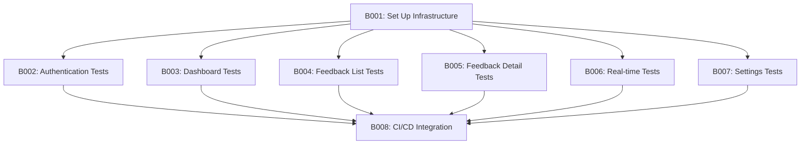

# WebUI BDD Testing Tasks

> **Version:** 1.1.0
> **Status:** 🔄 In Progress
> **Created:** 2025-01-20
> **Updated:** 2025-01-21
> **Related:** [003.webui-user-stories/README.md](../003.webui-user-stories/README.md)

---

## 📊 Quick Status Overview

| Metric          | Value |
| --------------- | ----- |
| **Total Tasks** | 8     |
| **Completed**   | 7     |
| **In Progress** | 0     |
| **Not Started** | 1     |
| **Blocked**     | 0     |

---

## 📋 Task Summary

| Task ID | Title                               | Priority  | Status  | Dependencies |
| ------- | ----------------------------------- | --------- | ------- | ------------ |
| B001    | Set Up BDD Test Infrastructure      | 🟢 High   | ✅ DONE | -            |
| B002    | Implement Authentication BDD Tests  | 🟢 High   | ✅ DONE | B001         |
| B003    | Implement Dashboard BDD Tests       | 🟢 High   | ✅ DONE | B001         |
| B004    | Implement Feedback List BDD Tests   | 🟢 High   | ✅ DONE | B001         |
| B005    | Implement Feedback Detail BDD Tests | 🟢 High   | ✅ DONE | B001         |
| B006    | Implement Real-time Updates Tests   | 🟡 Medium | ✅ DONE | B001         |
| B007    | Implement Settings BDD Tests        | 🟡 Medium | ✅ DONE | B001         |
| B008    | Integration with CI/CD              | 🟡 Medium | 🔲 TODO | B002-B007    |

---

## 📝 Task Details

---

### B001 - Set Up BDD Test Infrastructure

**Status:** ✅ DONE
**Priority:** 🟢 High
**Dependencies:** None

**Description:**

Set up the BDD testing infrastructure for the WebUI package, including:

- Playwright or Cypress configuration for E2E tests
- Test utilities and helpers
- Server management integration with shared Taskfile

**Implementation:**

1. Create `tests/bdd/` directory structure:

```
tests/
├── bdd/
│   ├── authentication.test.ts    # E001 tests
│   ├── dashboard.test.ts         # E002 tests
│   ├── feedback-list.test.ts     # E003 tests
│   ├── feedback-detail.test.ts   # E004 tests
│   ├── realtime-updates.test.ts  # E005 tests
│   └── settings.test.ts          # E006 tests
├── setup.ts                      # Test utilities
└── e2e/                          # Existing E2E tests
```

2. Update `Taskfile.yml` to include shared taskfiles:

```yaml
includes:
  server:
    taskfile: ../../taskfiles/Server.yml
    optional: true
    vars:
      SERVER_NAME: feedback-webui
      SERVER_PORT: "3002"
      SERVER_CMD: bun run dev
      HEALTH_ENDPOINT: /api/health
  testing:
    taskfile: ../../taskfiles/Testing.yml
    optional: true
```

3. Create `tests/setup.ts` with:
   - `DEFAULT_BASE_URL` export
   - Test client helpers
   - Page object models

**Acceptance Criteria:**

- [ ] tests/bdd/ directory created
- [ ] Taskfile.yml includes shared taskfiles
- [ ] tests/setup.ts has DEFAULT_BASE_URL pattern
- [ ] BDD tests can be run with `task test:bdd`

---

### B002 - Implement Authentication BDD Tests

**Status:** ✅ DONE
**Priority:** 🟢 High
**Dependencies:** B001

**Description:**

Implement BDD tests for Epic E001: Authentication (3 user stories).

**User Stories to Test:**

- **US-WUI-001:** User Login
- **US-WUI-002:** Session Persistence
- **US-WUI-003:** User Logout

**Test Scenarios:**

```typescript
describe("E001: Authentication", () => {
  describe("US-WUI-001: User Login", () => {
    it(
      "Given I am on the login page, When I enter valid credentials, Then I should be redirected to dashboard",
    );
    it("Given I enter invalid credentials, Then I should see error message");
    it(
      "Given I click Login without credentials, Then I should see validation errors",
    );
    it("Given I check Remember Me, Then my session should persist");
  });

  describe("US-WUI-002: Session Persistence", () => {
    it(
      "Given I am logged in, When I refresh the page, Then I should remain logged in",
    );
    it(
      "Given my session expires, When I access protected page, Then I should be redirected to login",
    );
  });

  describe("US-WUI-003: User Logout", () => {
    it(
      "Given I am logged in, When I click logout, Then I should be logged out",
    );
    it("And my session token should be invalidated");
  });
});
```

**Acceptance Criteria:**

- [ ] All 3 user story scenarios tested
- [ ] Tests follow Given/When/Then pattern
- [ ] Tests pass with running server

---

### B003 - Implement Dashboard BDD Tests

**Status:** ✅ DONE
**Priority:** 🟢 High
**Dependencies:** B001

**Description:**

Implement BDD tests for Epic E002: Dashboard (2 user stories).

**User Stories to Test:**

- **US-WUI-004:** View Dashboard Overview
- **US-WUI-005:** Dashboard Statistics

**Acceptance Criteria:**

- [ ] All 2 user story scenarios tested
- [ ] Tests follow Given/When/Then pattern
- [ ] Tests pass with running server

---

### B004 - Implement Feedback List BDD Tests

**Status:** ✅ DONE
**Priority:** 🟢 High
**Dependencies:** B001

**Description:**

Implement BDD tests for Epic E003: Feedback List (4 user stories).

**User Stories to Test:**

- **US-WUI-006:** View Feedback List
- **US-WUI-007:** Filter Feedback
- **US-WUI-008:** Search Feedback
- **US-WUI-009:** Paginate Feedback

**Acceptance Criteria:**

- [ ] All 4 user story scenarios tested
- [ ] Tests follow Given/When/Then pattern
- [ ] Tests pass with running server

---

### B005 - Implement Feedback Detail BDD Tests

**Status:** ✅ DONE
**Priority:** 🟢 High
**Dependencies:** B001

**Description:**

Implement BDD tests for Epic E004: Feedback Detail (4 user stories).

**User Stories to Test:**

- **US-WUI-010:** View Feedback Detail
- **US-WUI-011:** Update Feedback Status
- **US-WUI-012:** View Screenshots
- **US-WUI-013:** Delete Feedback

**Acceptance Criteria:**

- [ ] All 4 user story scenarios tested
- [ ] Tests follow Given/When/Then pattern
- [ ] Tests pass with running server

---

### B006 - Implement Real-time Updates Tests

**Status:** ✅ DONE
**Priority:** 🟡 Medium
**Dependencies:** B001

**Description:**

Implement BDD tests for Epic E005: Real-time Updates (3 user stories).

**User Stories to Test:**

- **US-WUI-014:** Real-time Feedback Notifications
- **US-WUI-015:** Live Status Updates
- **US-WUI-016:** Connection Status Indicator

**Technical Notes:**

- May require WebSocket testing capabilities
- Consider using mock WebSocket server for tests

**Acceptance Criteria:**

- [ ] All 3 user story scenarios tested
- [ ] WebSocket events properly tested
- [ ] Tests pass with running server

---

### B007 - Implement Settings BDD Tests

**Status:** ✅ DONE
**Priority:** 🟡 Medium
**Dependencies:** B001

**Description:**

Implement BDD tests for Epic E006: Settings & Preferences (2 user stories).

**User Stories to Test:**

- **US-WUI-017:** User Preferences
- **US-WUI-018:** Theme Settings

**Acceptance Criteria:**

- [ ] All 2 user story scenarios tested
- [ ] Tests follow Given/When/Then pattern
- [ ] Tests pass with running server

---

### B008 - Integration with CI/CD

**Status:** 🔲 TODO
**Priority:** 🟡 Medium
**Dependencies:** B002, B003, B004, B005, B006, B007

**Description:**

Integrate BDD tests with CI/CD pipeline.

**Implementation:**

1. Update GitHub Actions workflow:

```yaml
- name: Run WebUI BDD Tests
  run: |
    cd packages/feedback-server-webui
    task test:with-server
```

2. Add test reporting and coverage

3. Configure parallel test execution

**Acceptance Criteria:**

- [ ] BDD tests run in CI pipeline
- [ ] Test results are reported
- [ ] Failure blocks PR merge

---

## 🔄 Implementation Order



---

## 📝 Implementation Notes

### Test Framework Choice

Recommend using **Playwright** for WebUI BDD tests:

- Built-in browser automation
- Excellent TypeScript support
- Cross-browser testing
- Network interception for mocking
- Video recording for debugging

### Page Object Model

Use Page Object Model for maintainability:

```typescript
// pages/LoginPage.ts
export class LoginPage {
  constructor(private page: Page) {}

  async goto() {
    await this.page.goto("/login");
  }

  async login(email: string, password: string) {
    await this.page.fill('[name="email"]', email);
    await this.page.fill('[name="password"]', password);
    await this.page.click('button[type="submit"]');
  }
}
```

### Test Data Management

Use fixtures for test data:

```typescript
// fixtures/users.ts
export const testUser = {
  email: "test@example.com",
  password: "Test123!",
};
```

---

## 🔗 Related Documents

- [003.webui-user-stories/README.md](../003.webui-user-stories/README.md) - User stories with Gherkin
- [002.webui-tasks/README.md](../002.webui-tasks/README.md) - General WebUI tasks
- [../../taskfiles/Server.yml](../../../../taskfiles/Server.yml) - Shared server management
- [../../taskfiles/Testing.yml](../../../../taskfiles/Testing.yml) - Shared testing utilities

---

**Document Status:** Active
**Author:** GitHub Copilot
**Created:** January 2025
