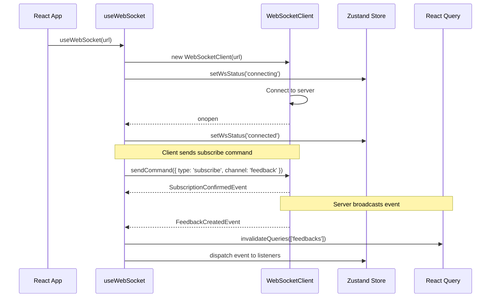
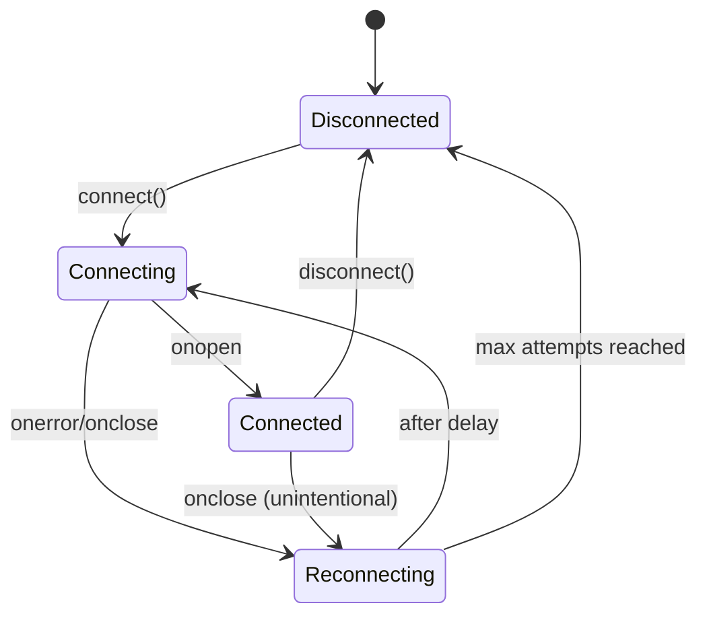

# 005: WebSocket API-First Integration Addon Specification

> **Addon Specification** for `feedback-server-webui` package
> **Version:** 0.1.0
> **Status:** Draft
> **Dependencies:** 
>   - `packages/feedback-server-api/docs/spec/001.websocket-addon-specification`
>   - `packages/feedback-server/docs/spec/006.websocket-api-first-integration`

---

## 📋 Overview

This addon specification describes how to implement WebSocket client integration in the `feedback-server-webui` React application using TypeSpec-generated types from `@feedback/api-types` and JSON Schema validation from `@feedback/api-schemas`.

### Current State

The `feedback-server-webui` package has:

- `WebSocketStatus` type in UI store (`disconnected`, `connecting`, `connected`, `reconnecting`)
- `useWebSocketStatus()` hook for accessing connection state
- No actual WebSocket client implementation (TASK-WUI-021 is pending)

### Target State

Implement:

1. **Type-safe WebSocket client** using `@feedback/api-types`
2. **React hooks** for WebSocket communication
3. **React Query integration** for cache invalidation on events
4. **Zustand store integration** for connection state
5. **Automatic reconnection** with exponential backoff

---

## 🎯 Goals & Non-Goals

### Goals

1. ✅ Create reusable `useWebSocket` hook with type-safe messaging
2. ✅ Integrate WebSocket events with React Query cache
3. ✅ Integrate WebSocket status with Zustand UI store
4. ✅ Support typed `sendCommand()` for client-to-server messages
5. ✅ Implement automatic reconnection with backoff
6. ✅ Support subscription management for feedback channels

### Non-Goals

1. ❌ Implement custom WebSocket protocol (use standard browser WebSocket)
2. ❌ Add service worker for offline sync (separate feature)
3. ❌ Support multiple simultaneous WebSocket connections

---

## 🏗️ Architecture

### Directory Structure

```
packages/feedback-server-webui/src/
├── hooks/
│   ├── index.ts                  # Re-exports
│   ├── useWebSocket.ts           # NEW: Main WebSocket hook
│   ├── useFeedbackSubscription.ts # NEW: Feedback-specific subscription
│   └── ...
├── lib/
│   ├── websocket/                # NEW: WebSocket client library
│   │   ├── index.ts              # Re-exports
│   │   ├── client.ts             # WebSocket client class
│   │   ├── types.ts              # Extended client types
│   │   └── reconnect.ts          # Reconnection logic
│   └── ...
├── stores/
│   └── ui.ts                     # MODIFY: Add WebSocket actions
└── ...
```

### Component Flow



### Hook Composition

```mermaid
graph TD
    subgraph "Application Layer"
        FeedbackList[FeedbackList Component]
        FeedbackDetail[FeedbackDetail Component]
    end
    
    subgraph "Hook Layer"
        useFeedbackSub[useFeedbackSubscription]
        useWS[useWebSocket]
    end
    
    subgraph "Library Layer"
        WSClient[WebSocketClient]
        Reconnect[ReconnectManager]
    end
    
    subgraph "External"
        Store[Zustand Store]
        RQ[React Query]
        Types[@feedback/api-types]
    end
    
    FeedbackList --> useFeedbackSub
    FeedbackDetail --> useFeedbackSub
    useFeedbackSub --> useWS
    useWS --> WSClient
    WSClient --> Reconnect
    useWS --> Store
    useWS --> RQ
    useWS --> Types
```

---

## 🔧 Integration Points

### 1. Package Dependencies

Add to `packages/feedback-server-webui/package.json`:

```json
{
  "dependencies": {
    "@feedback/api-types": "workspace:*"
  }
}
```

**Note:** JSON Schema validation is optional on the client side. The server validates all messages.

### 2. Type Imports

```typescript
// src/hooks/useWebSocket.ts
import type { 
  ServerEvents, 
  ClientCommands,
  SubscribeCommand,
  UnsubscribeCommand,
  PingCommand,
  FeedbackCreatedEvent,
  FeedbackUpdatedEvent,
  FeedbackDeletedEvent,
  ConnectionAckEvent,
  SubscriptionConfirmedEvent,
  ErrorEvent,
  PongEvent,
} from "@feedback/api-types";
```

### 3. React Query Integration

Invalidate/update cache on server events:

```typescript
// When FeedbackCreatedEvent received
queryClient.invalidateQueries({ queryKey: ["feedbacks"] });

// When FeedbackUpdatedEvent received
queryClient.setQueryData(
  ["feedback", event.feedback.id],
  event.feedback
);
// Also invalidate list
queryClient.invalidateQueries({ queryKey: ["feedbacks"] });

// When FeedbackDeletedEvent received
queryClient.removeQueries({ queryKey: ["feedback", event.feedbackId] });
queryClient.invalidateQueries({ queryKey: ["feedbacks"] });
```

### 4. Zustand Store Integration

```typescript
// src/stores/ui.ts - Add to existing UIState
interface UIState {
  // Existing...
  wsStatus: WebSocketStatus;
  wsConnectionId: string | null;
  wsLastError: string | null;
  
  // Actions
  setWsStatus: (status: WebSocketStatus) => void;
  setWsConnectionId: (id: string | null) => void;
  setWsLastError: (error: string | null) => void;
}
```

---

## 📊 Hook API Design

### `useWebSocket` Hook

```typescript
interface UseWebSocketOptions {
  url: string;
  autoConnect?: boolean;
  autoReconnect?: boolean;
  reconnectInterval?: number;
  maxReconnectAttempts?: number;
  onEvent?: (event: ServerEvents) => void;
}

interface UseWebSocketReturn {
  // Connection state
  status: WebSocketStatus;
  connectionId: string | null;
  lastError: string | null;
  
  // Actions
  connect: () => void;
  disconnect: () => void;
  sendCommand: (command: ClientCommands) => void;
  
  // Subscription helpers
  subscribe: (channel: string, filters?: SubscriptionFilters) => void;
  unsubscribe: (channel: string) => void;
  
  // Keep-alive
  ping: () => void;
}
```

### `useFeedbackSubscription` Hook

```typescript
interface UseFeedbackSubscriptionOptions {
  projectId?: string;
  autoSubscribe?: boolean;
  onFeedbackCreated?: (event: FeedbackCreatedEvent) => void;
  onFeedbackUpdated?: (event: FeedbackUpdatedEvent) => void;
  onFeedbackDeleted?: (event: FeedbackDeletedEvent) => void;
}

interface UseFeedbackSubscriptionReturn {
  isSubscribed: boolean;
  subscribe: () => void;
  unsubscribe: () => void;
}
```

---

## 🔄 Event Handling

### Event Dispatch Pattern

```typescript
// Event handler in useWebSocket
function handleServerEvent(event: ServerEvents) {
  switch (event.type) {
    case "connection.ack":
      handleConnectionAck(event);
      break;
    case "subscription.confirmed":
      handleSubscriptionConfirmed(event);
      break;
    case "feedback.created":
      handleFeedbackCreated(event);
      break;
    case "feedback.updated":
      handleFeedbackUpdated(event);
      break;
    case "feedback.deleted":
      handleFeedbackDeleted(event);
      break;
    case "error":
      handleError(event);
      break;
    case "pong":
      handlePong(event);
      break;
  }
}
```

### Cache Update Strategy

| Event Type | Cache Action |
|-----------|--------------|
| `feedback.created` | Invalidate list query |
| `feedback.updated` | Update item + invalidate list |
| `feedback.deleted` | Remove item + invalidate list |

---

## 🔁 Reconnection Strategy

### Exponential Backoff

```typescript
const INITIAL_DELAY = 1000;     // 1 second
const MAX_DELAY = 30000;        // 30 seconds
const BACKOFF_MULTIPLIER = 2;
const MAX_ATTEMPTS = 10;

function getReconnectDelay(attempt: number): number {
  const delay = INITIAL_DELAY * Math.pow(BACKOFF_MULTIPLIER, attempt);
  return Math.min(delay, MAX_DELAY);
}
```

### Reconnection Flow



### State Preservation

On reconnection:

1. **Restore subscriptions** - Re-send subscribe commands
2. **Update UI state** - Show "reconnecting" status
3. **Handle errors** - Show toast notification

---

## 🧪 Testing Strategy

### Unit Tests

1. **WebSocket client tests** - Mock WebSocket, test message handling
2. **Hook tests** - Use React Testing Library, mock client
3. **Event handler tests** - Verify React Query cache updates

### Integration Tests

1. **Connection flow** - Connect, receive ack, subscribe
2. **Event propagation** - Server event → UI update
3. **Reconnection** - Simulate disconnect, verify reconnect

### E2E Tests

1. **Real-time updates** - Create feedback via API, verify list updates
2. **Multi-client** - Open two browsers, verify sync

---

## 📁 Files to Create/Modify

### New Files

| File | Purpose |
|------|---------|
| `src/lib/websocket/index.ts` | Module re-exports |
| `src/lib/websocket/client.ts` | WebSocket client class |
| `src/lib/websocket/types.ts` | Client-specific types |
| `src/lib/websocket/reconnect.ts` | Reconnection logic |
| `src/hooks/useWebSocket.ts` | Main WebSocket hook |
| `src/hooks/useFeedbackSubscription.ts` | Feedback subscription hook |

### Modified Files

| File | Changes |
|------|---------|
| `src/stores/ui.ts` | Add WebSocket connection state/actions |
| `src/hooks/index.ts` | Export new hooks |
| `package.json` | Add `@feedback/api-types` dependency |

---

## 🔗 Relationship to Existing Tasks

This addon specification provides the foundation for:

- **TASK-WUI-021**: Create WebSocket Client
- **TASK-WUI-022**: Integrate WebSocket with Store
- **TASK-WUI-023**: Implement Real-time UI Updates

These existing tasks should reference this specification for implementation details.

---

## 📚 References

- [WebSocket Addon Specification](../../../feedback-server-api/docs/spec/001.websocket-addon-specification/README.md)
- [WebSocket Addon Tasks](../../../feedback-server-api/docs/spec/002.websocket-addon-tasks/TASKS-OVERVIEW.md)
- [Server WebSocket Integration](../../../feedback-server/docs/spec/006.websocket-api-first-integration/README.md)
- [WebUI Tasks Overview](../002.webui-tasks/TASKS-OVERVIEW.md)

---

**Document compiled by:** GitHub Copilot
**For project:** react-feedback-widget / feedback-server-webui
**Date:** January 2025
