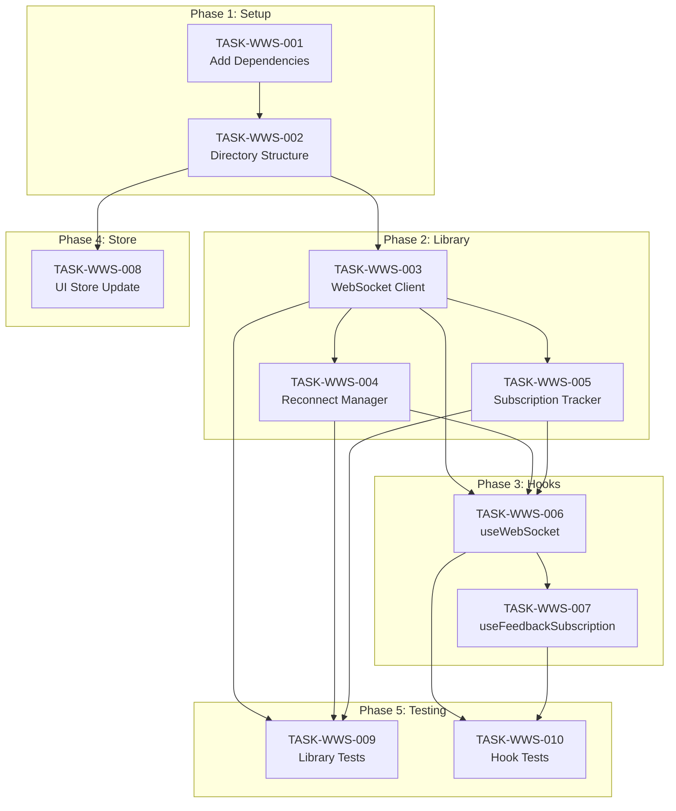

# 005: WebSocket API-First Integration Tasks

> **Tasks for:** `feedback-server-webui` package
> **Related Specification:** [README.md](./README.md) > **Status:** 0/10 Complete

---

## 📊 Task Summary

| Category          | Tasks  | Completed | Remaining |
| ----------------- | ------ | --------- | --------- |
| Setup             | 2      | 0         | 2         |
| Library           | 3      | 0         | 3         |
| Hooks             | 2      | 0         | 2         |
| Store Integration | 1      | 0         | 1         |
| Testing           | 2      | 0         | 2         |
| **Total**         | **10** | **0**     | **10**    |

---

## 🔧 Category: Setup

### TASK-WWS-001: Add WebSocket API-First Dependencies

**Priority:** P1 - High
**Estimated Effort:** 15 minutes
**Status:** 📋 NOT STARTED
**Dependencies:** `feedback-server-api` WebSocket tasks (WS-007)

**Description:**
Add the required dependencies for WebSocket API-First integration.

**Acceptance Criteria:**

- [ ] Add `@feedback/api-types` workspace dependency
- [ ] Run `bun install` to update lockfile
- [ ] Verify types are accessible with `import type { ServerEvents } from "@feedback/api-types"`

**Files to Modify:**

- `package.json`

---

### TASK-WWS-002: Create WebSocket Library Directory Structure

**Priority:** P1 - High
**Estimated Effort:** 15 minutes
**Status:** 📋 NOT STARTED
**Dependencies:** TASK-WWS-001

**Description:**
Create the `src/lib/websocket/` library directory structure.

**Acceptance Criteria:**

- [ ] Create `src/lib/websocket/` directory
- [ ] Create `src/lib/websocket/index.ts` with placeholder exports
- [ ] Create `src/lib/websocket/types.ts` for client-specific types
- [ ] Verify module structure matches specification

**Files to Create:**

- `src/lib/websocket/index.ts`
- `src/lib/websocket/types.ts`

---

## 📚 Category: Library

### TASK-WWS-003: Create WebSocket Client Class

**Priority:** P1 - High
**Estimated Effort:** 2 hours
**Status:** 📋 NOT STARTED
**Dependencies:** TASK-WWS-002

**Description:**
Create the core WebSocket client class that handles connection and messaging.

**Acceptance Criteria:**

- [ ] Create `src/lib/websocket/client.ts`
- [ ] Implement `WebSocketClient` class
- [ ] Support typed `sendCommand(command: ClientCommands)`
- [ ] Parse incoming messages as `ServerEvents`
- [ ] Emit events via callback pattern
- [ ] Handle connection lifecycle (open, close, error)
- [ ] Include connection ID tracking from `ConnectionAckEvent`

**Files to Create:**

- `src/lib/websocket/client.ts`

**Implementation Notes:**

```typescript
import type { ServerEvents, ClientCommands } from "@feedback/api-types";

export type WebSocketClientOptions = {
  url: string;
  onEvent: (event: ServerEvents) => void;
  onStatusChange: (status: WebSocketStatus) => void;
};

export class WebSocketClient {
  private ws: WebSocket | null = null;
  private connectionId: string | null = null;

  constructor(private options: WebSocketClientOptions) {}

  connect(): void {
    /* ... */
  }
  disconnect(): void {
    /* ... */
  }
  sendCommand(command: ClientCommands): void {
    /* ... */
  }
}
```

---

### TASK-WWS-004: Create Reconnection Manager

**Priority:** P1 - High
**Estimated Effort:** 1 hour
**Status:** 📋 NOT STARTED
**Dependencies:** TASK-WWS-003

**Description:**
Create reconnection logic with exponential backoff.

**Acceptance Criteria:**

- [ ] Create `src/lib/websocket/reconnect.ts`
- [ ] Implement exponential backoff (1s → 2s → 4s → ... → 30s max)
- [ ] Support maximum reconnection attempts (default: 10)
- [ ] Track reconnection state
- [ ] Provide `reset()` method for successful connections
- [ ] Emit status changes during reconnection

**Files to Create:**

- `src/lib/websocket/reconnect.ts`

**Implementation Notes:**

```typescript
export interface ReconnectManager {
  scheduleReconnect(callback: () => void): void;
  reset(): void;
  cancel(): void;
  getAttempt(): number;
  hasReachedMaxAttempts(): boolean;
}
```

---

### TASK-WWS-005: Create Subscription Tracker

**Priority:** P1 - High
**Estimated Effort:** 1 hour
**Status:** 📋 NOT STARTED
**Dependencies:** TASK-WWS-003

**Description:**
Create subscription tracking for automatic re-subscription on reconnect.

**Acceptance Criteria:**

- [ ] Add subscription tracking to client or separate module
- [ ] Track active subscriptions (channel, filters)
- [ ] Provide method to re-subscribe all on reconnect
- [ ] Update subscription state on `SubscriptionConfirmedEvent`
- [ ] Remove subscription on unsubscribe

**Files to Modify:**

- `src/lib/websocket/client.ts` or new `src/lib/websocket/subscriptions.ts`

---

## 🪝 Category: Hooks

### TASK-WWS-006: Create useWebSocket Hook

**Priority:** P1 - High
**Estimated Effort:** 2 hours
**Status:** 📋 NOT STARTED
**Dependencies:** TASK-WWS-003, TASK-WWS-004, TASK-WWS-005

**Description:**
Create the main React hook for WebSocket communication.

**Acceptance Criteria:**

- [ ] Create `src/hooks/useWebSocket.ts`
- [ ] Initialize WebSocket client on mount
- [ ] Expose connection state from Zustand store
- [ ] Provide `sendCommand()` function
- [ ] Provide `subscribe()` and `unsubscribe()` helpers
- [ ] Provide `ping()` for keep-alive
- [ ] Handle automatic reconnection
- [ ] Clean up on unmount

**Files to Create:**

- `src/hooks/useWebSocket.ts`

**Implementation Notes:**

```typescript
export function useWebSocket(options: UseWebSocketOptions): UseWebSocketReturn {
  const { url, autoConnect = true, autoReconnect = true } = options;
  const queryClient = useQueryClient();
  const { setWsStatus, setWsConnectionId } = useUIStore();

  // Implementation...

  return {
    status,
    connectionId,
    connect,
    disconnect,
    sendCommand,
    subscribe,
    unsubscribe,
    ping,
  };
}
```

---

### TASK-WWS-007: Create useFeedbackSubscription Hook

**Priority:** P2 - Medium
**Estimated Effort:** 1 hour
**Status:** 📋 NOT STARTED
**Dependencies:** TASK-WWS-006

**Description:**
Create a convenience hook for subscribing to feedback events.

**Acceptance Criteria:**

- [ ] Create `src/hooks/useFeedbackSubscription.ts`
- [ ] Use `useWebSocket` internally
- [ ] Auto-subscribe on mount (if enabled)
- [ ] Support project-specific subscriptions
- [ ] Provide callbacks for `onFeedbackCreated`, `onFeedbackUpdated`, `onFeedbackDeleted`
- [ ] Integrate with React Query for cache updates
- [ ] Auto-unsubscribe on unmount

**Files to Create:**

- `src/hooks/useFeedbackSubscription.ts`

**Implementation Notes:**

```typescript
export function useFeedbackSubscription(
  options: UseFeedbackSubscriptionOptions = {},
): UseFeedbackSubscriptionReturn {
  const { projectId, autoSubscribe = true } = options;
  const ws = useWebSocket({ url: getWebSocketUrl() });
  const queryClient = useQueryClient();

  // Handle events, update cache

  return {
    isSubscribed,
    subscribe,
    unsubscribe,
  };
}
```

---

## 🏪 Category: Store Integration

### TASK-WWS-008: Update UI Store for WebSocket State

**Priority:** P2 - Medium
**Estimated Effort:** 30 minutes
**Status:** 📋 NOT STARTED
**Dependencies:** TASK-WWS-002

**Description:**
Extend the Zustand UI store with additional WebSocket state and actions.

**Acceptance Criteria:**

- [ ] Add `wsConnectionId: string | null` to state
- [ ] Add `wsLastError: string | null` to state
- [ ] Add `setWsConnectionId(id: string | null)` action
- [ ] Add `setWsLastError(error: string | null)` action
- [ ] Update `useWebSocketStatus()` hook if needed
- [ ] Export new selectors

**Files to Modify:**

- `src/stores/ui.ts`
- `src/stores/index.ts`

---

## 🧪 Category: Testing

### TASK-WWS-009: Unit Tests for WebSocket Library

**Priority:** P2 - Medium
**Estimated Effort:** 2 hours
**Status:** 📋 NOT STARTED
**Dependencies:** TASK-WWS-003, TASK-WWS-004, TASK-WWS-005

**Description:**
Write unit tests for the WebSocket library components.

**Acceptance Criteria:**

- [ ] Create `src/lib/websocket/__tests__/client.test.ts`
- [ ] Create `src/lib/websocket/__tests__/reconnect.test.ts`
- [ ] Mock browser WebSocket API
- [ ] Test connection lifecycle
- [ ] Test message sending and receiving
- [ ] Test reconnection logic with mocked timers
- [ ] Achieve >80% code coverage for module

**Files to Create:**

- `src/lib/websocket/__tests__/client.test.ts`
- `src/lib/websocket/__tests__/reconnect.test.ts`

---

### TASK-WWS-010: Unit Tests for WebSocket Hooks

**Priority:** P2 - Medium
**Estimated Effort:** 2 hours
**Status:** 📋 NOT STARTED
**Dependencies:** TASK-WWS-006, TASK-WWS-007

**Description:**
Write unit tests for the WebSocket React hooks.

**Acceptance Criteria:**

- [ ] Create `src/hooks/__tests__/useWebSocket.test.tsx`
- [ ] Create `src/hooks/__tests__/useFeedbackSubscription.test.tsx`
- [ ] Use React Testing Library
- [ ] Mock WebSocket client
- [ ] Test connection state updates
- [ ] Test command sending
- [ ] Test subscription management
- [ ] Test React Query cache updates on events

**Files to Create:**

- `src/hooks/__tests__/useWebSocket.test.tsx`
- `src/hooks/__tests__/useFeedbackSubscription.test.tsx`

---

## 📊 Task Dependencies Diagram



---

## 🔗 Relationship to Existing WebUI Tasks

These tasks provide the foundation for the existing real-time tasks:

| Existing Task                                | Relationship                                                      |
| -------------------------------------------- | ----------------------------------------------------------------- |
| TASK-WUI-021: Create WebSocket Client        | Covered by TASK-WWS-003, TASK-WWS-004, TASK-WWS-005, TASK-WWS-006 |
| TASK-WUI-022: Integrate WebSocket with Store | Covered by TASK-WWS-007, TASK-WWS-008                             |
| TASK-WUI-023: Implement Real-time UI Updates | Uses hooks from this spec                                         |

After completing these tasks, TASK-WUI-021 and TASK-WUI-022 can be marked as complete. TASK-WUI-023 focuses on UI components that use these hooks.

---

## 🚀 Suggested Implementation Order

1. **TASK-WWS-001** - Add dependencies (15 min)
2. **TASK-WWS-002** - Directory structure (15 min)
3. **TASK-WWS-008** - UI Store update (30 min)
4. **TASK-WWS-003** - WebSocket client (2 hours)
5. **TASK-WWS-004** - Reconnect manager (1 hour)
6. **TASK-WWS-005** - Subscription tracker (1 hour)
7. **TASK-WWS-006** - useWebSocket hook (2 hours)
8. **TASK-WWS-007** - useFeedbackSubscription hook (1 hour)
9. **TASK-WWS-009** - Library tests (2 hours)
10. **TASK-WWS-010** - Hook tests (2 hours)

**Total Estimated Effort:** ~12 hours

---

**Document compiled by:** GitHub Copilot
**For project:** react-feedback-widget / feedback-server-webui
**Date:** January 2025
