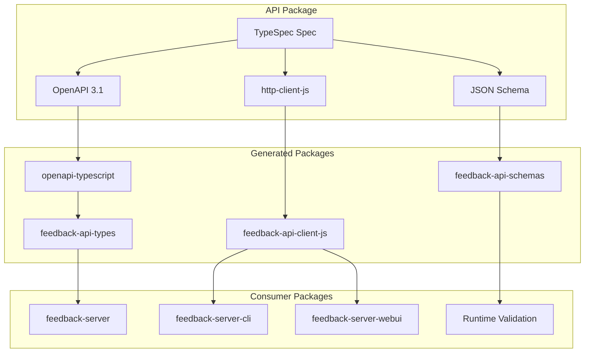

# Modular API Package Architecture

## Overview

This document analyzes the benefits and implementation strategy for extracting the API specification from `feedback-server` into a standalone `feedback-server-api` package, enabling a truly modular API-First architecture.

---

## 🎯 The Vision

### Current State (Tight Coupling)

```
packages/
├── feedback-server/
│   ├── typespec/           # API spec bundled with implementation
│   ├── src/generated/      # Generated types internal
│   └── src/                # Server implementation
```

**Problems:**

- API specification is tightly coupled to one server implementation
- Generated types are not easily shared with other packages
- TypeSpec tooling and emitter configs buried in server package
- No clear separation of concerns

### Target State (Loose Coupling)

```
packages/
├── feedback-server-api/            # Standalone API specification
│   ├── typespec/                   # TypeSpec definitions
│   ├── Taskfile.yml                # Code generation tasks
│   └── tspconfig.yaml              # Emitter configurations
├── generated/                      # Generated code packages
│   ├── feedback-api-types/         # TypeScript types (openapi-typescript)
│   ├── feedback-api-client-js/     # JavaScript client SDK
│   ├── feedback-api-client-python/ # Python client SDK (optional)
│   └── feedback-api-schemas/       # JSON Schemas (optional)
├── feedback-server/                # Implementation (uses generated types)
├── feedback-server-cli/            # CLI (uses generated client)
└── feedback-server-webui/          # WebUI (uses generated client)
```

**Benefits:**

- ✅ Single source of truth for API contract
- ✅ Generated packages as workspace dependencies
- ✅ Clear separation: spec → generation → implementation
- ✅ Framework-agnostic SDK generation
- ✅ Easy to add new generators/emitters

---

## 📊 TypeSpec Emitters Analysis

Based on research from [typespec.io](https://typespec.io), the following emitters are available:

### Core Emitters (Production Ready)

| Emitter                 | Output      | Status    | Use Case                         |
| ----------------------- | ----------- | --------- | -------------------------------- |
| `@typespec/openapi3`    | OpenAPI 3.x | ✅ 1.0 GA | API documentation, tooling       |
| `@typespec/json-schema` | JSON Schema | ✅ 1.0 GA | Data validation, form generation |

### Client Emitters (Preview)

| Emitter                        | Language   | Status     | Use Case                |
| ------------------------------ | ---------- | ---------- | ----------------------- |
| `@typespec/http-client-js`     | JavaScript | 🟡 Preview | Browser/Node.js clients |
| `@typespec/http-client-python` | Python     | 🟡 Preview | Python clients          |
| `@typespec/http-client-java`   | Java       | 🟡 Preview | Java clients            |
| `@typespec/http-client-csharp` | C#         | 🟡 Preview | .NET clients            |

### Server Emitters (Preview)

| Emitter                        | Framework  | Status     | Use Case        |
| ------------------------------ | ---------- | ---------- | --------------- |
| `@typespec/http-server-js`     | Express.js | 🟡 Preview | Node.js servers |
| `@typespec/http-server-csharp` | ASP.NET    | 🟡 Preview | .NET servers    |

### Special Emitters

| Emitter              | Output   | Status     | Use Case                  |
| -------------------- | -------- | ---------- | ------------------------- |
| `@typespec/protobuf` | Protobuf | 🟡 Preview | gRPC services, WebSockets |

---

## 🔧 OpenAPI-Based Generation Pipeline

Since TypeSpec's `http-server-js` only supports Express.js (not Hono), we use a hybrid approach:



---

## 🛠️ Taskfile.yml Approach

### Why Taskfile over package.json Scripts?

| Aspect            | package.json scripts | Taskfile.yml          |
| ----------------- | -------------------- | --------------------- |
| **Complexity**    | Simple commands only | Complex workflows     |
| **Dependencies**  | Manual chaining      | Built-in `deps:`      |
| **Variables**     | Limited              | Full variable support |
| **Conditionals**  | None                 | `if:` conditions      |
| **Parallelism**   | `&` hacks            | Native parallel tasks |
| **Documentation** | None                 | Built-in descriptions |
| **Cross-package** | Difficult            | Easy with includes    |

### Example API Package Taskfile

```yaml
# packages/feedback-server-api/Taskfile.yml
version: "3"

vars:
  TYPESPEC_DIR: ./typespec
  OUTPUT_DIR: ../generated

tasks:
  default:
    desc: Build all generated packages
    cmds:
      - task: generate:all

  generate:all:
    desc: Generate all code from TypeSpec
    deps:
      - generate:openapi
      - generate:json-schema
    cmds:
      - task: generate:types
      - task: generate:client-js

  generate:openapi:
    desc: Generate OpenAPI 3.1 specification
    sources:
      - "{{.TYPESPEC_DIR}}/**/*.tsp"
    generates:
      - "{{.OUTPUT_DIR}}/openapi/openapi.yaml"
    cmds:
      - tsp compile {{.TYPESPEC_DIR}} --emit @typespec/openapi3

  generate:json-schema:
    desc: Generate JSON Schema for validation
    sources:
      - "{{.TYPESPEC_DIR}}/**/*.tsp"
    generates:
      - "{{.OUTPUT_DIR}}/schemas/*.json"
    cmds:
      - tsp compile {{.TYPESPEC_DIR}} --emit @typespec/json-schema

  generate:types:
    desc: Generate TypeScript types from OpenAPI
    deps: [generate:openapi]
    cmds:
      - openapi-typescript {{.OUTPUT_DIR}}/openapi/openapi.yaml -o {{.OUTPUT_DIR}}/feedback-api-types/src/api-types.d.ts

  generate:client-js:
    desc: Generate JavaScript client SDK
    sources:
      - "{{.TYPESPEC_DIR}}/**/*.tsp"
    cmds:
      - tsp compile {{.TYPESPEC_DIR}} --emit @typespec/http-client-js

  clean:
    desc: Clean generated files
    cmds:
      - rm -rf {{.OUTPUT_DIR}}/feedback-api-types/src/*.d.ts
      - rm -rf {{.OUTPUT_DIR}}/feedback-api-client-js/src

  version:
    desc: Update version in generated packages
    vars:
      VERSION: "{{.CLI_ARGS}}"
    cmds:
      - |
        for pkg in feedback-api-types feedback-api-client-js; do
          jq ".version = \"{{.VERSION}}\"" {{.OUTPUT_DIR}}/$pkg/package.json > tmp.json
          mv tmp.json {{.OUTPUT_DIR}}/$pkg/package.json
        done
```

### Root Taskfile for Monorepo

```yaml
# Taskfile.yml (monorepo root)
version: "3"

includes:
  api: ./packages/feedback-server-api
  server: ./packages/feedback-server

tasks:
  default:
    desc: Build entire project
    cmds:
      - task: build

  build:
    desc: Build all packages in dependency order
    cmds:
      - task: api:generate:all
      - task: server:build

  dev:
    desc: Start development servers
    deps:
      - api:generate:all
    cmds:
      - task: server:dev

  test:
    desc: Run all tests
    cmds:
      - bun run --filter "*" test
```

---

## 📦 Generated Package Skeletons

Generated packages need a `package.json` and configuration that persists across regeneration:

### feedback-api-types Skeleton

```
packages/generated/feedback-api-types/
├── package.json          # Git tracked (skeleton)
├── tsconfig.json         # Git tracked
├── README.md             # Git tracked
└── src/
    ├── index.ts          # Git tracked (exports)
    └── api-types.d.ts    # .gitignore (generated)
```

**package.json:**

```json
{
  "name": "@feedback/api-types",
  "version": "0.0.0",
  "description": "Generated TypeScript types from Feedback Server API",
  "main": "./src/index.ts",
  "types": "./src/index.ts",
  "exports": {
    ".": "./src/index.ts"
  },
  "scripts": {
    "typecheck": "tsc --noEmit"
  },
  "devDependencies": {
    "typescript": "^5.5.0"
  },
  "peerDependencies": {},
  "files": ["src"],
  "keywords": ["feedback", "api", "types", "generated"],
  "license": "MIT"
}
```

**src/index.ts:**

```typescript
// Re-export generated types
export * from "./api-types";
```

---

## 📋 Gitignore Strategy

```gitignore
# packages/generated/.gitignore

# Generated source files
**/src/api-types.d.ts
**/src/api-types.ts
**/src/generated/**

# But keep skeleton files (not ignored)
# !**/package.json
# !**/tsconfig.json
# !**/README.md
# !**/src/index.ts
```

---

## 🔗 Workspace Integration

### Root package.json

```json
{
  "workspaces": ["packages/*", "packages/generated/*"]
}
```

### Consumer Package Dependencies

```json
// packages/feedback-server/package.json
{
  "dependencies": {
    "@feedback/api-types": "workspace:*"
  }
}
```

```json
// packages/feedback-server-cli/package.json
{
  "dependencies": {
    "@feedback/api-client-js": "workspace:*"
  }
}
```

---

## 🌟 Additional Insights from TypeSpec Documentation

### JSON Schema for Data Validation

TypeSpec can generate JSON Schemas that can be used for:

- Runtime validation with libraries like Ajv
- Form generation
- Configuration validation

```typescript
// TypeSpec with JSON Schema decorators
import "@typespec/json-schema";
using JsonSchema;

@jsonSchema
model Feedback {
  @minLength(1)
  @maxLength(1000)
  content: string;

  @minValue(1)
  @maxValue(5)
  rating?: int32;
}
```

### Protobuf for WebSocket Communication

If future development requires efficient binary protocols for WebSocket communication, TypeSpec can generate Protobuf definitions:

```typescript
// TypeSpec with Protobuf decorators
import "@typespec/protobuf";
using Protobuf;

@package({name: "feedback.v1"})
namespace Feedback.V1;

@service
interface FeedbackService {
  @stream(StreamMode.ServerStreaming)
  streamFeedback(@field(1) userId: string): Feedback;
}
```

### OpenAPI 3.1 and JSON Schema Compatibility

From [Speakeasy documentation](https://www.speakeasy.com/openapi/frameworks/hono):

> "OpenAPI Specification version 3.1 is fully compatible with JSON Schema, which gives you access to a large ecosystem of tools and libraries."

This means we can leverage:

- JSON Schema validators (Ajv)
- Form generators
- Documentation tools
- Test data generators

---

## 📊 Comparison: Bundled vs. Standalone API Package

| Aspect                     | Bundled (Current) | Standalone (Proposed) |
| -------------------------- | ----------------- | --------------------- |
| **Reusability**            | ❌ Limited        | ✅ Full               |
| **Separation of Concerns** | ❌ Mixed          | ✅ Clear              |
| **Multi-language SDKs**    | ❌ Difficult      | ✅ Easy               |
| **Build Complexity**       | 🟢 Simple         | 🟡 Medium             |
| **Maintenance**            | 🟡 Coupled        | ✅ Independent        |
| **Versioning**             | ❌ With server    | ✅ Independent        |
| **CI/CD**                  | 🟡 Coupled        | ✅ Separate pipelines |

---

## ✅ Recommendation

**Proceed with the standalone API package architecture:**

1. ✅ Creates a true single source of truth
2. ✅ Enables independent versioning of API contract
3. ✅ Simplifies multi-client SDK generation
4. ✅ Follows industry best practices (OpenAPI-first development)
5. ✅ Taskfile provides powerful automation

---

## 🔗 References

- [TypeSpec Official Documentation](https://typespec.io/docs)
- [TypeSpec JSON Schema Emitter](https://typespec.io/docs/emitters/json-schema/reference/)
- [TypeSpec Protobuf Emitter](https://typespec.io/docs/emitters/protobuf/reference/)
- [TypeSpec Client Emitters](https://typespec.io/docs/emitters/clients/introduction/)
- [TypeSpec for OpenAPI Developers](https://typespec.io/docs/getting-started/typespec-for-openapi-dev/)
- [Speakeasy Hono Integration](https://www.speakeasy.com/openapi/frameworks/hono)
- [Taskfile Documentation](https://taskfile.dev/)
- [Bun Workspaces](https://bun.sh/docs/install/workspaces)

---

**Research compiled by:** GitHub Copilot
**For project:** react-visual-feedback / feedback-server
**Date:** January 17, 2026
