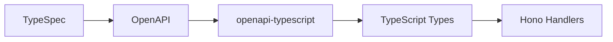
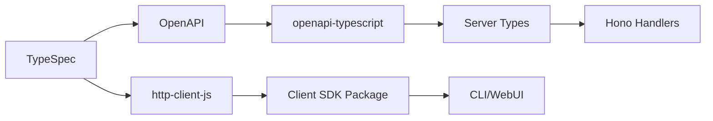
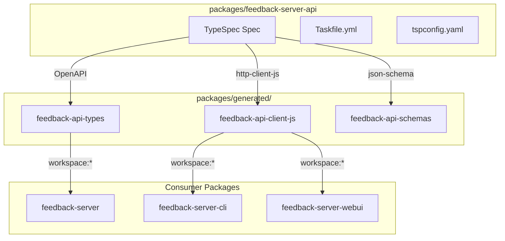

# Code Generation Options Comparison

## Overview

Detailed comparison of code generation approaches for implementing API-First development in the feedback-server.

## Tools Comparison

### TypeSpec Emitters

| Feature        | openapi3     | http-server-js | http-client-js |
| -------------- | ------------ | -------------- | -------------- |
| **Status**     | ✅ 1.0 GA    | 🟡 Preview     | 🟡 Preview     |
| **Output**     | OpenAPI YAML | TS Server Code | TS Client SDK  |
| **Express**    | N/A          | ✅ Yes         | N/A            |
| **Hono**       | N/A          | ❌ No          | N/A            |
| **Types**      | Schema       | Full           | Full           |
| **Router**     | N/A          | ✅ Generated   | N/A            |
| **Validation** | N/A          | ❌ No          | N/A            |
| **Effort**     | 🟢 Low       | 🟡 Medium      | 🟡 Medium      |

### OpenAPI-based Tools

| Feature        | openapi-typescript | openapi-fetch | zod-openapi |
| -------------- | ------------------ | ------------- | ----------- |
| **Status**     | ✅ Stable          | ✅ Stable     | ✅ Stable   |
| **Output**     | TS Types           | TS Client     | Zod Schemas |
| **Runtime**    | ❌ No              | ✅ Yes        | ✅ Yes      |
| **Validation** | ❌ No              | ❌ No         | ✅ Yes      |
| **Framework**  | Any                | Any           | Any         |
| **Effort**     | 🟢 Low             | 🟢 Low        | 🟡 Medium   |

## Feature Matrix

| Requirement            | Option 1 | Option 2 | Option 3 | Option 4 |
| ---------------------- | -------- | -------- | -------- | -------- |
| **Compile-time types** | ✅       | ✅       | ⚠️       | ✅       |
| **Runtime validation** | ❌       | ❌       | ❌       | ✅       |
| **Hono compatible**    | ✅       | ✅       | ✅       | ✅       |
| **Client SDK**         | ⚠️       | ✅       | ❌       | ⚠️       |
| **Low effort**         | ✅       | ⚠️       | ✅       | ⚠️       |
| **Future-proof**       | ✅       | ✅       | ❌       | ✅       |

**Legend:**

- Option 1: openapi-typescript only
- Option 2: openapi-typescript + http-client-js
- Option 3: Manual types package
- Option 4: openapi-typescript + Zod

## Build Pipeline Comparison

### Option 1: openapi-typescript (Simplest)



**Commands:**

```bash
tsp compile typespec/
openapi-typescript src/generated/openapi.yaml -o src/generated/api-types.d.ts
```

### Option 2: Full Generation



**Commands:**

```bash
tsp compile typespec/  # Generates both OpenAPI and Client SDK
openapi-typescript src/generated/openapi.yaml -o src/generated/api-types.d.ts
```

## Cost-Benefit Analysis

| Factor             | Option 1 | Option 2  | Option 3  | Option 4  |
| ------------------ | -------- | --------- | --------- | --------- |
| **Setup Time**     | 1 hour   | 3 hours   | 30 min    | 4 hours   |
| **Migration Time** | 4 hours  | 6 hours   | 2 hours   | 8 hours   |
| **Maintenance**    | 🟢 Low   | 🟡 Medium | 🔴 High   | 🟡 Medium |
| **Type Safety**    | 🟢 High  | 🟢 High   | 🟡 Medium | 🟢 High   |
| **Runtime Safety** | ❌ None  | ❌ None   | ❌ None   | ✅ Full   |
| **Learning Curve** | 🟢 Low   | 🟡 Medium | 🟢 Low    | 🟡 Medium |

## Decision Matrix

### Weighted Scoring

| Criteria           | Weight | Opt 1    | Opt 2    | Opt 3    | Opt 4    | Opt 5 🆕 |
| ------------------ | ------ | -------- | -------- | -------- | -------- | -------- |
| **Effort**         | 30%    | 10       | 7        | 9        | 5        | 6        |
| **Type Safety**    | 25%    | 9        | 10       | 5        | 10       | 10       |
| **Maintenance**    | 20%    | 9        | 8        | 4        | 7        | 10       |
| **Future-proof**   | 15%    | 8        | 10       | 3        | 9        | 10       |
| **Runtime Safety** | 10%    | 0        | 0        | 0        | 10       | 5        |
| **Reusability**    | 10%    | 5        | 7        | 3        | 6        | 10       |
| **Total**          | 110%   | **8.15** | **7.75** | **5.05** | **7.55** | **8.60** |

**Option 5: Standalone API Package with Taskfile** - Highest long-term value for monorepo architecture.

### Recommendation

**Option 5 (Standalone API Package)** scores highest due to:

- Best reusability across packages
- Cleanest separation of concerns
- Most future-proof architecture
- Enables multi-language SDK generation
- Taskfile automation for complex workflows

**Note:** Higher initial effort, but pays off in multi-package monorepo.

---

## 🆕 Option 5: Standalone API Package Architecture

### Overview

Extract API specification to standalone `feedback-server-api` package with:

- TypeSpec definitions as the single source of truth
- Taskfile.yml for complex code generation workflows
- Generated packages stored separately (gitignored source, tracked skeletons)
- Workspace dependencies for consumption

### Architecture



### Emitters Used

| Emitter                  | Output              | Package                  |
| ------------------------ | ------------------- | ------------------------ |
| `@typespec/openapi3`     | OpenAPI 3.1 YAML    | (internal)               |
| `openapi-typescript`     | TypeScript types    | `@feedback/api-types`    |
| `@typespec/http-client-js` | JS Client SDK     | `@feedback/api-client-js`|
| `@typespec/json-schema`  | JSON Schemas        | `@feedback/api-schemas`  |
| `@typespec/protobuf`     | Protobuf (optional) | Future WebSocket support |

### Pros

- ✅ True single source of truth
- ✅ Independent versioning of API contract
- ✅ Multi-client SDK generation ready
- ✅ Taskfile handles complex workflows
- ✅ Clean separation: spec → generation → implementation
- ✅ Gitignore strategy: track skeletons, ignore generated code

### Cons

- ❌ Higher initial setup effort
- ❌ More complex build pipeline
- ❌ Requires Taskfile knowledge

### Effort: 🟡 Medium (2-3 days initial, saves time long-term)

---

## Package Dependencies

### Option 1: Minimal

```json
{
  "devDependencies": {
    "@typespec/compiler": "^1.0.0",
    "@typespec/http": "^1.0.0",
    "@typespec/openapi3": "^1.0.0",
    "openapi-typescript": "^7.0.0"
  }
}
```

### Option 2: With Client SDK

```json
{
  "devDependencies": {
    "@typespec/compiler": "^1.0.0",
    "@typespec/http": "^1.0.0",
    "@typespec/openapi3": "^1.0.0",
    "@typespec/http-client-js": "^0.38.1",
    "openapi-typescript": "^7.0.0"
  }
}
```

### Option 4: With Zod

```json
{
  "devDependencies": {
    "@typespec/compiler": "^1.0.0",
    "@typespec/http": "^1.0.0",
    "@typespec/openapi3": "^1.0.0",
    "openapi-typescript": "^7.0.0",
    "zod": "^3.22.0",
    "@hono/zod-validator": "^0.2.0"
  }
}
```

### Option 5: Standalone API Package

```json
// packages/feedback-server-api/package.json
{
  "devDependencies": {
    "@typespec/compiler": "^1.0.0",
    "@typespec/http": "^1.0.0",
    "@typespec/rest": "^1.0.0",
    "@typespec/openapi": "^1.0.0",
    "@typespec/openapi3": "^1.0.0",
    "@typespec/json-schema": "^1.0.0",
    "@typespec/http-client-js": "^0.38.1",
    "@typespec/protobuf": "^0.25.0",
    "openapi-typescript": "^7.10.0"
  }
}
```

## Conclusion

### For feedback-server (Hono + Bun) in Monorepo

**Implement Option 5 (Standalone API Package)** for long-term maintainability.

### Implementation Order

1. **Phase 1:** Create standalone `feedback-server-api` package with Taskfile
2. **Phase 2:** Set up `packages/generated/` with skeleton packages
3. **Phase 3:** Migrate TypeSpec from feedback-server to api package
4. **Phase 4:** Update consumer packages to use workspace dependencies
5. **Future:** Add JSON Schema validation, Protobuf for WebSockets

---

- **Research compiled by:** GitHub Copilot
- **For project:** react-visual-feedback / feedback-server
- **Date:** January 17, 2026
