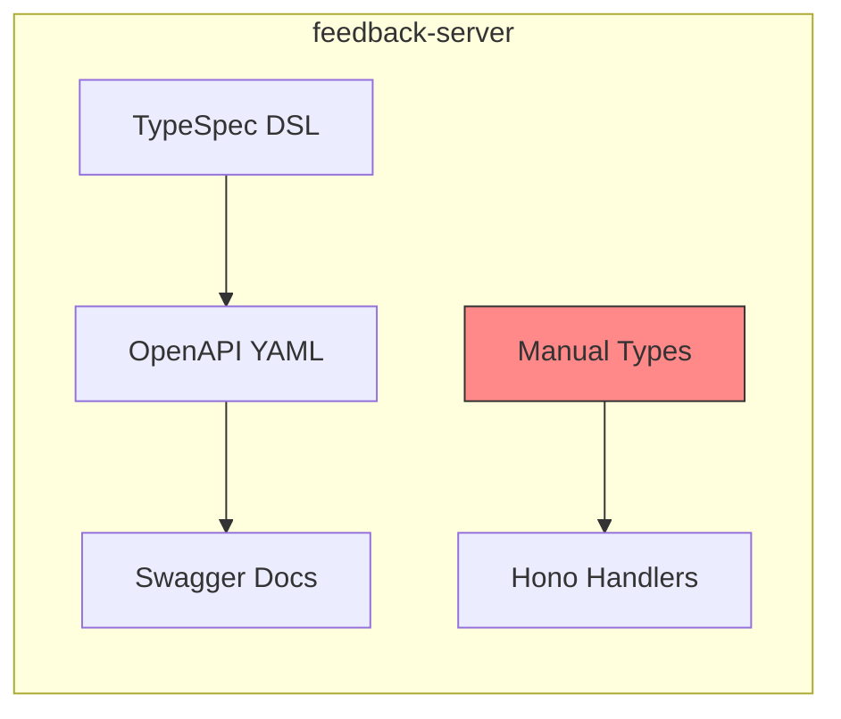

# API-First Technical Debt - Software Specification

**Version**: 2.0.0
**Created**: 2026-01-17
**Updated**: 2026-01-17
**Research**: [../docs/research/typespec-api-first/](../../research/typespec-api-first/)

---

## 🎯 Overview

The **API-First Technical Debt Specification** addresses a gap in the current feedback-server implementation where TypeSpec is used only for generating OpenAPI documentation, missing the core benefits of API-First development.

### The Problem

Currently, the feedback-server:

- ✅ **Generates OpenAPI YAML** from TypeSpec definitions
- ✅ **Serves Swagger documentation** at `/swagger`
- ❌ **Does NOT generate TypeScript types** from the API specification
- ❌ **Manual type definitions** in `src/types/` can drift from the spec
- ❌ **No compile-time guarantees** that handlers match the API contract
- ❌ **API spec is bundled** with server implementation (tight coupling)
- ❌ **No easy way** to generate client SDKs for other packages

### The Solution: Modular API Package Architecture

Implement a **standalone API specification package** (`feedback-server-api`) that:

1. **Centralizes TypeSpec definitions** as the single source of truth
2. **Generates multiple outputs** via TypeSpec emitters and openapi-typescript
3. **Stores generated packages** in dedicated `packages/generated/` directory
4. **Uses Taskfile.yml** for complex code generation workflows
5. **Enables workspace dependencies** for consuming packages

### Key Benefits

| Benefit               | Current            | After Implementation      |
| --------------------- | ------------------ | ------------------------- |
| Type Safety           | ⚠️ Manual          | ✅ Generated              |
| Spec Sync             | ❌ Manual          | ✅ Automatic              |
| Breaking Changes      | ❌ Runtime errors  | ✅ Compile-time errors    |
| Client SDK            | ❌ None            | ✅ Generated (JS/Python)  |
| API Reusability       | ❌ Bundled         | ✅ Standalone package     |
| Multi-client Support  | ❌ Manual          | ✅ Generated SDKs         |
| Build Automation      | ⚠️ package.json    | ✅ Taskfile.yml           |
| Documentation         | ✅ OpenAPI/Swagger | ✅ OpenAPI/Swagger        |

---

## 📊 Feature Matrix

| Feature                    | Included | Technology               | Notes                           |
| -------------------------- | -------- | ------------------------ | ------------------------------- |
| Standalone API Package     | ✅       | TypeSpec + Taskfile      | Central source of truth         |
| TypeScript type generation | ✅       | openapi-typescript       | From OpenAPI YAML               |
| JavaScript Client SDK      | ✅       | @typespec/http-client-js | Preview but stable              |
| JSON Schema generation     | ✅       | @typespec/json-schema    | For runtime validation          |
| Protobuf generation        | ⚠️       | @typespec/protobuf       | Future WebSocket support        |
| Python Client SDK          | ⚠️       | @typespec/http-client-python | Optional, on-demand          |
| Server type application    | ✅       | Manual application       | Types in handlers               |
| Runtime validation         | ⚠️       | JSON Schema + Ajv        | Optional future enhancement     |
| CI type checking           | ✅       | TypeScript compiler      | Fail on type drift              |
| Taskfile automation        | ✅       | Taskfile.dev             | Complex build workflows         |

**Legend**: ✅ Included | ⚠️ Optional/Future | ❌ Not Included

---

## 🏗️ Architecture

### Current State (Tight Coupling)



**Problems:**

- API spec bundled with implementation
- No shared types across packages
- Manual type synchronization

### Target State (Modular Architecture)

```mermaid
graph TD
    subgraph "feedback-server-api"
        TS[TypeSpec Spec]
        TF[Taskfile.yml]
        TC[tspconfig.yaml]
    end

    subgraph "packages/generated/"
        Types[@feedback/api-types]
        ClientJS[@feedback/api-client-js]
        Schemas[@feedback/api-schemas]
    end

    subgraph "Consumer Packages"
        Server[feedback-server]
        CLI[feedback-server-cli]
        WebUI[feedback-server-webui]
    end

    TS --> |openapi-typescript| Types
    TS --> |http-client-js| ClientJS
    TS --> |json-schema| Schemas

    Types --> |workspace:*| Server
    ClientJS --> |workspace:*| CLI
    ClientJS --> |workspace:*| WebUI

    style Types fill:#8f8,stroke:#333
    style ClientJS fill:#8f8,stroke:#333
    style Schemas fill:#8f8,stroke:#333
```

### Directory Structure

```
react-feedback-widget/                      # Monorepo root
├── Taskfile.yml                            # 🆕 Root Taskfile (orchestration)
├── package.json                            # Workspace config
├── packages/
│   ├── feedback-server-api/                # 🆕 Standalone API spec package
│   │   ├── package.json
│   │   ├── Taskfile.yml                    # 🆕 Code generation tasks
│   │   ├── tspconfig.yaml                  # TypeSpec config with all emitters
│   │   └── typespec/
│   │       ├── main.tsp                    # 📦 Migrated from feedback-server
│   │       ├── models.tsp
│   │       └── routes.tsp
│   ├── generated/                          # 🆕 Generated packages directory
│   │   ├── .gitignore                      # Ignore generated source, keep skeletons
│   │   ├── feedback-api-types/             # TypeScript types
│   │   │   ├── package.json                # ✅ Git tracked (skeleton)
│   │   │   ├── tsconfig.json               # ✅ Git tracked
│   │   │   └── src/
│   │   │       ├── index.ts                # ✅ Git tracked (exports)
│   │   │       └── api-types.d.ts          # 🚫 Gitignored (generated)
│   │   ├── feedback-api-client-js/         # JavaScript client SDK
│   │   │   ├── package.json                # ✅ Git tracked
│   │   │   └── src/                        # 🚫 Gitignored (generated)
│   │   └── feedback-api-schemas/           # JSON Schemas
│   │       ├── package.json                # ✅ Git tracked
│   │       └── schemas/                    # 🚫 Gitignored (generated)
│   ├── feedback-server/                    # Server implementation
│   │   ├── package.json                    # ✏️ Add @feedback/api-types dependency
│   │   └── src/
│   │       ├── generated/                  # ❌ Remove (types come from workspace)
│   │       └── routes/
│   │           └── feedback.ts             # ✏️ Import from @feedback/api-types
│   ├── feedback-server-cli/                # CLI implementation
│   │   └── package.json                    # ✏️ Add @feedback/api-client-js dependency
│   └── feedback-server-webui/              # WebUI implementation
│       └── package.json                    # ✏️ Add @feedback/api-client-js dependency
```

---

## 🔧 Technical Implementation

### TypeSpec Emitters Configuration

```yaml
# packages/feedback-server-api/tspconfig.yaml
emit:
  - "@typespec/openapi3"
  - "@typespec/json-schema"
  - "@typespec/http-client-js"

options:
  "@typespec/openapi3":
    emitter-output-dir: "{project-root}/../generated/openapi"
    output-file: "openapi.yaml"
    
  "@typespec/json-schema":
    emitter-output-dir: "{project-root}/../generated/feedback-api-schemas/schemas"
    bundleId: "https://feedback.api/schemas"
    
  "@typespec/http-client-js":
    emitter-output-dir: "{project-root}/../generated/feedback-api-client-js/src"
    packageDetails:
      name: "@feedback/api-client-js"
      version: "1.0.0"
```

### Taskfile.yml (API Package)

```yaml
# packages/feedback-server-api/Taskfile.yml
version: '3'

vars:
  TYPESPEC_DIR: ./typespec
  OUTPUT_DIR: ../generated

tasks:
  default:
    desc: Generate all code from TypeSpec
    cmds:
      - task: generate:all

  generate:all:
    desc: Generate all outputs
    deps:
      - generate:openapi
    cmds:
      - task: generate:types
      - task: generate:client-js
      - task: generate:schemas

  generate:openapi:
    desc: Generate OpenAPI 3.1 specification
    sources:
      - "{{.TYPESPEC_DIR}}/**/*.tsp"
    cmds:
      - tsp compile {{.TYPESPEC_DIR}}

  generate:types:
    desc: Generate TypeScript types from OpenAPI
    deps: [generate:openapi]
    cmds:
      - openapi-typescript {{.OUTPUT_DIR}}/openapi/openapi.yaml -o {{.OUTPUT_DIR}}/feedback-api-types/src/api-types.d.ts

  generate:client-js:
    desc: Generate JavaScript client SDK
    cmds:
      - tsp compile {{.TYPESPEC_DIR}} --emit @typespec/http-client-js

  generate:schemas:
    desc: Generate JSON Schemas
    cmds:
      - tsp compile {{.TYPESPEC_DIR}} --emit @typespec/json-schema

  clean:
    desc: Clean generated files
    cmds:
      - rm -rf {{.OUTPUT_DIR}}/feedback-api-types/src/api-types.d.ts
      - rm -rf {{.OUTPUT_DIR}}/feedback-api-client-js/src
      - rm -rf {{.OUTPUT_DIR}}/feedback-api-schemas/schemas

  version:
    desc: Update version in generated packages
    vars:
      VERSION: '{{.CLI_ARGS}}'
    cmds:
      - |
        for pkg in feedback-api-types feedback-api-client-js feedback-api-schemas; do
          jq ".version = \"{{.VERSION}}\"" {{.OUTPUT_DIR}}/$pkg/package.json > tmp.json
          mv tmp.json {{.OUTPUT_DIR}}/$pkg/package.json
        done
```

### Root Taskfile.yml

```yaml
# Taskfile.yml (monorepo root)
version: '3'

includes:
  api: ./packages/feedback-server-api

tasks:
  default:
    desc: Build entire project
    cmds:
      - task: build

  build:
    desc: Build all packages in dependency order
    cmds:
      - task: api:generate:all
      - bun run --filter "*" build

  dev:
    desc: Start development with generated types
    deps:
      - api:generate:all
    cmds:
      - bun run --filter feedback-server dev

  generate:
    desc: Generate all API artifacts
    cmds:
      - task: api:generate:all

  clean:
    desc: Clean all generated code
    cmds:
      - task: api:clean
```

### Workspace Configuration

```json
// package.json (root)
{
  "workspaces": [
    "packages/*",
    "packages/generated/*"
  ]
}
```

### Consumer Dependencies

```json
// packages/feedback-server/package.json
{
  "dependencies": {
    "@feedback/api-types": "workspace:*"
  }
}

// packages/feedback-server-cli/package.json
{
  "dependencies": {
    "@feedback/api-client-js": "workspace:*"
  }
}
```

### Handler Type Application Example

```typescript
// packages/feedback-server/src/routes/feedback.ts
import type { 
  Feedback, 
  CreateFeedbackRequest,
  FeedbackListResponse 
} from "@feedback/api-types";

app.get("/api/v1/feedback", async (c): Promise<Response> => {
  const items: Feedback[] = await service.listAll();
  const response: FeedbackListResponse = {
    items,
    pagination: { page: 1, limit: 20, total: items.length, totalPages: 1 }
  };
  return c.json(response);
});
```

---

## 📐 Design Decisions

### ADR-001: Standalone API Package

**Context**: TypeSpec and API spec are currently bundled with feedback-server.

**Decision**: Extract to standalone `feedback-server-api` package.

**Rationale**:

- Single source of truth for API contract
- Independent versioning of API specification
- Enables multi-client SDK generation
- Clear separation of concerns

**Consequences**:

- Additional package to maintain
- Build order dependency (API first)
- Improved reusability and modularity

### ADR-002: Use Taskfile.yml for Build Automation

**Context**: package.json scripts are limited for complex build workflows.

**Decision**: Use [Taskfile.dev](https://taskfile.dev/) for code generation tasks.

**Rationale**:

- Supports task dependencies (`deps:`)
- File change detection (`sources:`)
- Variables and conditionals
- Better documentation (descriptions)
- Cross-package task orchestration via includes

**Consequences**:

- Requires `task` CLI installation
- Learning curve for team
- More powerful automation capabilities

### ADR-003: Generated Packages Directory

**Context**: Generated code needs to be available as workspace packages.

**Decision**: Store generated packages in `packages/generated/` with gitignore strategy.

**Rationale**:

- Keep skeleton files in git (package.json, tsconfig.json, index.ts)
- Gitignore generated source files
- Enables workspace:* dependencies
- Clean regeneration without losing package metadata

**Consequences**:

- Must run generation before using packages
- CI must generate before build/test
- Skeleton maintenance required

### ADR-004: openapi-typescript for Server Types

**Context**: TypeSpec's `http-server-js` only supports Express.js.

**Decision**: Use `openapi-typescript` to generate types from OpenAPI for Hono.

**Rationale**:

- Framework-agnostic type generation
- Mature, stable tooling
- Zero runtime overhead

**Consequences**:

- Manual type application in handlers
- Two-step generation (TypeSpec → OpenAPI → types)

### ADR-005: TypeSpec http-client-js for Client SDK

**Context**: Consumer packages need type-safe API clients.

**Decision**: Generate JavaScript client SDK with `@typespec/http-client-js`.

**Rationale**:

- Type-safe client code
- Single source of truth
- Reduces duplication

**Consequences**:

- Preview-stage tooling (acceptable risk)
- Generated code style may differ from handwritten

---

## 📁 Affected Files

### Packages to Create

| Package                          | Purpose                           |
| -------------------------------- | --------------------------------- |
| `packages/feedback-server-api/`  | Standalone API specification      |
| `packages/generated/feedback-api-types/` | Generated TypeScript types |
| `packages/generated/feedback-api-client-js/` | Generated JS client SDK |
| `packages/generated/feedback-api-schemas/` | Generated JSON Schemas   |

### Files to Create

| File                            | Purpose                            |
| ------------------------------- | ---------------------------------- |
| `Taskfile.yml` (root)           | Monorepo build orchestration       |
| `packages/feedback-server-api/Taskfile.yml` | API generation tasks   |
| `packages/generated/.gitignore` | Gitignore generated source files   |

### Files to Migrate

| From                                    | To                                        |
| --------------------------------------- | ----------------------------------------- |
| `feedback-server/typespec/`             | `feedback-server-api/typespec/`           |
| `feedback-server/tspconfig.yaml`        | `feedback-server-api/tspconfig.yaml`      |

### Files to Modify

| File                                | Changes                            |
| ----------------------------------- | ---------------------------------- |
| `package.json` (root)               | Add generated/* to workspaces     |
| `feedback-server/package.json`      | Add @feedback/api-types dependency |
| `feedback-server/src/routes/*.ts`   | Import from @feedback/api-types   |
| `feedback-server-cli/package.json`  | Add @feedback/api-client-js dependency |

### Files to Remove

| File                                  | Reason                              |
| ------------------------------------- | ----------------------------------- |
| `feedback-server/src/generated/`      | Types now in workspace package      |
| `feedback-server/typespec/`           | Migrated to API package             |

---

## 📋 Acceptance Criteria

### Must Have

- [ ] Standalone `feedback-server-api` package created
- [ ] Taskfile.yml for API package with all generation tasks
- [ ] Root Taskfile.yml for build orchestration
- [ ] Generated packages directory with proper gitignore
- [ ] At least TypeScript types generated and usable
- [ ] feedback-server uses @feedback/api-types via workspace:*
- [ ] `task generate` works from root
- [ ] CI pipeline updated to run generation

### Should Have

- [ ] JavaScript client SDK generated
- [ ] JSON Schemas generated
- [ ] feedback-server-cli uses generated client
- [ ] All 131 server tests still pass
- [ ] Documentation updated

### Nice to Have

- [ ] Python client SDK generated
- [ ] Protobuf generation for WebSocket (future)
- [ ] Version bump task in Taskfile
- [ ] Pre-commit hook to check generated types are current

---

## ⚠️ Risks and Mitigations

| Risk                                  | Likelihood | Impact    | Mitigation                   |
| ------------------------------------- | ---------- | --------- | ---------------------------- |
| TypeSpec emitter changes              | 🟡 Medium  | 🟡 Medium | Pin versions, test upgrades  |
| Taskfile learning curve               | 🟡 Medium  | 🟢 Low    | Add documentation, examples  |
| Build order complexity                | 🟢 Low     | 🟡 Medium | Clear deps in Taskfile       |
| Generated code breaks                 | 🟢 Low     | 🟡 Medium | CI type checking             |
| Workspace resolution issues           | 🟢 Low     | 🟡 Medium | Test with bun install        |

---

## 🔗 Related Documentation

- **Research**: [TypeSpec API-First Research](../../research/typespec-api-first/)
  - [04-modular-api-package-architecture.md](../../research/typespec-api-first/04-modular-api-package-architecture.md)
- **Tasks**: [API-First Tasks](../005.api-first-tasks/TASKS-OVERVIEW.md)
- **Original Spec**: [Server Software Specification](../001.server-software-specification/README.md)
- **Taskfile Documentation**: [taskfile.dev](https://taskfile.dev/)
- **Bun Workspaces**: [bun.sh/docs/install/workspaces](https://bun.sh/docs/install/workspaces)

---

## 📊 Success Metrics

| Metric                      | Current         | Target               |
| --------------------------- | --------------- | -------------------- |
| Packages with shared types  | 0               | 3 (server, cli, webui) |
| Manual type definitions     | ~15 types       | 0 API types          |
| Client SDKs generated       | 0               | 1+ (JS required)     |
| Compile-time API errors     | 0               | All type errors      |
| Build automation            | package.json    | Taskfile.yml         |
| API spec location           | Bundled         | Standalone package   |

---

**Last Updated**: 2026-01-17
**Author**: GitHub Copilot
