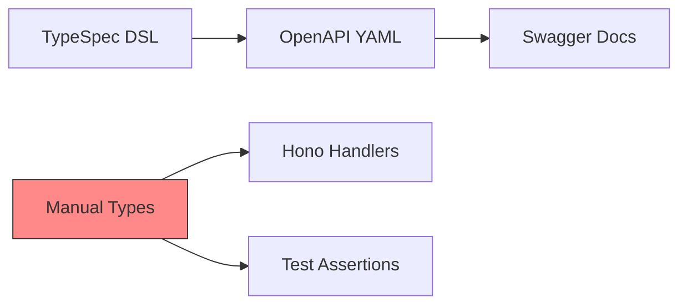
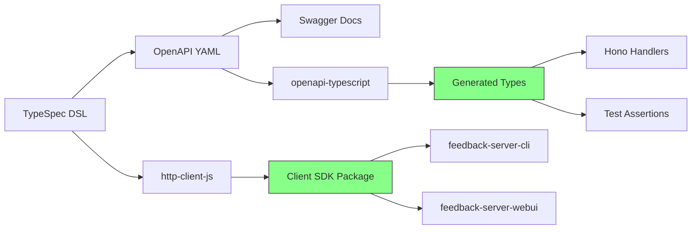

# API-First Technical Debt - Software Specification

**Version**: 1.0.0
**Created**: 2026-01-17
**Updated**: 2026-01-17
**Research**: [../docs/research/typespec-api-first/](../../research/typespec-api-first/)

---

## 🎯 Overview

The **API-First Technical Debt Specification** addresses a gap in the current feedback-server implementation where TypeSpec is used only for generating OpenAPI documentation, missing the core benefits of API-First development.

### The Problem

Currently, the feedback-server:

- ✅ **Generates OpenAPI YAML** from TypeSpec definitions
- ✅ **Serves Swagger documentation** at `/swagger`
- ❌ **Does NOT generate TypeScript types** from the API specification
- ❌ **Manual type definitions** in `src/types/` can drift from the spec
- ❌ **No compile-time guarantees** that handlers match the API contract

### The Solution

Implement proper API-First development by:

1. **Generating TypeScript types** from OpenAPI using `openapi-typescript`
2. **Using generated types** in Hono route handlers
3. **Generating client SDK** using `@typespec/http-client-js` for consuming packages

### Key Benefits

| Benefit          | Current            | After Implementation   |
| ---------------- | ------------------ | ---------------------- |
| Type Safety      | ⚠️ Manual          | ✅ Generated           |
| Spec Sync        | ❌ Manual          | ✅ Automatic           |
| Breaking Changes | ❌ Runtime errors  | ✅ Compile-time errors |
| Client SDK       | ❌ None            | ✅ Generated           |
| Documentation    | ✅ OpenAPI/Swagger | ✅ OpenAPI/Swagger     |

---

## 📊 Feature Matrix

| Feature                    | Included | Technology               | Notes                       |
| -------------------------- | -------- | ------------------------ | --------------------------- |
| TypeScript type generation | ✅       | openapi-typescript       | From OpenAPI YAML           |
| Server type application    | ✅       | Manual application       | Types in handlers           |
| Client SDK generation      | ✅       | @typespec/http-client-js | Preview but stable          |
| Runtime validation         | ⚠️       | @hono/zod-validator      | Optional future enhancement |
| CI type checking           | ✅       | TypeScript compiler      | Fail on type drift          |

**Legend**: ✅ Included | ⚠️ Optional/Future | ❌ Not Included

---

## 🏗️ Architecture

### Current State



### Target State



### File Structure Changes

```
packages/feedback-server/
├── src/
│   ├── generated/
│   │   ├── openapi.yaml              # ✅ Existing
│   │   └── api-types.d.ts            # 🆕 Generated TypeScript types
│   ├── types/
│   │   └── index.ts                  # ❌ Remove or deprecate
│   └── routes/
│       └── feedback.ts               # ✏️ Use generated types
├── typespec/
│   └── tspconfig.yaml                # ✏️ Add http-client-js emitter
└── package.json                      # ✏️ Add generation scripts
```

---

## 🔧 Technical Implementation

### Dependencies to Add

```json
{
  "devDependencies": {
    "openapi-typescript": "^7.5.0",
    "@typespec/http-client-js": "^0.1.0"
  },
  "dependencies": {
    "openapi-fetch": "^0.12.0"
  }
}
```

### Package.json Scripts

```json
{
  "scripts": {
    "generate": "bun run generate:openapi && bun run generate:types",
    "generate:openapi": "tsp compile typespec/",
    "generate:types": "openapi-typescript src/generated/openapi.yaml -o src/generated/api-types.d.ts",
    "typecheck": "tsc --noEmit"
  }
}
```

### TypeSpec Configuration Update

```yaml
# typespec/tspconfig.yaml
emit:
  - "@typespec/openapi3"
  - "@typespec/http-client-js"

options:
  "@typespec/openapi3":
    emitter-output-dir: "{project-root}/src/generated"
    output-file: "openapi.yaml"
  "@typespec/http-client-js":
    emitter-output-dir: "{project-root}/../feedback-api-client"
    packageDetails:
      name: "@feedback/api-client"
      version: "1.0.0"
```

### Handler Type Application Example

```typescript
// src/routes/feedback.ts
import type { components, operations } from "../generated/api-types";

// Type aliases for convenience
type FeedbackItem = components["schemas"]["FeedbackItem"];
type CreateFeedbackRequest =
  operations["createFeedback"]["requestBody"]["content"]["application/json"];
type ListFeedbackResponse =
  operations["listFeedback"]["responses"]["200"]["content"]["application/json"];

// Apply to handler
app.get("/api/v1/feedback", async (c): Promise<Response> => {
  const items: FeedbackItem[] = await service.listAll();
  const response: ListFeedbackResponse = {
    items,
    pagination: {
      page: 1,
      limit: 20,
      total: items.length,
      totalPages: 1,
    },
  };
  return c.json(response);
});
```

---

## 📐 Design Decisions

### ADR-001: Use openapi-typescript Instead of http-server-js

**Context**: TypeSpec provides `@typespec/http-server-js` for server code generation.

**Decision**: Use `openapi-typescript` instead.

**Rationale**:

- `http-server-js` only supports Express.js, not Hono
- `openapi-typescript` generates types from OpenAPI, framework-agnostic
- Zero runtime overhead (types only, no code generation)
- Stable, production-ready tooling

**Consequences**:

- Manual type application in handlers (not generated router)
- No automatic runtime validation (can add with Zod if needed)

### ADR-002: Generate Client SDK with http-client-js

**Context**: The feedback-server-cli and feedback-server-webui packages need to consume the API.

**Decision**: Generate a client SDK using `@typespec/http-client-js`.

**Rationale**:

- Type-safe client code generated from spec
- Single source of truth for API contract
- Reduces duplication across consuming packages

**Consequences**:

- Additional package in monorepo (`feedback-api-client`)
- Preview-stage tooling (acceptable risk for internal SDK)

### ADR-003: Keep Manual Types as Fallback

**Context**: Generated types may not cover all use cases (internal types, test helpers).

**Decision**: Keep `src/types/index.ts` but deprecate API contract types.

**Rationale**:

- Internal types (service layer, configuration) are not in API spec
- Test utilities may need types not exposed in API
- Smooth migration path

**Consequences**:

- Clear separation: API types (generated) vs. internal types (manual)
- Documentation needed to prevent confusion

---

## 📁 Affected Files

### Files to Create

| File                            | Purpose                                 |
| ------------------------------- | --------------------------------------- |
| `src/generated/api-types.d.ts`  | Generated TypeScript types from OpenAPI |
| `packages/feedback-api-client/` | Generated client SDK package            |

### Files to Modify

| File                      | Changes                            |
| ------------------------- | ---------------------------------- |
| `package.json`            | Add dependencies, scripts          |
| `typespec/tspconfig.yaml` | Add http-client-js emitter         |
| `src/routes/feedback.ts`  | Use generated types                |
| `src/routes/video.ts`     | Use generated types                |
| `src/routes/health.ts`    | Use generated types (minimal)      |
| `tests/**/*.test.ts`      | Use generated types for assertions |

### Files to Deprecate

| File                 | Action                                    |
| -------------------- | ----------------------------------------- |
| `src/types/index.ts` | Keep for internal types, remove API types |

---

## 📋 Acceptance Criteria

### Must Have

- [ ] TypeScript types generated from OpenAPI
- [ ] At least 3 route handlers use generated types
- [ ] `bun run generate` script works correctly
- [ ] `bun run typecheck` passes with generated types
- [ ] CI pipeline runs type generation and checking

### Should Have

- [ ] Client SDK generated with http-client-js
- [ ] All route handlers use generated types
- [ ] Tests use generated types for response validation
- [ ] Documentation updated with API-First workflow

### Nice to Have

- [ ] Runtime validation with Zod (future enhancement)
- [ ] Type coverage reporting
- [ ] Breaking change detection in CI

---

## ⚠️ Risks and Mitigations

| Risk                               | Likelihood | Impact    | Mitigation                   |
| ---------------------------------- | ---------- | --------- | ---------------------------- |
| http-client-js preview instability | 🟡 Medium  | 🟡 Medium | Pin version, test thoroughly |
| Type generation build failures     | 🟢 Low     | 🟡 Medium | Add to CI, fix immediately   |
| Developer learning curve           | 🟡 Medium  | 🟢 Low    | Add documentation, examples  |
| OpenAPI drift from TypeSpec        | 🟢 Low     | 🟢 Low    | Automated generation in CI   |

---

## 🔗 Related Documentation

- **Research**: [TypeSpec API-First Research](../../research/typespec-api-first/)
- **Tasks**: [API-First Tasks](../005.api-first-tasks/TASKS-OVERVIEW.md)
- **Original Spec**: [Server Software Specification](../001.server-software-specification/README.md)

---

## 📊 Success Metrics

| Metric                  | Current   | Target          |
| ----------------------- | --------- | --------------- |
| Manual type definitions | ~15 types | 0 API types     |
| Type-safe handlers      | 0%        | 100%            |
| Client SDK packages     | 0         | 1               |
| Compile-time API errors | 0         | All type errors |

---

**Last Updated**: 2026-01-17
**Author**: GitHub Copilot
