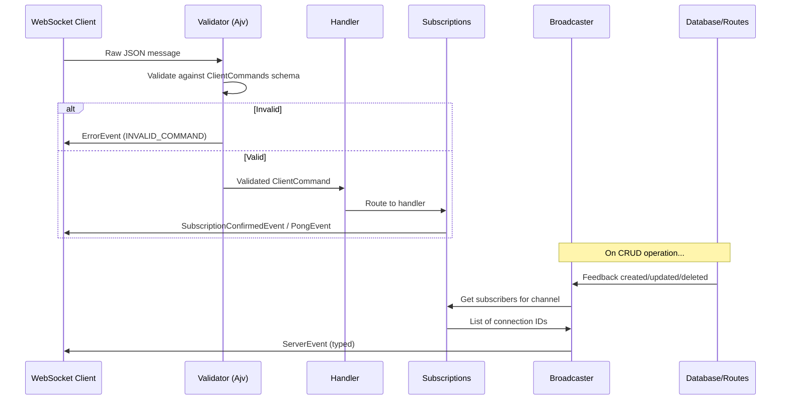

# 006: WebSocket API-First Integration Addon Specification

> **Addon Specification** for `feedback-server` package
> **Version:** 0.1.0
> **Status:** Draft
> **Dependencies:** `packages/feedback-server-api/docs/spec/001.websocket-addon-specification`

---

## 📋 Overview

This addon specification describes how to upgrade the existing WebSocket implementation in `feedback-server` to use TypeSpec-generated types and JSON Schema validation from the `@feedback/api-types` and `@feedback/api-schemas` packages.

### Current State

The `feedback-server` package already has a functional WebSocket implementation in `src/websocket.ts` with:

- Basic message types (`ClientMessage`, `ServerMessage`)
- Project-based subscriptions
- Feedback CRUD event broadcasting
- Sync protocol support

### Target State

Upgrade to use:

1. **TypeSpec-generated types** from `@feedback/api-types`
2. **JSON Schema validation** using Ajv with schemas from `@feedback/api-schemas`
3. **Standardized event structure** per the WebSocket API-First specification
4. **Type-safe message handling** with discriminated unions

---

## 🎯 Goals & Non-Goals

### Goals

1. ✅ Replace local message types with TypeSpec-generated types
2. ✅ Add Ajv JSON Schema validation for incoming commands
3. ✅ Ensure type-safe event broadcasting
4. ✅ Maintain backward compatibility during transition
5. ✅ Support new event types (`connection.ack`, `subscription.confirmed`, etc.)

### Non-Goals

1. ❌ Change the Bun WebSocket API usage (keep native API)
2. ❌ Add new subscription patterns beyond what's specified
3. ❌ Implement authentication (separate concern)

---

## 🏗️ Architecture

### Directory Structure

```
packages/feedback-server/src/
├── websocket/                    # NEW: WebSocket module directory
│   ├── index.ts                  # Re-exports from module
│   ├── config.ts                 # WebSocket Bun configuration
│   ├── validator.ts              # Ajv schema validation
│   ├── handler.ts                # Message routing and handling
│   ├── broadcaster.ts            # Event broadcasting utilities
│   ├── subscriptions.ts          # Subscription management
│   └── types.ts                  # Local type extensions (ClientData, etc.)
├── websocket.ts                  # DEPRECATED: Will be replaced
└── ...
```

### Component Flow



---

## 🔧 Integration Points

### 1. Package Dependencies

Add to `packages/feedback-server/package.json`:

```json
{
  "dependencies": {
    "@feedback/api-types": "workspace:*",
    "@feedback/api-schemas": "workspace:*",
    "ajv": "^8.17.1"
  }
}
```

### 2. Type Imports

Replace local type definitions with imports from `@feedback/api-types`:

```typescript
// Before (src/websocket.ts)
export type ClientMessage =
  | { type: "subscribe"; projectId: string }
  | { type: "ping" };
// ...

// After (src/websocket/types.ts)
import type {
  ServerEvents,
  ClientCommands,
  FeedbackCreatedEvent,
  FeedbackUpdatedEvent,
  // ... individual types
} from "@feedback/api-types";
```

### 3. Schema Validation

Create validator using Ajv:

```typescript
// src/websocket/validator.ts
import Ajv from "ajv";
import clientCommandsSchema from "@feedback/api-schemas/client-commands.json";
import type { ClientCommands } from "@feedback/api-types";

const ajv = new Ajv({ strict: false });
const validateCommand = ajv.compile(clientCommandsSchema);

export function parseAndValidateCommand(
  data: string,
):
  | { success: true; command: ClientCommands }
  | { success: false; error: string } {
  let parsed: unknown;
  try {
    parsed = JSON.parse(data);
  } catch {
    return { success: false, error: "Invalid JSON" };
  }

  if (!validateCommand(parsed)) {
    return {
      success: false,
      error: ajv.errorsText(validateCommand.errors),
    };
  }

  return { success: true, command: parsed as ClientCommands };
}
```

### 4. Route Handler Integration

Update route handlers to use typed broadcasting:

```typescript
// src/routes/feedback.ts
import { notifyFeedbackCreated } from "../websocket/broadcaster";
import type { FeedbackCreatedEvent } from "@feedback/api-types";

// After successful POST /api/feedbacks
const event: FeedbackCreatedEvent = {
  type: "feedback.created",
  timestamp: new Date().toISOString(),
  feedback: createdFeedback,
};
notifyFeedbackCreated(event);
```

---

## 📊 Message Type Mapping

### Current → New Mapping

| Current Type       | New TypeSpec Type        | Notes                         |
| ------------------ | ------------------------ | ----------------------------- |
| `feedback:created` | `feedback.created`       | Dot notation per spec         |
| `feedback:updated` | `feedback.updated`       | Dot notation per spec         |
| `feedback:deleted` | `feedback.deleted`       | Dot notation per spec         |
| `welcome`          | `connection.ack`         | Renamed, adds `serverVersion` |
| `subscribed`       | `subscription.confirmed` | Renamed, structured channel   |
| `pong`             | `pong`                   | Same, add timestamp           |
| `error`            | `error`                  | Add typed error codes         |

### Backward Compatibility

During migration, support both old and new event formats:

```typescript
// Option: Emit both formats temporarily
function broadcastFeedbackCreated(feedback: Feedback) {
  // New format (preferred)
  broadcast({
    type: "feedback.created",
    timestamp: new Date().toISOString(),
    feedback,
  });

  // Old format (deprecation period)
  broadcast({
    type: "feedback:created",
    feedback,
  });
}
```

---

## 🧪 Testing Strategy

### Unit Tests

1. **Validator tests** - Verify JSON Schema validation
2. **Handler tests** - Verify message routing
3. **Broadcaster tests** - Verify event emission

### Integration Tests

1. **End-to-end message flow** - Connect → Subscribe → Receive events
2. **Error handling** - Invalid commands receive ErrorEvent
3. **Type safety** - TypeScript compilation catches type errors

---

## 📁 Files to Create/Modify

### New Files

| File                             | Purpose                 |
| -------------------------------- | ----------------------- |
| `src/websocket/index.ts`         | Module re-exports       |
| `src/websocket/config.ts`        | Bun WebSocket config    |
| `src/websocket/validator.ts`     | Ajv validation          |
| `src/websocket/handler.ts`       | Message routing         |
| `src/websocket/broadcaster.ts`   | Event broadcasting      |
| `src/websocket/subscriptions.ts` | Subscription management |
| `src/websocket/types.ts`         | Local type extensions   |

### Modified Files

| File                     | Changes                          |
| ------------------------ | -------------------------------- |
| `src/index.ts`           | Import from `./websocket` module |
| `src/routes/feedback.ts` | Use typed broadcasting           |
| `package.json`           | Add dependencies                 |

### Deprecated Files

| File               | Action                                          |
| ------------------ | ----------------------------------------------- |
| `src/websocket.ts` | Migrate to `src/websocket/` module, then delete |

---

## 🔗 External Dependencies

- **[@feedback/api-types](../../generated/feedback-api-types/README.md)** - TypeSpec-generated TypeScript types
- **[@feedback/api-schemas](../../generated/feedback-api-schemas/README.md)** - TypeSpec-generated JSON Schemas
- **[Ajv](https://ajv.js.org/)** - JSON Schema validator

---

## 📚 References

- [WebSocket Addon Specification](../../../feedback-server-api/docs/spec/001.websocket-addon-specification/README.md)
- [WebSocket Addon Tasks](../../../feedback-server-api/docs/spec/002.websocket-addon-tasks/TASKS-OVERVIEW.md)
- [Current WebSocket Implementation](../../src/websocket.ts)

---

**Document compiled by:** GitHub Copilot
**For project:** react-feedback-widget / feedback-server
**Date:** January 2025
