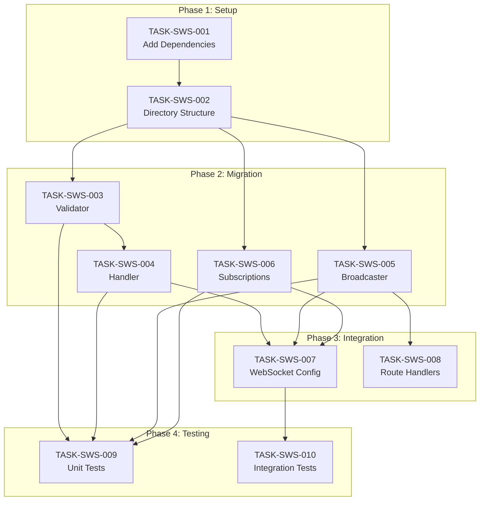

# 006: WebSocket API-First Integration Tasks

> **Tasks for:** `feedback-server` package
> **Related Specification:** [README.md](./README.md)
> **Status:** 0/10 Complete

---

## 📊 Task Summary

| Category | Tasks | Completed | Remaining |
|----------|-------|-----------|-----------|
| Setup | 2 | 0 | 2 |
| Migration | 4 | 0 | 4 |
| Integration | 2 | 0 | 2 |
| Testing | 2 | 0 | 2 |
| **Total** | **10** | **0** | **10** |

---

## 🔧 Category: Setup

### TASK-SWS-001: Add WebSocket API-First Dependencies

**Priority:** P1 - High
**Estimated Effort:** 15 minutes
**Status:** 📋 NOT STARTED
**Dependencies:** `feedback-server-api` WebSocket tasks (WS-006, WS-007)

**Description:**
Add the required dependencies for WebSocket API-First integration.

**Acceptance Criteria:**

- [ ] Add `@feedback/api-types` workspace dependency
- [ ] Add `@feedback/api-schemas` workspace dependency
- [ ] Add `ajv` dependency (^8.17.1)
- [ ] Run `bun install` to update lockfile
- [ ] Verify types are accessible with `import type { ServerEvents } from "@feedback/api-types"`

**Files to Modify:**

- `package.json`

---

### TASK-SWS-002: Create WebSocket Module Directory Structure

**Priority:** P1 - High
**Estimated Effort:** 15 minutes
**Status:** 📋 NOT STARTED
**Dependencies:** TASK-SWS-001

**Description:**
Create the new `src/websocket/` module directory structure.

**Acceptance Criteria:**

- [ ] Create `src/websocket/` directory
- [ ] Create `src/websocket/index.ts` with placeholder exports
- [ ] Create `src/websocket/types.ts` for local type extensions
- [ ] Verify module structure matches specification

**Files to Create:**

- `src/websocket/index.ts`
- `src/websocket/types.ts`

---

## 🔄 Category: Migration

### TASK-SWS-003: Create JSON Schema Validator

**Priority:** P1 - High
**Estimated Effort:** 1 hour
**Status:** 📋 NOT STARTED
**Dependencies:** TASK-SWS-002

**Description:**
Create the Ajv-based JSON Schema validator for incoming WebSocket commands.

**Acceptance Criteria:**

- [ ] Create `src/websocket/validator.ts`
- [ ] Import `ClientCommands` schema from `@feedback/api-schemas`
- [ ] Create `parseAndValidateCommand()` function
- [ ] Return typed result with success/error discriminator
- [ ] Handle JSON parse errors gracefully
- [ ] Include descriptive error messages from Ajv

**Files to Create:**

- `src/websocket/validator.ts`

**Implementation Notes:**

```typescript
import Ajv from "ajv";
import clientCommandsSchema from "@feedback/api-schemas/client-commands.json";
import type { ClientCommands } from "@feedback/api-types";

const ajv = new Ajv({ strict: false });
const validateCommand = ajv.compile(clientCommandsSchema);

export type ValidationResult = 
  | { success: true; command: ClientCommands }
  | { success: false; error: string };

export function parseAndValidateCommand(data: string): ValidationResult {
  // Implementation
}
```

---

### TASK-SWS-004: Create Message Handler with Type-Safe Routing

**Priority:** P1 - High
**Estimated Effort:** 2 hours
**Status:** 📋 NOT STARTED
**Dependencies:** TASK-SWS-003

**Description:**
Create the message handler that routes validated commands to appropriate handlers.

**Acceptance Criteria:**

- [ ] Create `src/websocket/handler.ts`
- [ ] Import types from `@feedback/api-types`
- [ ] Use validator from TASK-SWS-003
- [ ] Route commands by `type` discriminator:
  - `subscribe` → `handleSubscribe()`
  - `unsubscribe` → `handleUnsubscribe()`
  - `ping` → `handlePing()`
  - `authenticate` → `handleAuthenticate()`
- [ ] Send `ErrorEvent` for invalid commands
- [ ] Log WebSocket messages appropriately

**Files to Create:**

- `src/websocket/handler.ts`

---

### TASK-SWS-005: Create Typed Event Broadcaster

**Priority:** P1 - High
**Estimated Effort:** 1.5 hours
**Status:** 📋 NOT STARTED
**Dependencies:** TASK-SWS-002

**Description:**
Create the event broadcaster that sends typed `ServerEvents` to subscribed clients.

**Acceptance Criteria:**

- [ ] Create `src/websocket/broadcaster.ts`
- [ ] Import types from `@feedback/api-types`
- [ ] Create typed broadcast functions:
  - `broadcastFeedbackCreated(event: FeedbackCreatedEvent)`
  - `broadcastFeedbackUpdated(event: FeedbackUpdatedEvent)`
  - `broadcastFeedbackDeleted(event: FeedbackDeletedEvent)`
  - `broadcastToChannel(channel: string, event: ServerEvents)`
- [ ] Use new event type format (`feedback.created` vs `feedback:created`)
- [ ] Include `timestamp` in all events

**Files to Create:**

- `src/websocket/broadcaster.ts`

---

### TASK-SWS-006: Create Subscription Manager

**Priority:** P1 - High
**Estimated Effort:** 1.5 hours
**Status:** 📋 NOT STARTED
**Dependencies:** TASK-SWS-002

**Description:**
Create the subscription manager that tracks client subscriptions to channels.

**Acceptance Criteria:**

- [ ] Create `src/websocket/subscriptions.ts`
- [ ] Track subscriptions by connection ID and channel
- [ ] Support channel patterns (e.g., `feedback`, `feedback:project-123`)
- [ ] Apply subscription filters when broadcasting
- [ ] Clean up subscriptions on connection close
- [ ] Send `SubscriptionConfirmedEvent` on successful subscribe
- [ ] Export subscription-related types

**Files to Create:**

- `src/websocket/subscriptions.ts`

---

## 🔗 Category: Integration

### TASK-SWS-007: Create Bun WebSocket Configuration

**Priority:** P2 - Medium
**Estimated Effort:** 1 hour
**Status:** 📋 NOT STARTED
**Dependencies:** TASK-SWS-004, TASK-SWS-005, TASK-SWS-006

**Description:**
Create the Bun WebSocket configuration that wires together all components.

**Acceptance Criteria:**

- [ ] Create `src/websocket/config.ts`
- [ ] Export `websocketConfig` for Bun server
- [ ] Wire `open`, `message`, `close`, `error` handlers
- [ ] Send `ConnectionAckEvent` on connection open
- [ ] Use handler from TASK-SWS-004 for message handling
- [ ] Clean up subscriptions on close
- [ ] Export `getWebSocketStats()` function

**Files to Create:**

- `src/websocket/config.ts`

---

### TASK-SWS-008: Update Route Handlers for Typed Broadcasting

**Priority:** P2 - Medium
**Estimated Effort:** 1.5 hours
**Status:** 📋 NOT STARTED
**Dependencies:** TASK-SWS-005

**Description:**
Update the feedback route handlers to use typed event broadcasting.

**Acceptance Criteria:**

- [ ] Update `src/routes/feedback.ts`
- [ ] Replace `notifyFeedbackCreated()` with typed version
- [ ] Replace `notifyFeedbackUpdated()` with typed version
- [ ] Replace `notifyFeedbackDeleted()` with typed version
- [ ] Include `changedFields` array in update events
- [ ] Ensure all events have correct `timestamp`

**Files to Modify:**

- `src/routes/feedback.ts`

---

## 🧪 Category: Testing

### TASK-SWS-009: Unit Tests for WebSocket Module

**Priority:** P2 - Medium
**Estimated Effort:** 2 hours
**Status:** 📋 NOT STARTED
**Dependencies:** TASK-SWS-003, TASK-SWS-004, TASK-SWS-005, TASK-SWS-006

**Description:**
Write unit tests for the WebSocket module components.

**Acceptance Criteria:**

- [ ] Create `src/websocket/__tests__/validator.test.ts`
- [ ] Create `src/websocket/__tests__/handler.test.ts`
- [ ] Test valid commands pass validation
- [ ] Test invalid commands fail with descriptive errors
- [ ] Test JSON parse errors are handled
- [ ] Test message routing to correct handlers
- [ ] Achieve >80% code coverage for module

**Files to Create:**

- `src/websocket/__tests__/validator.test.ts`
- `src/websocket/__tests__/handler.test.ts`
- `src/websocket/__tests__/broadcaster.test.ts`
- `src/websocket/__tests__/subscriptions.test.ts`

---

### TASK-SWS-010: Integration Tests for WebSocket Flow

**Priority:** P2 - Medium
**Estimated Effort:** 2 hours
**Status:** 📋 NOT STARTED
**Dependencies:** TASK-SWS-007

**Description:**
Write integration tests for the complete WebSocket message flow.

**Acceptance Criteria:**

- [ ] Create `tests/websocket-integration.test.ts`
- [ ] Test connection receives `ConnectionAckEvent`
- [ ] Test subscribe command receives `SubscriptionConfirmedEvent`
- [ ] Test ping command receives `PongEvent`
- [ ] Test invalid command receives `ErrorEvent`
- [ ] Test feedback CRUD triggers appropriate events

**Files to Create:**

- `tests/websocket-integration.test.ts`

---

## 📊 Task Dependencies Diagram



---

## 🚀 Suggested Implementation Order

1. **TASK-SWS-001** - Add dependencies (15 min)
2. **TASK-SWS-002** - Directory structure (15 min)
3. **TASK-SWS-003** - Validator (1 hour)
4. **TASK-SWS-005** - Broadcaster (1.5 hours)
5. **TASK-SWS-006** - Subscriptions (1.5 hours)
6. **TASK-SWS-004** - Handler (2 hours)
7. **TASK-SWS-007** - WebSocket config (1 hour)
8. **TASK-SWS-008** - Route handlers (1.5 hours)
9. **TASK-SWS-009** - Unit tests (2 hours)
10. **TASK-SWS-010** - Integration tests (2 hours)

**Total Estimated Effort:** ~13 hours

---

**Document compiled by:** GitHub Copilot
**For project:** react-feedback-widget / feedback-server
**Date:** January 2025
