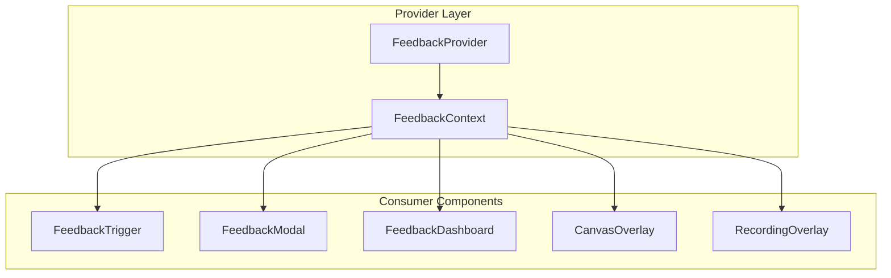
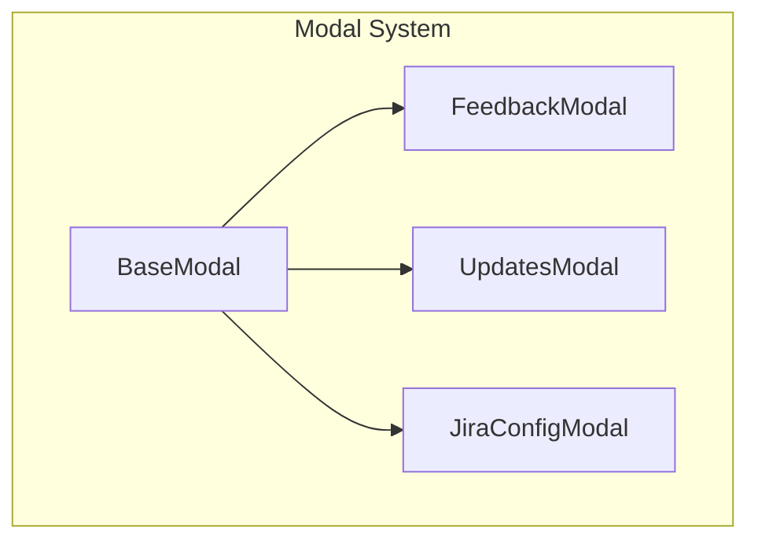
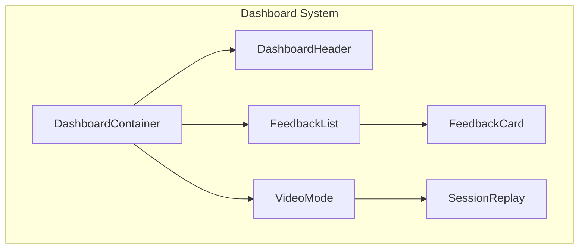

# Component Hierarchy

> **Updated:** 2026-01-16  
> **Related:** [Architecture Overview](./README.md)

## Overview

The React Visual Feedback component hierarchy follows a layered architecture where the `FeedbackProvider` is the root that provides context to all child components.

## Component Tree

```
<FeedbackProvider>                    # Root context provider
├── <FeedbackTrigger />               # FAB button to trigger feedback
├── <SelectionOverlay />              # Element highlighting overlay
│   ├── <HighlightRenderer />         # Renders highlight rectangles
│   └── <Tooltip />                   # Element info tooltip
├── <CanvasOverlay />                 # Annotation drawing canvas
│   └── <CanvasOverlayComponent />    # Canvas logic
├── <RecordingOverlay />              # Recording indicator
├── <FeedbackModal />                 # Feedback submission modal
│   ├── <BaseModal />                 # Reusable modal base
│   ├── <ErrorBoundary />             # Error boundary wrapper
│   └── (Form fields, annotation tools)
├── <FeedbackDashboard />             # Feedback management
│   ├── <DashboardContainer />        # Main orchestrator
│   │   ├── <DashboardHeader />       # Search and filters
│   │   ├── <FeedbackList />          # Feedback items list
│   │   │   └── <FeedbackCard />      # Individual feedback card
│   │   │       └── <StatusBadge />   # Status indicator
│   │   └── <VideoMode />             # Video replay mode
│   │       └── <SessionReplay />     # Video player
│   └── <StatusDropdown />            # Status selection
├── <SubmissionQueue />               # Offline queue manager
├── <UpdatesModal />                  # Changelog display
└── <ErrorToast />                    # Toast notifications
```

## Component Relationships

### Provider Layer



### Modal Components



### Dashboard Components



## Component Responsibilities

### Core Components

| Component | Responsibility | Key Props |
|-----------|----------------|-----------|
| `FeedbackProvider` | Context provider, state machine, service injection | `onSubmit`, `integrations`, `theme`, `services` |
| `FeedbackTrigger` | Activation button, customizable UI | `position`, `icon`, `label`, `className` |
| `FeedbackModal` | Feedback form, annotations, submission | `onClose`, `initialType`, `allowRecording` |
| `FeedbackDashboard` | Feedback management, filtering, status updates | `statuses`, `onStatusChange`, `integrations` |

### Overlay Components

| Component | Responsibility | Key Props |
|-----------|----------------|-----------|
| `SelectionOverlay` | Element hover/selection highlighting | `highlightStyle`, `tooltipStyle` |
| `CanvasOverlay` | Drawing annotations on screenshots | `screenshot`, `onSave`, `tools` |
| `RecordingOverlay` | Recording status indicator | `duration`, `onStop`, `onPause` |

### Dashboard Sub-Components

| Component | Responsibility | Key Props |
|-----------|----------------|-----------|
| `DashboardContainer` | Orchestrates dashboard state | `feedbackItems`, `onItemSelect` |
| `DashboardHeader` | Search, filter, title | `searchQuery`, `onSearch`, `filterStatus` |
| `FeedbackList` | Renders list of feedback cards | `items`, `selectedId`, `onSelect` |
| `FeedbackCard` | Individual feedback display | `feedback`, `onStatusChange`, `expanded` |
| `VideoMode` | Fullscreen video with logs | `videoBlob`, `eventLogs`, `onClose` |

### Shared Components

| Component | Responsibility | Key Props |
|-----------|----------------|-----------|
| `BaseModal` | Reusable modal with animations, focus trap | `isOpen`, `onClose`, `title`, `size` |
| `ErrorBoundary` | Error catching with fallback UI | `fallback`, `onError`, `onReset` |
| `StatusBadge` | Status indicator with color | `status`, `statuses`, `size` |
| `StatusDropdown` | Status selection dropdown | `value`, `onChange`, `statuses` |
| `LogEntry` | Event log display | `log`, `expanded`, `onToggle` |
| `ErrorToast` | Toast notification | `message`, `type`, `duration` |

## Context Access

### Using the Context

```tsx
import { useFeedback } from 'react-visual-feedback';

function MyComponent() {
  const {
    isActive,
    setIsActive,
    screenshot,
    captureScreenshot,
    recording,
    startRecording,
    stopRecording,
    submit,
    integrationStatus,
  } = useFeedback();

  return (/* ... */);
}
```

### Using Individual Hooks (Recommended)

For better performance and code organization, use individual hooks:

```tsx
import {
  useActivation,
  useRecording,
  useScreenCapture,
  useFeedbackSubmission,
} from 'react-visual-feedback';

function MyComponent() {
  const { isActive, toggle } = useActivation();
  const { start, stop, isRecording } = useRecording();
  const { capture, screenshot } = useScreenCapture();
  const { submit, isSubmitting } = useFeedbackSubmission();

  return (/* ... */);
}
```

## Component Communication

### Parent → Child (Props)

```tsx
<FeedbackCard
  feedback={feedbackItem}
  onStatusChange={(newStatus) => handleStatusChange(feedbackItem.id, newStatus)}
  expanded={expandedId === feedbackItem.id}
/>
```

### Child → Parent (Callbacks)

```tsx
<DashboardHeader
  searchQuery={query}
  onSearch={(newQuery) => setQuery(newQuery)}
  onFilterChange={(filter) => setFilter(filter)}
/>
```

### Sibling Communication (via Context)

```tsx
// FeedbackTrigger updates context
const { setIsActive } = useFeedback();
<button onClick={() => setIsActive(true)}>Feedback</button>

// FeedbackModal reads context
const { isActive, screenshot } = useFeedback();
if (!isActive) return null;
```

## Component Composition Patterns

### Compound Components

```tsx
<FeedbackDashboard>
  <FeedbackDashboard.Header />
  <FeedbackDashboard.List />
  <FeedbackDashboard.Detail />
</FeedbackDashboard>
```

### Render Props

```tsx
<FeedbackProvider
  render={({ isActive, toggle }) => (
    <button onClick={toggle}>{isActive ? 'Cancel' : 'Feedback'}</button>
  )}
/>
```

### HOC Pattern

```tsx
import { withErrorBoundary } from 'react-visual-feedback';

const SafeFeedbackModal = withErrorBoundary(FeedbackModal, {
  fallback: <ErrorFallback />
});
```

## Styling Hierarchy

Components use styled-components with theme access:

```tsx
// Theme flows from FeedbackProvider
<ThemeProvider theme={getTheme('light')}>
  <FeedbackProvider>
    {/* All components have theme access */}
    <FeedbackModal />  {/* Uses theme.colors.primary */}
    <FeedbackDashboard />  {/* Uses theme.spacing */}
  </FeedbackProvider>
</ThemeProvider>
```

## Error Boundaries

Error boundaries wrap critical components:

```
<FeedbackProvider>
  <ErrorBoundary fallback={<FeedbackErrorFallback />}>
    <FeedbackModal />
  </ErrorBoundary>
  <ErrorBoundary fallback={<DashboardErrorFallback />}>
    <FeedbackDashboard />
  </ErrorBoundary>
</FeedbackProvider>
```

---

*Documentation compiled by GitHub Copilot*  
*For project: react-visual-feedback*
