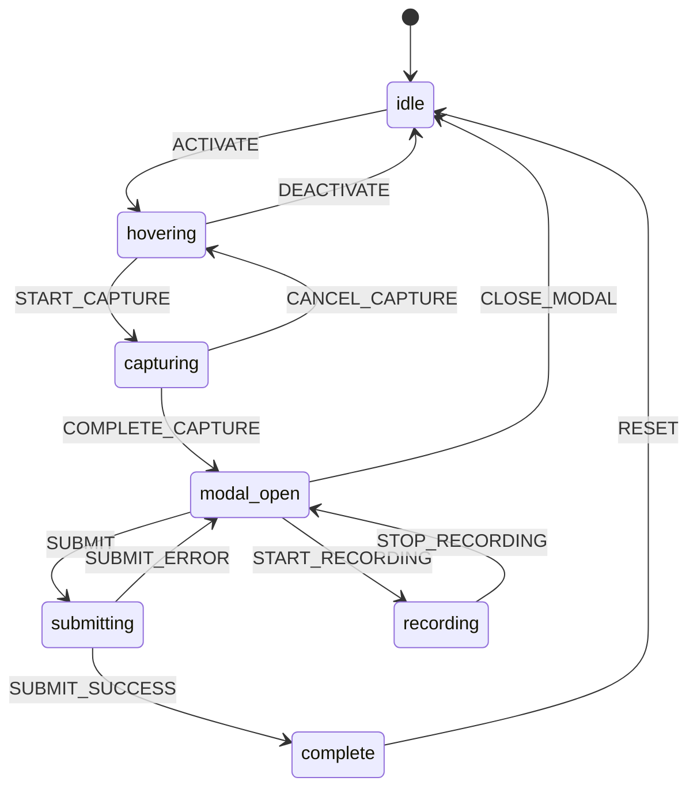

# Data Flow

> **Updated:** 2026-01-16
> **Related:** [Architecture Overview](./README.md)

## Overview

React Visual Feedback uses XState v5 for state management with a unidirectional data flow. State changes flow from events through the state machine to context updates.

## Data Flow Diagram

```
┌─────────────────────────────────────────────────────────────────┐
│                        User Actions                              │
│  Click trigger → Hover element → Capture → Annotate → Submit    │
└──────────────────────────────┬──────────────────────────────────┘
                               │
                               ▼
┌─────────────────────────────────────────────────────────────────┐
│                        Event Dispatch                            │
│  { type: 'START_CAPTURE', payload: element }                    │
└──────────────────────────────┬──────────────────────────────────┘
                               │
                               ▼
┌─────────────────────────────────────────────────────────────────┐
│                     XState State Machine                         │
│  ┌─────┐    ┌────────┐    ┌──────────┐    ┌─────────────┐       │
│  │idle │───▶│hovering│───▶│capturing │───▶│  modal_open │       │
│  └─────┘    └────────┘    └──────────┘    └──────┬──────┘       │
│                                                   │              │
│                                            ┌──────▼──────┐       │
│                                            │ submitting  │       │
│                                            └──────┬──────┘       │
│                                                   │              │
│                                            ┌──────▼──────┐       │
│                                            │  complete   │       │
│                                            └─────────────┘       │
└──────────────────────────────┬──────────────────────────────────┘
                               │
                               ▼
┌─────────────────────────────────────────────────────────────────┐
│                        Context Update                            │
│  { isActive: true, screenshot: '...', modalOpen: true }         │
└──────────────────────────────┬──────────────────────────────────┘
                               │
                               ▼
┌─────────────────────────────────────────────────────────────────┐
│                        React Re-render                           │
│  Components re-render with new context values                    │
└─────────────────────────────────────────────────────────────────┘
```

## State Machine States

The feedback state machine has the following states:

```typescript
type FeedbackState =
  | "idle" // No feedback activity
  | "hovering" // User hovering over elements
  | "capturing" // Screenshot capture in progress
  | "modal_open" // Feedback modal is open
  | "recording" // Screen recording active
  | "submitting" // Submitting feedback
  | "complete"; // Submission complete
```

### State Transitions



## Events

The state machine responds to these events:

### Activation Events

| Event       | Description          | Payload                  |
| ----------- | -------------------- | ------------------------ |
| `SET_STATE` | Partial state update | `Partial<FeedbackState>` |

### Element Selection Events

| Event            | Description         | Payload                                                    |
| ---------------- | ------------------- | ---------------------------------------------------------- |
| `START_HOVERING` | Begin element hover | `{ element, componentInfo, highlightStyle, tooltipStyle }` |
| `STOP_HOVERING`  | End element hover   | —                                                          |

### Capture Events

| Event              | Description              | Payload                   |
| ------------------ | ------------------------ | ------------------------- |
| `START_CAPTURE`    | Begin screenshot capture | `HTMLElement`             |
| `COMPLETE_CAPTURE` | Capture completed        | `string \| null` (base64) |
| `CANCEL_CAPTURE`   | Cancel capture           | —                         |

### Modal Events

| Event                   | Description                | Payload |
| ----------------------- | -------------------------- | ------- |
| `OPEN_DASHBOARD`        | Open dashboard             | —       |
| `CLOSE_DASHBOARD`       | Close dashboard            | —       |
| `OPEN_MANUAL_FEEDBACK`  | Open modal without capture | —       |
| `CLOSE_MANUAL_FEEDBACK` | Close modal                | —       |
| `RESET_MODAL`           | Reset modal state          | —       |

### Recording Events

| Event                     | Description                    | Payload           |
| ------------------------- | ------------------------------ | ----------------- |
| `START_RECORDING_INIT`    | Begin recording initialization | —                 |
| `START_RECORDING_SUCCESS` | Recording started successfully | —                 |
| `START_RECORDING_FAILURE` | Recording failed to start      | —                 |
| `PAUSE_RECORDING`         | Pause recording                | —                 |
| `RESUME_RECORDING`        | Resume recording               | —                 |
| `CANCEL_RECORDING`        | Cancel recording               | —                 |
| `STOP_RECORDING`          | Stop and save recording        | `RecordingResult` |

### Integration Events

| Event                 | Description                  | Payload                                |
| --------------------- | ---------------------------- | -------------------------------------- |
| `INTEGRATION_START`   | Begin integration submission | `{ jira?: boolean, sheets?: boolean }` |
| `INTEGRATION_SUCCESS` | Integration succeeded        | `IntegrationResults`                   |
| `INTEGRATION_ERROR`   | Integration failed           | `Partial<IntegrationResults>`          |
| `INTEGRATION_RESET`   | Reset integration state      | —                                      |

### Queue Events

| Event               | Description          | Payload                                      |
| ------------------- | -------------------- | -------------------------------------------- |
| `ADD_SUBMISSION`    | Add to offline queue | `QueuedSubmission`                           |
| `UPDATE_SUBMISSION` | Update queued item   | `Partial<QueuedSubmission> & { id: string }` |
| `REMOVE_SUBMISSION` | Remove from queue    | `string` (id)                                |

## Context (Extended State)

The state machine context contains all application state:

```typescript
interface FeedbackContext {
  // Activation
  internalIsActive: boolean;

  // Element Selection
  hoveredElement: HTMLElement | null;
  selectedElement: HTMLElement | null;
  componentInfo: ReactComponentInfo | null;
  highlightStyle: HighlightStyle;
  tooltipStyle: TooltipStyle;

  // Capture
  isCapturing: boolean;
  screenshot: string | null;
  isCanvasActive: boolean;

  // Modal
  isModalOpen: boolean;
  isManualFeedback: boolean;

  // Dashboard
  isDashboardOpen: boolean;

  // Recording
  isRecordingInitializing: boolean;
  isRecording: boolean;
  recordingPaused: boolean;
  videoBlob: Blob | null;
  videoDuration: number;
  eventLogs: EventLog[];

  // Integrations
  integrationStatus: IntegrationStatusMap;
  integrationResults: IntegrationResults;

  // Offline Queue
  submissionQueue: QueuedSubmission[];
}
```

## Selectors

Selectors provide read access to specific parts of state:

```typescript
// Usage
import { selectIsActive, selectScreenshot } from "react-visual-feedback";

const isActive = selectIsActive(state);
const screenshot = selectScreenshot(state);
```

### Available Selectors

| Category          | Selectors                                                                                                                                  |
| ----------------- | ------------------------------------------------------------------------------------------------------------------------------------------ |
| Activation        | `selectIsActive`                                                                                                                           |
| Element Selection | `selectIsHovering`, `selectHoveredElement`, `selectSelectedElement`, `selectComponentInfo`, `selectHighlightStyle`, `selectTooltipStyle`   |
| Modal             | `selectIsModalOpen`, `selectIsManualFeedback`                                                                                              |
| Capture           | `selectIsCapturing`, `selectScreenshot`, `selectHasScreenshot`, `selectIsCanvasActive`                                                     |
| Recording         | `selectIsRecordingInitializing`, `selectIsRecording`, `selectRecordingPaused`, `selectVideoBlob`, `selectVideoDuration`, `selectEventLogs` |
| Dashboard         | `selectIsDashboardOpen`                                                                                                                    |
| Integrations      | `selectIntegrationStatus`, `selectIntegrationResults`                                                                                      |
| Queue             | `selectSubmissionQueue`, `selectHasQueuedSubmissions`, `selectQueuedSubmissionCount`                                                       |

## Action Creators

Type-safe action creators for dispatching events:

```typescript
import { actions } from "react-visual-feedback";

// Usage
send(actions.startCapture(element));
send(actions.completeCapture(screenshotData));
send(actions.openDashboard());
```

### Action Categories

```typescript
const actions = {
  // Activation
  setState: (payload) => ({ type: 'SET_STATE', payload }),

  // Element Selection
  startHovering: (element, componentInfo, highlightStyle, tooltipStyle) => ({ ... }),
  stopHovering: () => ({ type: 'STOP_HOVERING' }),

  // Capture
  startCapture: (element) => ({ type: 'START_CAPTURE', payload: element }),
  completeCapture: (screenshot) => ({ type: 'COMPLETE_CAPTURE', payload: screenshot }),
  cancelCapture: () => ({ type: 'CANCEL_CAPTURE' }),

  // Modal
  openDashboard: () => ({ type: 'OPEN_DASHBOARD' }),
  closeDashboard: () => ({ type: 'CLOSE_DASHBOARD' }),
  openManualFeedback: () => ({ type: 'OPEN_MANUAL_FEEDBACK' }),
  closeManualFeedback: () => ({ type: 'CLOSE_MANUAL_FEEDBACK' }),
  resetModal: () => ({ type: 'RESET_MODAL' }),

  // Recording
  startRecordingInit: () => ({ type: 'START_RECORDING_INIT' }),
  startRecordingSuccess: () => ({ type: 'START_RECORDING_SUCCESS' }),
  startRecordingFailure: () => ({ type: 'START_RECORDING_FAILURE' }),
  pauseRecording: () => ({ type: 'PAUSE_RECORDING' }),
  resumeRecording: () => ({ type: 'RESUME_RECORDING' }),
  cancelRecording: () => ({ type: 'CANCEL_RECORDING' }),
  stopRecording: (result) => ({ type: 'STOP_RECORDING', payload: result }),

  // Integrations
  integrationStart: (jira, sheets) => ({ ... }),
  integrationSuccess: (results) => ({ ... }),
  integrationError: (results) => ({ ... }),
  integrationReset: () => ({ type: 'INTEGRATION_RESET' }),

  // Queue
  addSubmission: (submission) => ({ ... }),
  updateSubmission: (partial) => ({ ... }),
  removeSubmission: (id) => ({ ... }),
};
```

## Service Layer Data Flow

Services handle external I/O with dependency injection:

```
┌─────────────────────────────────────────────────────────────┐
│                      Component                               │
│  const { capture } = useScreenCapture({ screenshotService });│
└───────────────────────────┬─────────────────────────────────┘
                            │
                            ▼
┌─────────────────────────────────────────────────────────────┐
│                   Service Interface                          │
│  interface ScreenshotService {                               │
│    captureElement(element: HTMLElement): Promise<string>;    │
│    captureViewport(): Promise<string>;                       │
│    isSupported(): boolean;                                   │
│  }                                                           │
└───────────────────────────┬─────────────────────────────────┘
                            │
              ┌─────────────┴─────────────┐
              ▼                           ▼
┌─────────────────────────┐   ┌─────────────────────────┐
│ ModernScreenshotService │   │ MockScreenshotService   │
│     (Production)        │   │     (Testing)           │
│ Uses html2canvas        │   │ Returns test data       │
└─────────────────────────┘   └─────────────────────────┘
```

## Integration Data Flow

```
┌─────────────────────────────────────────────────────────────┐
│                   Feedback Submission                        │
│  { type: 'bug', description: '...', screenshot: '...' }     │
└───────────────────────────┬─────────────────────────────────┘
                            │
                            ▼
┌─────────────────────────────────────────────────────────────┐
│                  IntegrationRegistry                         │
│  submitToAll(feedback, options)                              │
└───────────────────────────┬─────────────────────────────────┘
                            │
              ┌─────────────┼─────────────┐
              ▼             ▼             ▼
┌───────────────────┐ ┌─────────────┐ ┌─────────────┐
│ JiraIntegration   │ │ SheetsInt.  │ │ CustomInt.  │
│ submit(feedback)  │ │ submit()    │ │ submit()    │
└─────────┬─────────┘ └──────┬──────┘ └──────┬──────┘
          │                  │               │
          ▼                  ▼               ▼
┌───────────────────┐ ┌─────────────┐ ┌─────────────┐
│   Jira Cloud API  │ │ Sheets API  │ │ Your Server │
└───────────────────┘ └─────────────┘ └─────────────┘
```

## Storage Data Flow

### Feedback Storage

```typescript
// Writing feedback
const storage = new LocalStorageService();
const feedback = { id: "123", type: "bug", description: "..." };
storage.set(STORAGE_KEYS.FEEDBACK_LIST, feedbackList);

// Reading feedback
const feedbackList = storage.get(STORAGE_KEYS.FEEDBACK_LIST);
```

### Video Storage

```typescript
// Videos use IndexedDB for large blobs
const videoStorage = new IndexedDBVideoStorageService();

// Store video
await videoStorage.save(feedbackId, videoBlob, { duration: 45 });

// Retrieve video
const blob = await videoStorage.get(feedbackId);
```

## Offline Queue Data Flow

```
┌─────────────────────────────────────────────────────────────┐
│                   Submit Feedback                            │
│  Online: Submit directly to integrations                     │
│  Offline: Add to queue, persist to localStorage              │
└───────────────────────────┬─────────────────────────────────┘
                            │
                            ▼
┌─────────────────────────────────────────────────────────────┐
│                   SubmissionQueue                            │
│  Watches network status, retries when online                 │
└───────────────────────────┬─────────────────────────────────┘
                            │
                    ┌───────┴───────┐
                    ▼               ▼
          ┌─────────────────┐ ┌─────────────────┐
          │ Online: Submit  │ │ Offline: Queue  │
          │ to integrations │ │ and persist     │
          └─────────────────┘ └─────────────────┘
```

## Performance Considerations

### Memoization

Selectors are memoized to prevent unnecessary re-renders:

```typescript
const selectScreenshot = (state: FeedbackState) => state.screenshot;
// Only re-computes when state.screenshot changes
```

### Lazy Loading

Services are lazy-loaded for tree-shaking:

```typescript
export async function createProductionServices() {
  const [
    { LocalStorageService },
    { IndexedDBVideoStorageService },
    // Only loaded when needed
  ] = await Promise.all([...]);
}
```

### Event Batching

XState batches state updates to minimize re-renders:

```typescript
// Multiple events → single render
send(actions.completeCapture(screenshot));
send(actions.openModal());
// React batches these into one update
```

---

_Documentation compiled by GitHub Copilot_
_For project: react-visual-feedback_
