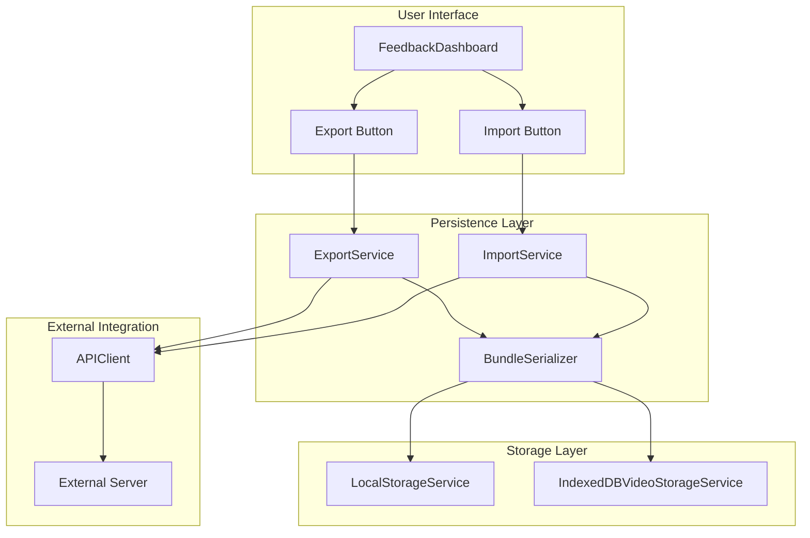
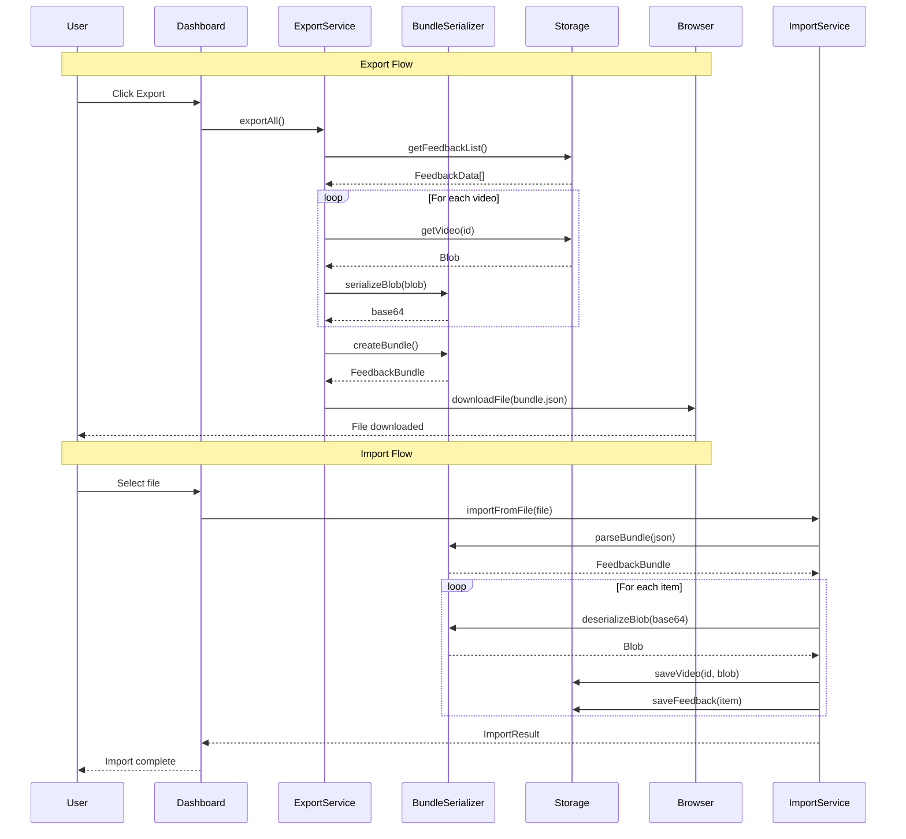

# Data Persistence API - Software Specification

**Version**: 1.0.0
**Created**: 2026-01-16
**Updated**: 2026-01-16

## 🎯 Overview

This specification defines the **Data Persistence API** for react-visual-feedback, enabling:

- **Export feedback data** to JSON files for backup and transfer
- **Import feedback data** from JSON files for restoration and testing
- **API endpoint integration** for external server storage
- **Session data bundling** including videos and event logs
- **Test fixture generation** for BDD testing scenarios

**Key Distinction**: This feature focuses on **data portability** - moving feedback data in and out of the browser. It does NOT modify the existing browser storage mechanisms (localStorage, IndexedDB), but adds an import/export layer on top.

### Primary Use Cases

1. **Testing**: Pre-populate feedback data for BDD tests (US008, US009)
2. **Backup**: Export all feedback data for archival
3. **Transfer**: Move feedback between devices or environments
4. **Integration**: Send feedback to external systems via API

---

## 📊 Feature Matrix

| Feature                  | Included | Technology              | Notes                                 |
| ------------------------ | -------- | ----------------------- | ------------------------------------- |
| Export to JSON           | ✅       | File System API / Blob  | Download feedback as JSON file        |
| Import from JSON         | ✅       | File Input / FileReader | Upload and restore feedback data      |
| Video blob serialization | ✅       | Base64 encoding         | Include video in export bundle        |
| Event log preservation   | ✅       | JSON serialization      | Include event logs in export          |
| Server API integration   | ⚠️       | Fetch API               | Optional: POST/GET to external server |
| TypeSpec API definition  | ⚠️       | TypeSpec → OpenAPI      | Optional: Generate OpenAPI spec       |
| Bulk operations          | ✅       | Batch processing        | Export/import multiple feedback items |
| Test fixture format      | ✅       | JSON schema             | Standardized format for BDD test data |

**Legend**: ✅ Included | ⚠️ Optional/Evaluated | ❌ Not Included

---

## 🔗 Integration Points

### Browser Storage Integration

The Data Persistence API integrates with existing storage services:

```typescript
// Current storage architecture
LocalStorageService<FeedbackData[]>; // Feedback metadata
IndexedDBVideoStorageService; // Video blobs
```

**Integration Pattern**:

1. **Export**: Read from localStorage + IndexedDB → Serialize → Output
2. **Import**: Input → Deserialize → Write to localStorage + IndexedDB

### External Server Integration (Optional)

For server-side storage, the API can communicate with REST endpoints:

```
POST /api/feedback          - Create/update feedback
GET  /api/feedback          - List all feedback
GET  /api/feedback/:id      - Get single feedback
DELETE /api/feedback/:id    - Delete feedback
POST /api/feedback/bulk     - Bulk import
GET  /api/feedback/export   - Bulk export
```

---

## 📦 Dependencies

### Core Dependencies (Already Available)

```json
{
  "dependencies": {
    "react": "^18.x || ^19.x",
    "styled-components": "^6.x"
  }
}
```

### New Dependencies (None Required)

The Data Persistence API uses only browser APIs:

- `Blob` - Binary data handling
- `URL.createObjectURL()` - Download links
- `FileReader` - File parsing
- `fetch` - API communication (for server integration)

### Development Dependencies (For TypeSpec - Optional)

```json
{
  "devDependencies": {
    "@typespec/compiler": "^0.52.0",
    "@typespec/http": "^0.52.0",
    "@typespec/openapi3": "^0.52.0"
  }
}
```

---

## 🏗️ Architecture

### System Layers



### Directory Structure

```
src/
├── services/
│   └── persistence/
│       ├── index.ts                    # Barrel exports
│       ├── types.ts                    # Persistence types
│       ├── ExportService.ts            # Export functionality
│       ├── ImportService.ts            # Import functionality
│       ├── BundleSerializer.ts         # Data serialization
│       ├── APIClient.ts                # Server communication (optional)
│       └── __tests__/
│           ├── ExportService.test.ts
│           ├── ImportService.test.ts
│           └── BundleSerializer.test.ts
└── types/
    └── persistence.ts                  # Type definitions
```

### Data Flow



---

## 💻 Core Implementation

### Type Definitions

```typescript
// types/persistence.ts

/**
 * Serialized video data with base64 encoding
 */
export interface SerializedVideo {
  /** Original video ID (matches feedback.id) */
  id: string;
  /** Base64-encoded video data */
  data: string;
  /** MIME type of the video */
  mimeType: string;
  /** Size in bytes of original blob */
  size: number;
  /** Duration in seconds (if known) */
  duration?: number;
}

/**
 * Complete feedback bundle for export/import
 */
export interface FeedbackBundle {
  /** Bundle format version for future compatibility */
  version: string;
  /** ISO timestamp when bundle was created */
  exportedAt: string;
  /** Source application identifier */
  source: string;
  /** Array of feedback items */
  feedback: FeedbackData[];
  /** Serialized video blobs */
  videos: SerializedVideo[];
  /** Metadata about the export */
  metadata: BundleMetadata;
}

/**
 * Bundle metadata
 */
export interface BundleMetadata {
  /** Total number of feedback items */
  feedbackCount: number;
  /** Total number of videos */
  videoCount: number;
  /** Total size of videos in bytes */
  totalVideoSize: number;
  /** User agent of exporting browser */
  userAgent: string;
  /** URL where export was performed */
  exportUrl: string;
}

/**
 * Result of an import operation
 */
export interface ImportResult {
  /** Whether import was successful */
  success: boolean;
  /** Number of items imported */
  importedCount: number;
  /** Number of items skipped (duplicates) */
  skippedCount: number;
  /** Error messages if any */
  errors: string[];
  /** Warning messages if any */
  warnings: string[];
}

/**
 * Options for import operation
 */
export interface ImportOptions {
  /** How to handle duplicate IDs */
  duplicateHandling: "skip" | "replace" | "rename";
  /** Whether to import videos */
  includeVideos: boolean;
  /** Filter by feedback type */
  typeFilter?: FeedbackType[];
  /** Filter by date range */
  dateRange?: {
    start: string;
    end: string;
  };
}

/**
 * Options for export operation
 */
export interface ExportOptions {
  /** Whether to include video blobs */
  includeVideos: boolean;
  /** Filter by feedback IDs */
  feedbackIds?: string[];
  /** Filter by feedback type */
  typeFilter?: FeedbackType[];
  /** Filter by date range */
  dateRange?: {
    start: string;
    end: string;
  };
  /** Compress output (future) */
  compress?: boolean;
}

/**
 * API configuration for server integration
 */
export interface APIConfig {
  /** Base URL of the API server */
  baseUrl: string;
  /** Authorization header value */
  authToken?: string;
  /** Request timeout in milliseconds */
  timeout?: number;
  /** Custom headers */
  headers?: Record<string, string>;
}
```

### Export Service

```typescript
// services/persistence/ExportService.ts

export interface ExportService {
  /**
   * Export all feedback to a downloadable JSON file
   */
  exportToFile(options?: ExportOptions): Promise<void>;

  /**
   * Export feedback and return the bundle object
   */
  exportToBundle(options?: ExportOptions): Promise<FeedbackBundle>;

  /**
   * Export feedback to an external API
   */
  exportToAPI(config: APIConfig, options?: ExportOptions): Promise<boolean>;

  /**
   * Generate a download for a bundle
   */
  downloadBundle(bundle: FeedbackBundle, filename?: string): void;
}
```

### Import Service

```typescript
// services/persistence/ImportService.ts

export interface ImportService {
  /**
   * Import feedback from a file input
   */
  importFromFile(file: File, options?: ImportOptions): Promise<ImportResult>;

  /**
   * Import feedback from a bundle object
   */
  importFromBundle(
    bundle: FeedbackBundle,
    options?: ImportOptions,
  ): Promise<ImportResult>;

  /**
   * Import feedback from an external API
   */
  importFromAPI(
    config: APIConfig,
    options?: ImportOptions,
  ): Promise<ImportResult>;

  /**
   * Validate a bundle before import
   */
  validateBundle(bundle: unknown): bundle is FeedbackBundle;
}
```

### Bundle Serializer

```typescript
// services/persistence/BundleSerializer.ts

export interface BundleSerializer {
  /**
   * Serialize a Blob to base64 string
   */
  serializeBlob(blob: Blob): Promise<string>;

  /**
   * Deserialize base64 string to Blob
   */
  deserializeBlob(data: string, mimeType: string): Blob;

  /**
   * Create a bundle from feedback and videos
   */
  createBundle(
    feedback: FeedbackData[],
    videos: Map<string, Blob>,
  ): Promise<FeedbackBundle>;

  /**
   * Parse a bundle from JSON string
   */
  parseBundle(json: string): FeedbackBundle;

  /**
   * Stringify a bundle to JSON
   */
  stringifyBundle(bundle: FeedbackBundle): string;
}
```

---

## 🔧 Feature Evaluation

### Export to JSON File ✅ RECOMMENDED

**Technology**: Blob + URL.createObjectURL + anchor download

**Rationale**:

- Essential for data backup and portability
- Works entirely in browser, no server required
- Standard pattern for file downloads
- Enables test fixture creation

**Implementation**:

```typescript
const blob = new Blob([JSON.stringify(bundle)], { type: "application/json" });
const url = URL.createObjectURL(blob);
const a = document.createElement("a");
a.href = url;
a.download = `feedback-export-${Date.now()}.json`;
a.click();
URL.revokeObjectURL(url);
```

### Import from JSON File ✅ RECOMMENDED

**Technology**: File input + FileReader

**Rationale**:

- Essential for data restoration
- Works entirely in browser
- Standard pattern for file uploads
- Enables BDD test data loading

**Implementation**:

```typescript
const reader = new FileReader();
reader.onload = (e) => {
  const bundle = JSON.parse(e.target.result as string);
  // Validate and import
};
reader.readAsText(file);
```

### Video Base64 Serialization ✅ RECOMMENDED

**Technology**: FileReader.readAsDataURL

**Rationale**:

- Enables complete data portability
- Videos are essential for session replay tests
- JSON-compatible format
- Standard browser API

**Trade-offs**:

- ⚠️ Base64 increases file size by ~33%
- ⚠️ Large videos may cause memory issues
- ⚠️ Consider size limits (50MB default max)

### Server API Integration ⚠️ OPTIONAL

**Technology**: Fetch API + REST endpoints

**Rationale**:

- Enables cloud backup and sync
- Supports team collaboration
- Requires server infrastructure
- Not needed for initial BDD testing use case

**Recommendation**: Implement API client interface, but defer server implementation to v1.1

### TypeSpec API Definition ⚠️ OPTIONAL

**Technology**: TypeSpec → OpenAPI 3.0

**Rationale**:

- Type-safe API contracts
- Generates OpenAPI specs automatically
- Enables code generation for clients/servers
- Modern alternative to writing OpenAPI by hand

**Recommendation**: Define TypeSpec if server API is implemented

---

## 📁 Configuration

### Bundle Format (JSON Schema)

```json
{
  "$schema": "http://json-schema.org/draft-07/schema#",
  "title": "FeedbackBundle",
  "type": "object",
  "required": [
    "version",
    "exportedAt",
    "source",
    "feedback",
    "videos",
    "metadata"
  ],
  "properties": {
    "version": {
      "type": "string",
      "pattern": "^\\d+\\.\\d+\\.\\d+$"
    },
    "exportedAt": {
      "type": "string",
      "format": "date-time"
    },
    "source": {
      "type": "string",
      "const": "react-visual-feedback"
    },
    "feedback": {
      "type": "array",
      "items": { "$ref": "#/definitions/FeedbackData" }
    },
    "videos": {
      "type": "array",
      "items": { "$ref": "#/definitions/SerializedVideo" }
    },
    "metadata": { "$ref": "#/definitions/BundleMetadata" }
  }
}
```

### Test Fixture Format

For BDD testing, a simplified fixture format:

```json
{
  "version": "1.0.0",
  "exportedAt": "2026-01-16T12:00:00Z",
  "source": "react-visual-feedback-test",
  "feedback": [
    {
      "id": "test-fb-001",
      "feedback": "Test feedback item with video",
      "type": "bug",
      "timestamp": "2026-01-16T11:00:00Z",
      "url": "http://localhost:3000/test",
      "userAgent": "TestBrowser/1.0",
      "viewport": {
        "width": 1920,
        "height": 1080,
        "scrollX": 0,
        "scrollY": 0,
        "devicePixelRatio": 1
      },
      "status": "new",
      "video": "video:test-fb-001",
      "eventLogs": [
        { "type": "click", "timestamp": 1000, "target": "button.submit" },
        {
          "type": "input",
          "timestamp": 1500,
          "target": "input.email",
          "value": "test@example.com"
        }
      ]
    }
  ],
  "videos": [
    {
      "id": "test-fb-001",
      "data": "data:video/webm;base64,GkXfo59...",
      "mimeType": "video/webm",
      "size": 1024,
      "duration": 5
    }
  ],
  "metadata": {
    "feedbackCount": 1,
    "videoCount": 1,
    "totalVideoSize": 1024,
    "userAgent": "TestRunner/1.0",
    "exportUrl": "http://localhost:3000/test"
  }
}
```

---

## 🚀 Usage

### Export Feedback (UI)

```tsx
// In FeedbackDashboard component
import { useExportService } from "./hooks/useExportService";

function DashboardHeader() {
  const { exportToFile, isExporting } = useExportService();

  return (
    <button
      onClick={() => exportToFile({ includeVideos: true })}
      disabled={isExporting}
    >
      {isExporting ? "Exporting..." : "Export All"}
    </button>
  );
}
```

### Import Feedback (UI)

```tsx
// In FeedbackDashboard component
import { useImportService } from "./hooks/useImportService";

function DashboardHeader() {
  const { importFromFile, isImporting, lastResult } = useImportService();

  const handleFileSelect = async (e: React.ChangeEvent<HTMLInputElement>) => {
    const file = e.target.files?.[0];
    if (file) {
      const result = await importFromFile(file, { duplicateHandling: "skip" });
      console.log(`Imported ${result.importedCount} items`);
    }
  };

  return (
    <input
      type="file"
      accept=".json"
      onChange={handleFileSelect}
      disabled={isImporting}
    />
  );
}
```

### BDD Test Setup

```typescript
// tests/bdd/fixtures/loadTestData.ts
import testFixture from "./feedback-with-video.fixture.json";

export async function loadTestData(page: Page): Promise<void> {
  // Inject test data into localStorage
  await page.evaluate((fixture) => {
    // Parse and store feedback
    localStorage.setItem(
      "react-feedback-data",
      JSON.stringify(fixture.feedback),
    );

    // Store videos in IndexedDB (would need helper)
  }, testFixture);
}
```

### Programmatic Export

```typescript
import { createExportService } from "./services/persistence";

const exportService = createExportService({
  storageService: new LocalStorageService(),
  videoService: new IndexedDBVideoStorageService(),
});

// Export to file
await exportService.exportToFile({ includeVideos: true });

// Export to bundle object
const bundle = await exportService.exportToBundle();
console.log(`Exported ${bundle.feedback.length} items`);
```

---

## ⚠️ Requirements

### Browser Requirements

- **localStorage**: For feedback metadata
- **IndexedDB**: For video blobs
- **File API**: For import (FileReader)
- **Blob API**: For export (createObjectURL)

### Size Constraints

| Constraint     | Limit               | Notes                             |
| -------------- | ------------------- | --------------------------------- |
| localStorage   | ~5-10 MB            | Varies by browser                 |
| IndexedDB      | ~50% disk           | Browser-managed                   |
| Single video   | 500 MB              | Configurable via STORAGE constant |
| Bundle file    | Recommended <100 MB | Base64 overhead ~33%              |
| Feedback items | 50 max              | Current hardcoded limit           |

### Browser Compatibility

| Browser       | Support | Notes        |
| ------------- | ------- | ------------ |
| Chrome 90+    | ✅      | Full support |
| Firefox 90+   | ✅      | Full support |
| Safari 15+    | ✅      | Full support |
| Edge 90+      | ✅      | Full support |
| Mobile Chrome | ✅      | Full support |
| Mobile Safari | ✅      | Full support |

---

## 📐 Design Decisions

### ADR-001: Use Base64 for Video Serialization

**Context**: Need to include video blobs in JSON export files.

**Decision**: Use Base64 encoding for video data in JSON bundles.

**Rationale**:

- **JSON Compatibility**: Base64 strings are valid JSON
- **Simplicity**: Single file export/import
- **Universal**: Works across all browsers
- **No Dependencies**: Uses native FileReader API

**Alternatives Considered**:

1. **ZIP Bundle**: Better compression, but requires library
2. **Separate Files**: More complex, harder to share
3. **Binary Format**: Not human-readable, harder to debug

**Consequences**:

- ✅ Simple, single-file exports
- ✅ Human-inspectable (partially)
- ⚠️ ~33% size increase
- ⚠️ Memory-intensive for large videos

---

### ADR-002: Decouple from Storage Implementation

**Context**: Export/import should work regardless of storage backend.

**Decision**: Use service interfaces, not concrete implementations.

**Rationale**:

- **Flexibility**: Can switch storage backends
- **Testability**: Easy to mock in tests
- **Separation of Concerns**: Persistence logic separate from storage

**Implementation**:

```typescript
interface DataPersistenceService {
  exportService: ExportService;
  importService: ImportService;
}

// Factory creates with injected dependencies
function createPersistenceService(
  storageService: StorageService<FeedbackData[]>,
  videoService: VideoStorageService,
): DataPersistenceService;
```

---

### ADR-003: Version Bundle Format

**Context**: Bundle format may evolve, need backwards compatibility.

**Decision**: Include version field in bundle, validate on import.

**Rationale**:

- **Future-proof**: Can migrate old formats
- **Compatibility**: Clear versioning for changes
- **Error Handling**: Can detect incompatible versions

**Migration Strategy**:

```typescript
function migrateBundleIfNeeded(bundle: unknown): FeedbackBundle {
  const version = (bundle as { version?: string }).version;

  if (version === "1.0.0") return bundle as FeedbackBundle;
  if (version === "0.9.0") return migrateFrom090(bundle);

  throw new Error(`Unsupported bundle version: ${version}`);
}
```

---

### ADR-004: Optional Server API

**Context**: Some users may want cloud storage, but most just need local export/import.

**Decision**: Design API client interface, but make server integration optional.

**Rationale**:

- **MVP First**: Export/import is immediate need for BDD tests
- **No Server Required**: Works without backend infrastructure
- **Extensible**: API client can be added later

**API Interface** (for future implementation):

```typescript
interface FeedbackAPIClient {
  uploadFeedback(feedback: FeedbackData[]): Promise<void>;
  downloadFeedback(): Promise<FeedbackData[]>;
  uploadVideo(id: string, blob: Blob): Promise<string>;
  downloadVideo(id: string): Promise<Blob>;
}
```

---

## 🧪 Testing Considerations

### Unit Tests

```typescript
// BundleSerializer tests
describe("BundleSerializer", () => {
  it("should serialize blob to base64", async () => {
    const blob = new Blob(["test"], { type: "text/plain" });
    const base64 = await serializer.serializeBlob(blob);
    expect(base64).toMatch(/^data:text\/plain;base64,/);
  });

  it("should deserialize base64 to blob", () => {
    const base64 = "data:text/plain;base64,dGVzdA==";
    const blob = serializer.deserializeBlob(base64, "text/plain");
    expect(blob.size).toBe(4);
  });
});
```

### BDD Test Fixtures

The primary motivation for this feature is enabling BDD tests for US008 and US009:

```gherkin
Feature: Dashboard Status Update (US008)

  Background:
    Given the feedback dashboard has pre-populated items

  Scenario: Update feedback status
    Given user opens the feedback dashboard
    When user clicks on a feedback item
    And user changes the status to "In Progress"
    Then the status badge shows "In Progress"
    And the feedback list reflects the new status
```

```typescript
// tests/bdd/steps/dashboard.steps.ts
import { Given } from "@cucumber/cucumber";
import testFixture from "../fixtures/feedback-with-items.json";

Given("the feedback dashboard has pre-populated items", async function () {
  await this.page.evaluate((fixture) => {
    localStorage.setItem(
      "react-feedback-data",
      JSON.stringify(fixture.feedback),
    );
  }, testFixture);
});
```

---

## 📚 Related Documentation

- [Storage Service Documentation](../../services/storage-service.md)
- [Video Storage Service Documentation](../../services/video-storage-service.md)
- [BDD Testing Guide](../006.bdd/README.md)
- [Architecture Overview](../../architecture/README.md)

---

## ✅ Summary

The Data Persistence API enables:

1. ✅ **Export feedback** to JSON files with embedded videos
2. ✅ **Import feedback** from JSON files with data restoration
3. ✅ **Test fixtures** for BDD testing scenarios
4. ⚠️ **Server API** (optional, designed but not implemented)
5. ⚠️ **TypeSpec definitions** (optional, for API generation)

**Immediate Value**: Enables BDD tests for US008 (status update) and US009 (session replay) which require pre-populated feedback data.

---

**Specification compiled by:** GitHub Copilot
**For project:** react-visual-feedback
**Date:** January 16, 2026
